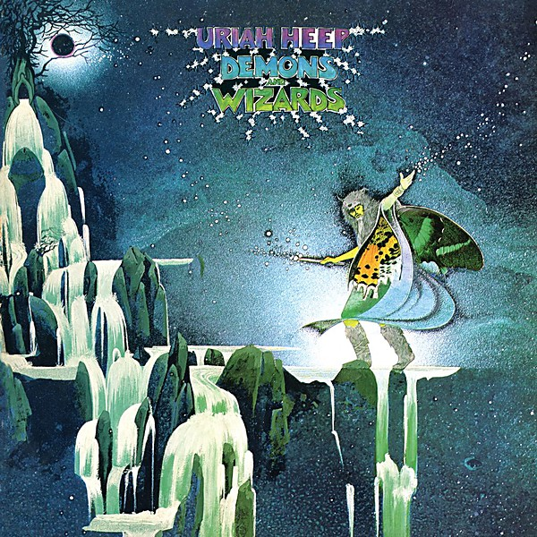

# Demons and Wizards

By **Uriah Heep**

## Album Data

- **Catalog:** Beets
- **Format:** Digital, Album
- **Album:** Demons and Wizards
- **Artist:** Uriah Heep
- **Albumartist:** Uriah Heep
- **Genre:** Progressive Rock
- **MusicBrainz Album Artist ID:** [f1548c5b-329e-4036-921c-02213a04b525](https://musicbrainz.org/artist/f1548c5b-329e-4036-921c-02213a04b525)
- **MusicBrainz Album ID:** [740ebf06-d078-31bb-869e-bb65f2c030ae](https://musicbrainz.org/release/740ebf06-d078-31bb-869e-bb65f2c030ae)
- **MusicBrainz Release Group ID:** [19f95cb8-6ffc-307f-a474-369103dd1b82](https://musicbrainz.org/release-group/19f95cb8-6ffc-307f-a474-369103dd1b82)
- **Year:** 2006
- **Catalog #:** SRM-1-614
- **Label:** Mercury Records
- **Total Tracks:** 07

## Album Tracks

### Track 01 - Look at Yourself

- **Artist:** Uriah Heep
- **Format:** MP3
- **Genre:** Progressive Rock
- **Length:** 5:08
- **MusicBrainz Track ID:** [27541e1e-9a45-4e3f-9aec-1f86f14420ba](https://musicbrainz.org/recording/27541e1e-9a45-4e3f-9aec-1f86f14420ba)
- **Title:** Look at Yourself
- **Track:** 01
- **Year:** 1971

### Track 02 - I Wanna Be Free

- **Artist:** Uriah Heep
- **Format:** MP3
- **Genre:** Psychedelic Rock
- **Length:** 3:58
- **MusicBrainz Track ID:** [347ae04b-ce21-4508-9975-20ece4bc37c0](https://musicbrainz.org/recording/347ae04b-ce21-4508-9975-20ece4bc37c0)
- **Title:** I Wanna Be Free
- **Track:** 02
- **Year:** 1971

### Track 03 - July Morning

- **Artist:** Uriah Heep
- **Format:** MP3
- **Genre:** Progressive Rock
- **Length:** 10:29
- **MusicBrainz Track ID:** [93628035-147c-4545-98ab-1c990cd2d5eb](https://musicbrainz.org/recording/93628035-147c-4545-98ab-1c990cd2d5eb)
- **Title:** July Morning
- **Track:** 03
- **Year:** 1971

### Track 04 - Tears in My Eyes

- **Artist:** Uriah Heep
- **Format:** MP3
- **Genre:** Progressive Rock
- **Length:** 4:58
- **MusicBrainz Track ID:** [18e4e159-0aaf-431b-a78c-50c81dc2f750](https://musicbrainz.org/recording/18e4e159-0aaf-431b-a78c-50c81dc2f750)
- **Title:** Tears in My Eyes
- **Track:** 04
- **Year:** 1971

### Track 05 - Shadows of Grief

- **Artist:** Uriah Heep
- **Format:** MP3
- **Genre:** Psychedelic Rock
- **Length:** 8:37
- **MusicBrainz Track ID:** [af779621-0787-408c-9323-ea946a1b4d4c](https://musicbrainz.org/recording/af779621-0787-408c-9323-ea946a1b4d4c)
- **Title:** Shadows of Grief
- **Track:** 05
- **Year:** 1971

### Track 06 - What Should Be Done

- **Artist:** Uriah Heep
- **Format:** MP3
- **Genre:** Progressive Rock
- **Length:** 4:12
- **MusicBrainz Track ID:** [f809616a-2622-460c-9b87-dc0f1056469f](https://musicbrainz.org/recording/f809616a-2622-460c-9b87-dc0f1056469f)
- **Title:** What Should Be Done
- **Track:** 06
- **Year:** 1971

### Track 07 - Love Machine

- **Artist:** Uriah Heep
- **Format:** MP3
- **Genre:** Progressive Rock
- **Length:** 3:37
- **MusicBrainz Track ID:** [909443a3-d415-4d71-a4db-26a213b65a74](https://musicbrainz.org/recording/909443a3-d415-4d71-a4db-26a213b65a74)
- **Title:** Love Machine
- **Track:** 07
- **Year:** 1971

## See also

- [20th Century Masters](20th_Century_Masters.md)
- [Look at Yourself](Look_at_Yourself.md)
- [The Magician’s Birthday](The_Magician’s_Birthday.md)
- [Roon: Demons and Wizards (Expanded Version)](../../Roon/Uriah_Heep/Demons_and_Wizards_Expanded_Version.md)
- [Roon: Look At Yourself (Expanded Version)](../../Roon/Uriah_Heep/Look_At_Yourself_Expanded_Version.md)
- [Roon: The Magician's Birthday](../../Roon/Uriah_Heep/The_Magicians_Birthday.md)
- [Roon: Travellers In Time](../../Roon/Uriah_Heep/Travellers_In_Time-_Anthology__Vol_1.md)
- [Roon: Very 'Eavy, Very 'Umble (Expanded Version)](../../Roon/Uriah_Heep/Very_Eavy__Very_Umble_Expanded_Version.md)
- [Vinyl: Demons And Wizards](../../Vinyl/Uriah_Heep/Demons_And_Wizards.md)
- [Vinyl: Look At Yourself](../../Vinyl/Uriah_Heep/Look_At_Yourself.md)
- [Vinyl: The Magician's Birthday](../../Vinyl/Uriah_Heep/The_Magicians_Birthday.md)
- [Vinyl: ](../../Vinyl/Uriah_Heep/Uriah_Heep.md)
