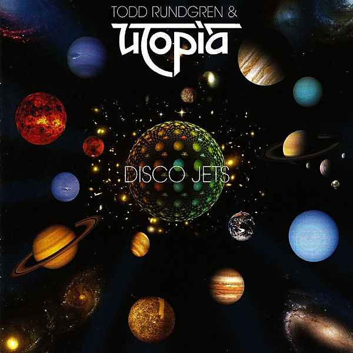

# Disco Jets

By **Utopia**

## Album Data

- **Catalog:** Beets
- **Format:** Digital, Album
- **Album:** Disco Jets
- **Artist:** Utopia
- **Albumartist:** Utopia
- **Genre:** Grindcore
- **MusicBrainz Album Artist ID:** [37283116-f2cc-47cb-8806-facd063b564f](https://musicbrainz.org/artist/37283116-f2cc-47cb-8806-facd063b564f)
- **MusicBrainz Album ID:** [15510061-8169-443f-9175-1a1a33acabba](https://musicbrainz.org/release/15510061-8169-443f-9175-1a1a33acabba)
- **MusicBrainz Release Group ID:** [769b5fce-0073-4059-a38f-567352425ed2](https://musicbrainz.org/release-group/769b5fce-0073-4059-a38f-567352425ed2)
- **Year:** 2012
- **Catalog #:** 
- **Label:** 
- **Total Tracks:** 07

## Album Tracks

### Track 01 - Overture

- **Artist:** Utopia
- **Format:** ALAC
- **Genre:** Progressive Rock
- **Length:** 6:53
- **MusicBrainz Track ID:** 
- **Title:** Overture
- **Track:** 01
- **Year:** 1977

### Track 02 - Magic Dragon Theatre

- **Artist:** Utopia
- **Format:** AAC
- **Genre:** Progressive Rock
- **Length:** 3:28
- **MusicBrainz Track ID:** 
- **Title:** Magic Dragon Theatre
- **Track:** 02
- **Year:** 2006

### Track 03 - Jealousy

- **Artist:** Utopia
- **Format:** AAC
- **Genre:** Progressive Rock
- **Length:** 4:43
- **MusicBrainz Track ID:** 
- **Title:** Jealousy
- **Track:** 03
- **Year:** 2006

### Track 04 - Eternal Love

- **Artist:** Utopia
- **Format:** AAC
- **Genre:** Progressive Rock
- **Length:** 4:49
- **MusicBrainz Track ID:** 
- **Title:** Eternal Love
- **Track:** 04
- **Year:** 2006

### Track 05 - Sunburst Finish

- **Artist:** Utopia
- **Format:** MP3
- **Genre:** Progressive Rock
- **Length:** 7:31
- **MusicBrainz Track ID:** 
- **Title:** Sunburst Finish
- **Track:** 05
- **Year:** 2006

### Track 06 - Hiroshima

- **Artist:** Utopia
- **Format:** AAC
- **Genre:** Progressive Rock
- **Length:** 7:16
- **MusicBrainz Track ID:** 
- **Title:** Hiroshima
- **Track:** 06
- **Year:** 2006

### Track 07 - Singring And The Glass Guitar (An Electrified Fairytale)

- **Artist:** Utopia
- **Format:** ALAC
- **Genre:** Progressive Rock
- **Length:** 18:21
- **MusicBrainz Track ID:** 
- **Title:** Singring And The Glass Guitar (An Electrified Fairytale)
- **Track:** 07
- **Year:** 1977

### Track 07 - Singring And The Glass Guitar [An Electrified ]

- **Artist:** Utopia
- **Format:** AAC
- **Genre:** Progressive Rock
- **Length:** 18:21
- **MusicBrainz Track ID:** 
- **Title:** Singring And The Glass Guitar [An Electrified ]
- **Track:** 07
- **Year:** 2006

## See also

- [RA](RA.md)
- [Swing to the Right](Swing_to_the_Right.md)
- [Todd Rundgren's Utopia](Todd_Rundgrens_Utopia.md)
- [Roon: Deface The Music](../../Roon/Utopia/Deface_The_Music.md)
- [Roon: Disco Jets](../../Roon/Utopia/Disco_Jets.md)
- [Roon: RA](../../Roon/Utopia/RA.md)
- [Roon: Swing To The Right](../../Roon/Utopia/Swing_To_The_Right.md)
- [Roon: Todd Rundgren's Utopia](../../Roon/Utopia/Todd_Rundgrens_Utopia.md)
- [Vinyl: Ra](../../Vinyl/Utopia/Ra.md)
- [Vinyl: Swing To The Right](../../Vinyl/Utopia/Swing_To_The_Right.md)
- [Vinyl: ](../../Vinyl/Utopia/Utopia.md)
