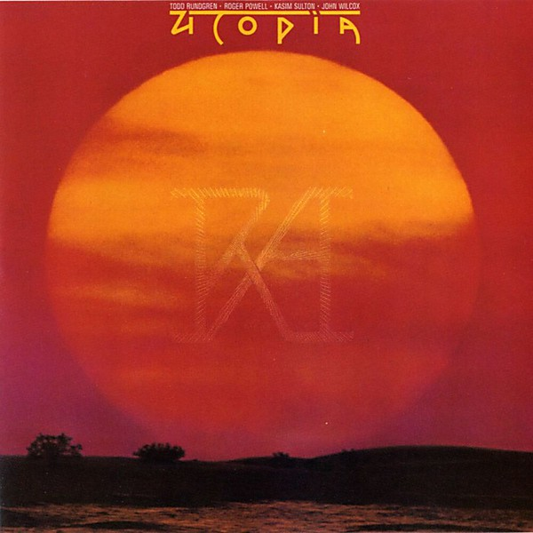

# RA

By **Utopia**

## Album Data

- **Catalog:** Beets
- **Format:** Digital, Album
- **Album:** RA
- **Artist:** Utopia
- **Albumartist:** Utopia
- **Genre:** Progressive Rock
- **MusicBrainz Album Artist ID:** 
- **MusicBrainz Album ID:** 
- **MusicBrainz Release Group ID:** 
- **Year:** 1977
- **Catalog #:** 
- **Label:** 
- **Total Tracks:** 10

## Album Tracks

### Track 01 - Swing to the Right

- **Artist:** Utopia
- **Format:** MP3
- **Genre:** Progressive Rock
- **Length:** 4:21
- **MusicBrainz Track ID:** [c0f7909e-3ddd-4a7c-9492-cbe3af8374f5](https://musicbrainz.org/recording/c0f7909e-3ddd-4a7c-9492-cbe3af8374f5)
- **Title:** Swing to the Right
- **Track:** 01
- **Year:** 1982

### Track 02 - Lysistrata

- **Artist:** Utopia
- **Format:** MP3
- **Genre:** Rock
- **Length:** 2:44
- **MusicBrainz Track ID:** [81c2d94b-ae23-43c9-a5a0-1198e62944d8](https://musicbrainz.org/recording/81c2d94b-ae23-43c9-a5a0-1198e62944d8)
- **Title:** Lysistrata
- **Track:** 02
- **Year:** 1982

### Track 03 - The Up

- **Artist:** Utopia
- **Format:** MP3
- **Genre:** New Wave
- **Length:** 4:08
- **MusicBrainz Track ID:** [d0257c91-fbec-4928-9248-aae91cc704fd](https://musicbrainz.org/recording/d0257c91-fbec-4928-9248-aae91cc704fd)
- **Title:** The Up
- **Track:** 03
- **Year:** 1982

### Track 04 - Junk Rock (Million Monkeys)

- **Artist:** Utopia
- **Format:** MP3
- **Genre:** Grindcore
- **Length:** 3:08
- **MusicBrainz Track ID:** [1d4d1c2d-540d-4ba0-9f88-b795b52e623f](https://musicbrainz.org/recording/1d4d1c2d-540d-4ba0-9f88-b795b52e623f)
- **Title:** Junk Rock (Million Monkeys)
- **Track:** 04
- **Year:** 1982

### Track 05 - Shinola

- **Artist:** Utopia
- **Format:** MP3
- **Genre:** Rock
- **Length:** 5:27
- **MusicBrainz Track ID:** [d26ff0a2-97fd-43a0-bff7-d746b352fcc8](https://musicbrainz.org/recording/d26ff0a2-97fd-43a0-bff7-d746b352fcc8)
- **Title:** Shinola
- **Track:** 05
- **Year:** 1982

### Track 06 - For the Love of Money

- **Artist:** Utopia
- **Format:** MP3
- **Genre:** New Wave
- **Length:** 3:42
- **MusicBrainz Track ID:** [e7d674f9-891a-4141-9e5b-fff8dac34840](https://musicbrainz.org/recording/e7d674f9-891a-4141-9e5b-fff8dac34840)
- **Title:** For the Love of Money
- **Track:** 06
- **Year:** 1982

### Track 07 - Last Dollar on Earth

- **Artist:** Utopia
- **Format:** MP3
- **Genre:** Grindcore
- **Length:** 4:12
- **MusicBrainz Track ID:** [3f598c84-ebdf-4519-996d-9460b94a5663](https://musicbrainz.org/recording/3f598c84-ebdf-4519-996d-9460b94a5663)
- **Title:** Last Dollar on Earth
- **Track:** 07
- **Year:** 1982

### Track 08 - Fahrenheit 451

- **Artist:** Utopia
- **Format:** MP3
- **Genre:** Grindcore
- **Length:** 2:47
- **MusicBrainz Track ID:** [96bf4487-3b1e-4200-ba24-203bf1d15bb6](https://musicbrainz.org/recording/96bf4487-3b1e-4200-ba24-203bf1d15bb6)
- **Title:** Fahrenheit 451
- **Track:** 08
- **Year:** 1982

### Track 09 - Only Human

- **Artist:** Utopia
- **Format:** MP3
- **Genre:** Progressive Rock
- **Length:** 5:11
- **MusicBrainz Track ID:** [69a39a49-5f9d-490d-b2d8-f924f9577877](https://musicbrainz.org/recording/69a39a49-5f9d-490d-b2d8-f924f9577877)
- **Title:** Only Human
- **Track:** 09
- **Year:** 1982

### Track 10 - One World

- **Artist:** Utopia
- **Format:** MP3
- **Genre:** Progressive Rock
- **Length:** 3:26
- **MusicBrainz Track ID:** [37e18c77-67f0-4fcc-95f2-9aff7a19baa9](https://musicbrainz.org/recording/37e18c77-67f0-4fcc-95f2-9aff7a19baa9)
- **Title:** One World
- **Track:** 10
- **Year:** 1982

## See also

- [Disco Jets](Disco_Jets.md)
- [Swing to the Right](Swing_to_the_Right.md)
- [Todd Rundgren's Utopia](Todd_Rundgrens_Utopia.md)
- [Roon: Deface The Music](../../Roon/Utopia/Deface_The_Music.md)
- [Roon: Disco Jets](../../Roon/Utopia/Disco_Jets.md)
- [Roon: RA](../../Roon/Utopia/RA.md)
- [Roon: Swing To The Right](../../Roon/Utopia/Swing_To_The_Right.md)
- [Roon: Todd Rundgren's Utopia](../../Roon/Utopia/Todd_Rundgrens_Utopia.md)
- [Vinyl: Ra](../../Vinyl/Utopia/Ra.md)
- [Vinyl: Swing To The Right](../../Vinyl/Utopia/Swing_To_The_Right.md)
- [Vinyl: ](../../Vinyl/Utopia/Utopia.md)
