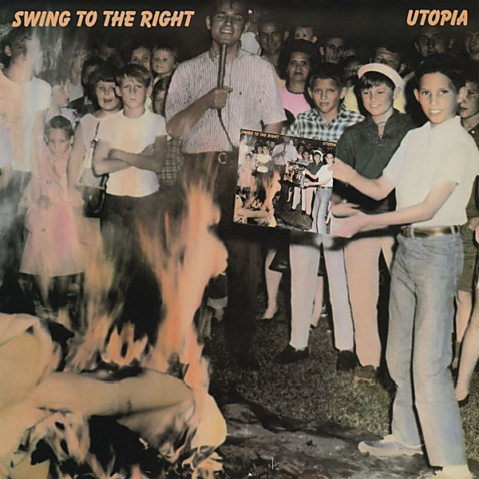

# Swing to the Right

By **Utopia**

## Album Data

- **Catalog:** Beets
- **Format:** Digital, Album
- **Album:** Swing to the Right
- **Artist:** Utopia
- **Albumartist:** Utopia
- **Genre:** Grindcore
- **MusicBrainz Album Artist ID:** [37283116-f2cc-47cb-8806-facd063b564f](https://musicbrainz.org/artist/37283116-f2cc-47cb-8806-facd063b564f)
- **MusicBrainz Album ID:** [e993abba-9587-4991-a167-7007ec124067](https://musicbrainz.org/release/e993abba-9587-4991-a167-7007ec124067)
- **MusicBrainz Release Group ID:** [0088f33b-732f-3f93-bc71-e8ad0460cd95](https://musicbrainz.org/release-group/0088f33b-732f-3f93-bc71-e8ad0460cd95)
- **Year:** 1982
- **Catalog #:** 
- **Label:** 
- **Total Tracks:** 04

## Album Tracks

### Track 01 - Utopia Theme

- **Artist:** Utopia
- **Format:** AAC
- **Genre:** Progressive Rock
- **Length:** 14:28
- **MusicBrainz Track ID:** 
- **Title:** Utopia Theme
- **Track:** 01
- **Year:** 1992

### Track 01 - Utopia

- **Artist:** Utopia
- **Format:** ALAC
- **Genre:** Progressive Rock
- **Length:** 14:19
- **MusicBrainz Track ID:** 
- **Title:** Utopia
- **Track:** 01
- **Year:** 1974

### Track 02 - Freak Parade

- **Artist:** Utopia
- **Format:** AAC
- **Genre:** Progressive Rock
- **Length:** 10:18
- **MusicBrainz Track ID:** 
- **Title:** Freak Parade
- **Track:** 02
- **Year:** 1992

### Track 02 - Freak Parade

- **Artist:** Utopia
- **Format:** ALAC
- **Genre:** Progressive Rock
- **Length:** 10:28
- **MusicBrainz Track ID:** 
- **Title:** Freak Parade
- **Track:** 02
- **Year:** 1974

### Track 03 - Freedom Fighters

- **Artist:** Utopia
- **Format:** AAC
- **Genre:** Progressive Rock
- **Length:** 4:04
- **MusicBrainz Track ID:** 
- **Title:** Freedom Fighters
- **Track:** 03
- **Year:** 1992

### Track 04 - The Ikon

- **Artist:** Utopia
- **Format:** AAC
- **Genre:** Progressive Rock
- **Length:** 30:25
- **MusicBrainz Track ID:** 
- **Title:** The Ikon
- **Track:** 04
- **Year:** 1992

## See also

- [Disco Jets](Disco_Jets.md)
- [RA](RA.md)
- [Todd Rundgren's Utopia](Todd_Rundgrens_Utopia.md)
- [Roon: Deface The Music](../../Roon/Utopia/Deface_The_Music.md)
- [Roon: Disco Jets](../../Roon/Utopia/Disco_Jets.md)
- [Roon: RA](../../Roon/Utopia/RA.md)
- [Roon: Swing To The Right](../../Roon/Utopia/Swing_To_The_Right.md)
- [Roon: Todd Rundgren's Utopia](../../Roon/Utopia/Todd_Rundgrens_Utopia.md)
- [Vinyl: Ra](../../Vinyl/Utopia/Ra.md)
- [Vinyl: Swing To The Right](../../Vinyl/Utopia/Swing_To_The_Right.md)
- [Vinyl: ](../../Vinyl/Utopia/Utopia.md)
