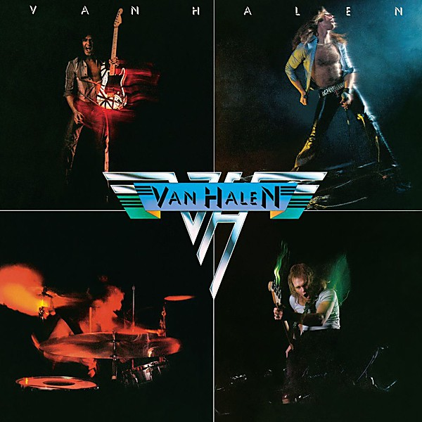

# Van Halen

By **Van Halen**

## Album Data

- **Catalog:** Beets
- **Format:** Digital, Album
- **Album:** Van Halen
- **Artist:** Van Halen
- **Albumartist:** Van Halen
- **Genre:** Heavy Metal
- **MusicBrainz Album Artist ID:** [b665b768-0d83-4363-950c-31ed39317c15](https://musicbrainz.org/artist/b665b768-0d83-4363-950c-31ed39317c15)
- **MusicBrainz Album ID:** [0d5f0dc2-b597-4b6c-9a6f-49b70b8e23b6](https://musicbrainz.org/release/0d5f0dc2-b597-4b6c-9a6f-49b70b8e23b6)
- **MusicBrainz Release Group ID:** [43a0e8b5-6059-397f-81e6-b8df5a648496](https://musicbrainz.org/release-group/43a0e8b5-6059-397f-81e6-b8df5a648496)
- **Year:** 1978
- **Catalog #:** BSK 3075
- **Label:** Warner Bros. Records
- **Total Tracks:** 11

## Album Tracks

### Track 01 - Runnin' With the Devil

- **Artist:** Van Halen
- **Format:** ALAC
- **Genre:** Heavy Metal
- **Length:** 3:35
- **MusicBrainz Track ID:** [f124bda8-5fd4-4b9e-92aa-892c7f74e561](https://musicbrainz.org/recording/f124bda8-5fd4-4b9e-92aa-892c7f74e561)
- **Title:** Runnin' With the Devil
- **Track:** 01
- **Year:** 1978

### Track 02 - Eruption

- **Artist:** Van Halen
- **Format:** ALAC
- **Genre:** Heavy Metal
- **Length:** 1:42
- **MusicBrainz Track ID:** [619f18ad-b7c8-4b0e-826e-585de75b33f8](https://musicbrainz.org/recording/619f18ad-b7c8-4b0e-826e-585de75b33f8)
- **Title:** Eruption
- **Track:** 02
- **Year:** 1978

### Track 03 - You Really Got Me

- **Artist:** Van Halen
- **Format:** ALAC
- **Genre:** Heavy Metal
- **Length:** 2:38
- **MusicBrainz Track ID:** [769e0ca1-f2eb-48df-a302-899a2826a7e9](https://musicbrainz.org/recording/769e0ca1-f2eb-48df-a302-899a2826a7e9)
- **Title:** You Really Got Me
- **Track:** 03
- **Year:** 1978

### Track 04 - Ain't Talkin' 'Bout Love

- **Artist:** Van Halen
- **Format:** ALAC
- **Genre:** Heavy Metal
- **Length:** 3:49
- **MusicBrainz Track ID:** [b03602f1-a3fd-4c66-b405-be5356752f73](https://musicbrainz.org/recording/b03602f1-a3fd-4c66-b405-be5356752f73)
- **Title:** Ain't Talkin' 'Bout Love
- **Track:** 04
- **Year:** 1978

### Track 05 - I'm the One

- **Artist:** Van Halen
- **Format:** ALAC
- **Genre:** Heavy Metal
- **Length:** 3:46
- **MusicBrainz Track ID:** [d6219c6a-92b3-46ab-9ed8-e7cf58538c72](https://musicbrainz.org/recording/d6219c6a-92b3-46ab-9ed8-e7cf58538c72)
- **Title:** I'm the One
- **Track:** 05
- **Year:** 1978

### Track 06 - Jamie's Cryin'

- **Artist:** Van Halen
- **Format:** ALAC
- **Genre:** Heavy Metal
- **Length:** 3:30
- **MusicBrainz Track ID:** [fed5b370-eaa4-44fb-9eb8-cfecdbf7b342](https://musicbrainz.org/recording/fed5b370-eaa4-44fb-9eb8-cfecdbf7b342)
- **Title:** Jamie's Cryin'
- **Track:** 06
- **Year:** 1978

### Track 07 - Atomic Punk

- **Artist:** Van Halen
- **Format:** ALAC
- **Genre:** Heavy Metal
- **Length:** 3:01
- **MusicBrainz Track ID:** [28fa8fee-f6f4-458d-afb9-9ae402fcfe45](https://musicbrainz.org/recording/28fa8fee-f6f4-458d-afb9-9ae402fcfe45)
- **Title:** Atomic Punk
- **Track:** 07
- **Year:** 1978

### Track 08 - Feel Your Love Tonight

- **Artist:** Van Halen
- **Format:** ALAC
- **Genre:** Heavy Metal
- **Length:** 3:42
- **MusicBrainz Track ID:** [99350394-ad6c-4e1f-98fa-5311c057e8ad](https://musicbrainz.org/recording/99350394-ad6c-4e1f-98fa-5311c057e8ad)
- **Title:** Feel Your Love Tonight
- **Track:** 08
- **Year:** 1978

### Track 09 - Little Dreamer

- **Artist:** Van Halen
- **Format:** ALAC
- **Genre:** Heavy Metal
- **Length:** 3:23
- **MusicBrainz Track ID:** [03f40a0a-2d36-49e0-86a7-9023176f5460](https://musicbrainz.org/recording/03f40a0a-2d36-49e0-86a7-9023176f5460)
- **Title:** Little Dreamer
- **Track:** 09
- **Year:** 1978

### Track 10 - Ice Cream Man

- **Artist:** Van Halen
- **Format:** ALAC
- **Genre:** Heavy Metal
- **Length:** 3:20
- **MusicBrainz Track ID:** [bd025ad2-f026-4e34-84ab-1254a2381738](https://musicbrainz.org/recording/bd025ad2-f026-4e34-84ab-1254a2381738)
- **Title:** Ice Cream Man
- **Track:** 10
- **Year:** 1978

### Track 11 - On Fire

- **Artist:** Van Halen
- **Format:** ALAC
- **Genre:** Heavy Metal
- **Length:** 3:00
- **MusicBrainz Track ID:** [5fb246b8-f3e7-45d8-a516-86b45f054cb4](https://musicbrainz.org/recording/5fb246b8-f3e7-45d8-a516-86b45f054cb4)
- **Title:** On Fire
- **Track:** 11
- **Year:** 1978

## See also

- [Roon: Van Halen II (Remastered)](../../Roon/Van_Halen/Van_Halen_II_Remastered.md)
- [Roon: Van Halen (Remastered)](../../Roon/Van_Halen/Van_Halen_Remastered.md)
