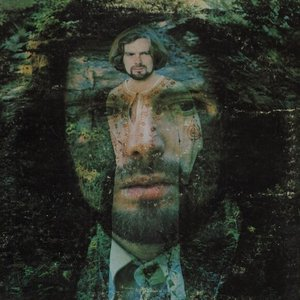

# His Band and the Street Choir

By **Van Morrison**

## Album Data

- **Catalog:** Beets
- **Format:** Digital, Album
- **Album:** His Band and the Street Choir
- **Artist:** Van Morrison
- **Albumartist:** Van Morrison
- **Genre:** Blue-Eyed Soul
- **MusicBrainz Album Artist ID:** [a41ac10f-0a56-4672-9161-b83f9b223559](https://musicbrainz.org/artist/a41ac10f-0a56-4672-9161-b83f9b223559)
- **MusicBrainz Album ID:** [a7e52c11-3b32-4464-b74a-c0b578f95f13](https://musicbrainz.org/release/a7e52c11-3b32-4464-b74a-c0b578f95f13)
- **MusicBrainz Release Group ID:** [c27a909a-6d4c-37eb-8925-4c5e23a8022b](https://musicbrainz.org/release-group/c27a909a-6d4c-37eb-8925-4c5e23a8022b)
- **Year:** 2015
- **Catalog #:** 
- **Label:** 
- **Total Tracks:** 00

## Album Tracks

### Track 00 - 1973

- **Artist:** Van Morrison
- **Format:** AAC
- **Genre:** Soul
- **Length:** 62:05
- **MusicBrainz Track ID:** 
- **Title:** 1973
- **Track:** 00
- **Year:** 1973

## See also

- [Astral Weeks](Astral_Weeks.md)
- [Songs From Hymns To The Silence](Songs_From_Hymns_To_The_Silence.md)
- [Roon: Astral Weeks (Expanded Edition)](../../Roon/Van_Morrison/Astral_Weeks_Expanded_Edition.md)
- [Roon: Blowin' Your Mind!](../../Roon/Van_Morrison/Blowin_Your_Mind!.md)
- [Roon: His Band and the Street Choir (2015 Remaster)](../../Roon/Van_Morrison/His_Band_and_the_Street_Choir_2015_Remaster.md)
- [Roon: Moondance (Hi-Res Version) (2013 Remaster)](../../Roon/Van_Morrison/Moondance_Hi-Res_Version_2013_Remaster.md)
- [Roon: Saint Dominic's Preview](../../Roon/Van_Morrison/Saint_Dominics_Preview.md)
