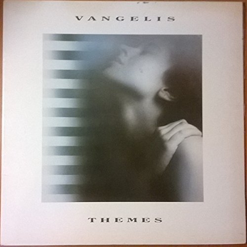

# Themes

By **Vangelis**

## Album Data

- **Catalog:** Beets
- **Format:** Digital, Album
- **Album:** Themes
- **Artist:** Vangelis
- **Albumartist:** Vangelis
- **Genre:** Electronica
- **MusicBrainz Album Artist ID:** 
- **MusicBrainz Album ID:** 
- **MusicBrainz Release Group ID:** 
- **Year:** 1989
- **Catalog #:** 
- **Label:** 
- **Total Tracks:** 00

## Album Tracks

### Track 00 - Ask The Mountains

- **Artist:** Vangelis
- **Format:** MP3
- **Genre:** Downtempo
- **Length:** 1:39
- **MusicBrainz Track ID:** 
- **Title:** Ask The Mountains
- **Track:** 00
- **Year:** 1995

### Track 00 - Come To Me

- **Artist:** Vangelis
- **Format:** MP3
- **Genre:** Ambient
- **Length:** 1:26
- **MusicBrainz Track ID:** 
- **Title:** Come To Me
- **Track:** 00
- **Year:** 1995

### Track 00 - Dream in an open place

- **Artist:** Vangelis
- **Format:** MP3
- **Genre:** Electronica
- **Length:** 1:21
- **MusicBrainz Track ID:** 
- **Title:** Dream in an open place
- **Track:** 00
- **Year:** 1995

### Track 00 - Echoes

- **Artist:** Vangelis
- **Format:** MP3
- **Genre:** Electronica
- **Length:** 1:29
- **MusicBrainz Track ID:** 
- **Title:** Echoes
- **Track:** 00
- **Year:** 1995

### Track 00 - Losing Sleep

- **Artist:** Vangelis
- **Format:** MP3
- **Genre:** Ambient
- **Length:** 1:29
- **MusicBrainz Track ID:** 
- **Title:** Losing Sleep
- **Track:** 00
- **Year:** 1995

### Track 00 - Messages

- **Artist:** Vangelis
- **Format:** MP3
- **Genre:** Ambient
- **Length:** 1:17
- **MusicBrainz Track ID:** 
- **Title:** Messages
- **Track:** 00
- **Year:** 1995

### Track 00 - P.S.

- **Artist:** Vangelis
- **Format:** MP3
- **Genre:** Synthpop
- **Length:** 1:13
- **MusicBrainz Track ID:** 
- **Title:** P.S.
- **Track:** 00
- **Year:** 1995

### Track 00 - Prelude

- **Artist:** Vangelis
- **Format:** MP3
- **Genre:** Ambient
- **Length:** 1:22
- **MusicBrainz Track ID:** 
- **Title:** Prelude
- **Track:** 00
- **Year:** 1995

### Track 00 - Voices

- **Artist:** Vangelis
- **Format:** MP3
- **Genre:** Ambient
- **Length:** 1:26
- **MusicBrainz Track ID:** 
- **Title:** Voices
- **Track:** 00
- **Year:** 1995

## See also

- [Albedo 0.39](Albedo_039.md)
- [Greatest Hits](Greatest_Hits.md)
- [Voices](Voices.md)
