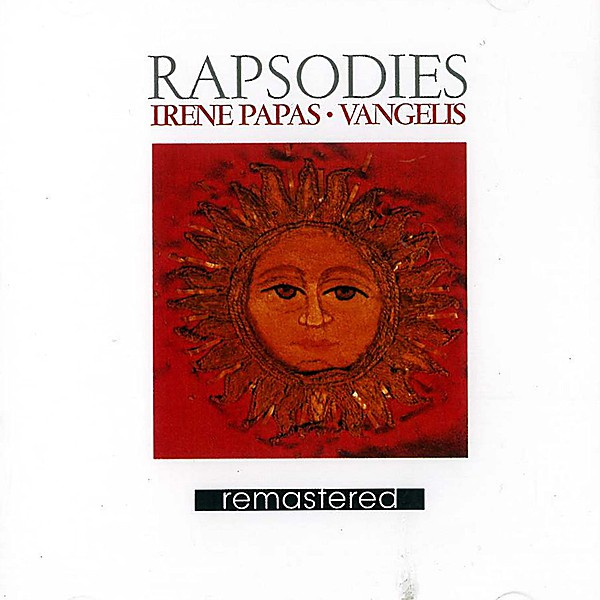

# Rapsodies

By **Vangelis & Irene Papas**

## Album Data

- **Catalog:** Beets
- **Format:** Digital, Album
- **Album:** Rapsodies
- **Artist:** Vangelis & Irene Papas
- **Albumartist:** Vangelis & Irene Papas
- **Genre:** Electronic
- **MusicBrainz Album Artist ID:** 
- **MusicBrainz Album ID:** 
- **MusicBrainz Release Group ID:** 
- **Year:** 1986
- **Catalog #:** 
- **Label:** 
- **Total Tracks:** 07

## Album Tracks

### Track 01 - Ti ipermacho Stratigo

- **Artist:** Vangelis & Irene Papas
- **Format:** ALAC
- **Genre:** Progressive Rock
- **Length:** 0:46
- **MusicBrainz Track ID:** 
- **Title:** Ti ipermacho Stratigo
- **Track:** 01
- **Year:** 1986

### Track 02 - O! gliki mou ear

- **Artist:** Vangelis & Irene Papas
- **Format:** ALAC
- **Genre:** Ambient
- **Length:** 1:07
- **MusicBrainz Track ID:** 
- **Title:** O! gliki mou ear
- **Track:** 02
- **Year:** 1986

### Track 04 - Rapsodia

- **Artist:** Vangelis & Irene Papas
- **Format:** ALAC
- **Genre:** Ambient
- **Length:** 1:07
- **MusicBrainz Track ID:** 
- **Title:** Rapsodia
- **Track:** 04
- **Year:** 1986

### Track 05 - Tin Oreotita tis Parthenias Su

- **Artist:** Vangelis & Irene Papas
- **Format:** ALAC
- **Genre:** Electronic
- **Length:** 1:02
- **MusicBrainz Track ID:** 
- **Title:** Tin Oreotita tis Parthenias Su
- **Track:** 05
- **Year:** 1986

### Track 06 - Christos Anesti

- **Artist:** Vangelis & Irene Papas
- **Format:** ALAC
- **Genre:** Progressive Rock
- **Length:** 1:18
- **MusicBrainz Track ID:** 
- **Title:** Christos Anesti
- **Track:** 06
- **Year:** 1986

### Track 07 - Asma Asmaton

- **Artist:** Vangelis & Irene Papas
- **Format:** ALAC
- **Genre:** Progressive Rock
- **Length:** 1:00
- **MusicBrainz Track ID:** 
- **Title:** Asma Asmaton
- **Track:** 07
- **Year:** 1986

