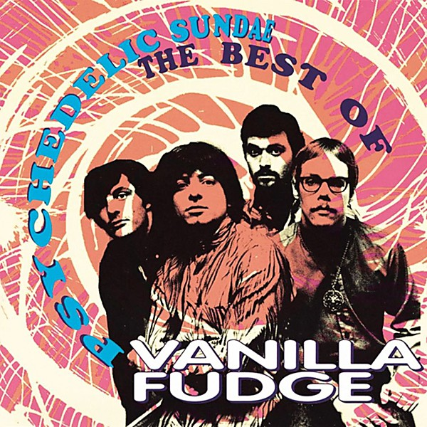

# Psychedelic Sundae

By **Vanilla Fudge**

## Album Data

- **Catalog:** Beets
- **Format:** Digital, Album
- **Album:** Psychedelic Sundae
- **Artist:** Vanilla Fudge
- **Albumartist:** Vanilla Fudge
- **Genre:** Acid Rock
- **MusicBrainz Album Artist ID:** [96ad1836-0a6e-423f-a2af-0f4a64a325ca](https://musicbrainz.org/artist/96ad1836-0a6e-423f-a2af-0f4a64a325ca)
- **MusicBrainz Album ID:** [b4daeacc-8a99-4625-a908-d809f0d4af09](https://musicbrainz.org/release/b4daeacc-8a99-4625-a908-d809f0d4af09)
- **MusicBrainz Release Group ID:** [c63ea85f-25ee-3bbb-bf2d-03c112493544](https://musicbrainz.org/release-group/c63ea85f-25ee-3bbb-bf2d-03c112493544)
- **Year:** 1993
- **Catalog #:** R2 71154
- **Label:** Rhino
- **Total Tracks:** 18

## Album Tracks

### Track 01 - You Keep Me Hangin' On

- **Artist:** Vanilla Fudge
- **Format:** ALAC
- **Genre:** Psychedelic Rock
- **Length:** 3:01
- **MusicBrainz Track ID:** [232ec385-8268-4a85-8d18-cc751915640b](https://musicbrainz.org/recording/232ec385-8268-4a85-8d18-cc751915640b)
- **Title:** You Keep Me Hangin' On
- **Track:** 01
- **Year:** 1993

### Track 02 - Where Is My Mind

- **Artist:** Vanilla Fudge
- **Format:** ALAC
- **Genre:** Psychedelic Rock
- **Length:** 2:46
- **MusicBrainz Track ID:** [08e29167-629c-4b8f-bf33-a0a042ac5663](https://musicbrainz.org/recording/08e29167-629c-4b8f-bf33-a0a042ac5663)
- **Title:** Where Is My Mind
- **Track:** 02
- **Year:** 1993

### Track 03 - The Look of Love

- **Artist:** Vanilla Fudge
- **Format:** ALAC
- **Genre:** Psychedelic Rock
- **Length:** 2:51
- **MusicBrainz Track ID:** [ba005be4-3855-49e9-9623-4dae29273776](https://musicbrainz.org/recording/ba005be4-3855-49e9-9623-4dae29273776)
- **Title:** The Look of Love
- **Track:** 03
- **Year:** 1993

### Track 04 - Ticket to Ride

- **Artist:** Vanilla Fudge
- **Format:** ALAC
- **Genre:** Psychedelic Rock
- **Length:** 5:55
- **MusicBrainz Track ID:** [8ea3a9f2-b47e-4491-b3a5-183c85f105cd](https://musicbrainz.org/recording/8ea3a9f2-b47e-4491-b3a5-183c85f105cd)
- **Title:** Ticket to Ride
- **Track:** 04
- **Year:** 1993

### Track 05 - Come by Day, Come by Night

- **Artist:** Vanilla Fudge
- **Format:** ALAC
- **Genre:** Psychedelic Rock
- **Length:** 2:58
- **MusicBrainz Track ID:** [72bdd26f-db30-471c-b4e8-03255efe8ca5](https://musicbrainz.org/recording/72bdd26f-db30-471c-b4e8-03255efe8ca5)
- **Title:** Come by Day, Come by Night
- **Track:** 05
- **Year:** 1993

### Track 06 - Take Me for a Little While

- **Artist:** Vanilla Fudge
- **Format:** ALAC
- **Genre:** Psychedelic Rock
- **Length:** 3:21
- **MusicBrainz Track ID:** [0af3c08e-dd12-43dd-8a55-f3e02f59ccd3](https://musicbrainz.org/recording/0af3c08e-dd12-43dd-8a55-f3e02f59ccd3)
- **Title:** Take Me for a Little While
- **Track:** 06
- **Year:** 1993

### Track 07 - That's What Makes a Man

- **Artist:** Vanilla Fudge
- **Format:** ALAC
- **Genre:** Psychedelic Rock
- **Length:** 4:28
- **MusicBrainz Track ID:** [f67f54dc-4ea4-41c2-b20b-a2d954caf09c](https://musicbrainz.org/recording/f67f54dc-4ea4-41c2-b20b-a2d954caf09c)
- **Title:** That's What Makes a Man
- **Track:** 07
- **Year:** 1993

### Track 08 - Season of the Witch

- **Artist:** Vanilla Fudge
- **Format:** ALAC
- **Genre:** Psychedelic Rock
- **Length:** 7:46
- **MusicBrainz Track ID:** [a08227d8-92ad-4c00-b7c0-d46bf428192d](https://musicbrainz.org/recording/a08227d8-92ad-4c00-b7c0-d46bf428192d)
- **Title:** Season of the Witch
- **Track:** 08
- **Year:** 1993

### Track 09 - Shotgun

- **Artist:** Vanilla Fudge
- **Format:** ALAC
- **Genre:** Acid Rock
- **Length:** 2:35
- **MusicBrainz Track ID:** [b5a8dd48-9606-4c88-8097-ff19ba1bf34a](https://musicbrainz.org/recording/b5a8dd48-9606-4c88-8097-ff19ba1bf34a)
- **Title:** Shotgun
- **Track:** 09
- **Year:** 1993

### Track 10 - Thoughts

- **Artist:** Vanilla Fudge
- **Format:** ALAC
- **Genre:** Psychedelic Rock
- **Length:** 3:33
- **MusicBrainz Track ID:** [2a49a429-7719-47d8-b340-bc00f4a8dd9f](https://musicbrainz.org/recording/2a49a429-7719-47d8-b340-bc00f4a8dd9f)
- **Title:** Thoughts
- **Track:** 10
- **Year:** 1993

### Track 11 - Faceless People

- **Artist:** Vanilla Fudge
- **Format:** ALAC
- **Genre:** Psychedelic Rock
- **Length:** 6:06
- **MusicBrainz Track ID:** [82ae5e34-abaa-43f8-8b26-02f36462eac5](https://musicbrainz.org/recording/82ae5e34-abaa-43f8-8b26-02f36462eac5)
- **Title:** Faceless People
- **Track:** 11
- **Year:** 1993

### Track 12 - Good Good Lovin'

- **Artist:** Vanilla Fudge
- **Format:** ALAC
- **Genre:** Psychedelic Rock
- **Length:** 3:00
- **MusicBrainz Track ID:** [5e0aa583-c308-4dde-a683-26016ef33622](https://musicbrainz.org/recording/5e0aa583-c308-4dde-a683-26016ef33622)
- **Title:** Good Good Lovin'
- **Track:** 12
- **Year:** 1993

### Track 13 - Some Velvet Morning

- **Artist:** Vanilla Fudge
- **Format:** ALAC
- **Genre:** Psychedelic Rock
- **Length:** 7:38
- **MusicBrainz Track ID:** [e637d175-f09e-4026-92a0-9ec1782299fc](https://musicbrainz.org/recording/e637d175-f09e-4026-92a0-9ec1782299fc)
- **Title:** Some Velvet Morning
- **Track:** 13
- **Year:** 1993

### Track 14 - I Can't Make It Alone

- **Artist:** Vanilla Fudge
- **Format:** ALAC
- **Genre:** Psychedelic Rock
- **Length:** 3:38
- **MusicBrainz Track ID:** [4ca346c4-fefd-486b-83cf-be159a462850](https://musicbrainz.org/recording/4ca346c4-fefd-486b-83cf-be159a462850)
- **Title:** I Can't Make It Alone
- **Track:** 14
- **Year:** 1993

### Track 15 - Lord in the Country

- **Artist:** Vanilla Fudge
- **Format:** ALAC
- **Genre:** Psychedelic Rock
- **Length:** 3:03
- **MusicBrainz Track ID:** [4f86a07f-72e5-4451-b709-7437294ecc42](https://musicbrainz.org/recording/4f86a07f-72e5-4451-b709-7437294ecc42)
- **Title:** Lord in the Country
- **Track:** 15
- **Year:** 1993

### Track 16 - Need Love

- **Artist:** Vanilla Fudge
- **Format:** ALAC
- **Genre:** Psychedelic Rock
- **Length:** 5:00
- **MusicBrainz Track ID:** [06db1041-8aa9-4d6d-a232-b9bec7448b33](https://musicbrainz.org/recording/06db1041-8aa9-4d6d-a232-b9bec7448b33)
- **Title:** Need Love
- **Track:** 16
- **Year:** 1993

### Track 17 - Street Walking Woman

- **Artist:** Vanilla Fudge
- **Format:** ALAC
- **Genre:** Psychedelic Rock
- **Length:** 6:14
- **MusicBrainz Track ID:** [5e7d518d-8aa0-4b35-afdc-365faa422ac4](https://musicbrainz.org/recording/5e7d518d-8aa0-4b35-afdc-365faa422ac4)
- **Title:** Street Walking Woman
- **Track:** 17
- **Year:** 1993

### Track 18 - All in Your Mind

- **Artist:** Vanilla Fudge
- **Format:** ALAC
- **Genre:** Psychedelic Rock
- **Length:** 3:02
- **MusicBrainz Track ID:** [040ffa5f-7eba-429e-8f72-4cc0556791f9](https://musicbrainz.org/recording/040ffa5f-7eba-429e-8f72-4cc0556791f9)
- **Title:** All in Your Mind
- **Track:** 18
- **Year:** 1993

## See also

- [CD: Psychedelic Sundae](../../CD/Vanilla_Fudge/Psychedelic_Sundae-_The_Best_Of_Vanilla_Fudge.md)
- [CD: ](../../CD/Vanilla_Fudge/Vanilla_Fudge.md)
- [Roon: Renaissance (2006 Remaster)](../../Roon/Vanilla_Fudge/Renaissance_2006_Remaster.md)
- [Roon: Rock & Roll](../../Roon/Vanilla_Fudge/Rock_and_Roll.md)
- [Roon: Vanilla Fudge](../../Roon/Vanilla_Fudge/Vanilla_Fudge.md)
- [Vinyl: ](../../Vinyl/Vanilla_Fudge/Vanilla_Fudge_index.md)
- [Vinyl: Vanilla Fudge](../../Vinyl/Vanilla_Fudge/Vanilla_Fudge.md)
