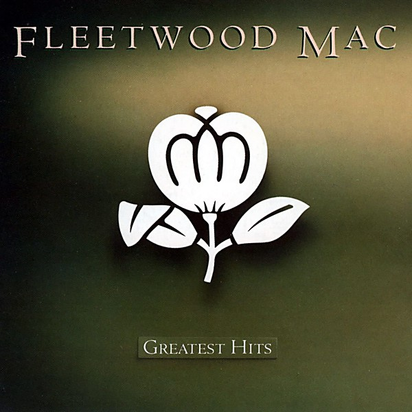

# Coming Up Roses

By **Various**

## Album Data

- **Catalog:** Beets
- **Format:** Digital, Album
- **Album:** Coming Up Roses
- **Artist:** Various
- **Albumartist:** Various
- **Genre:** Emo
- **MusicBrainz Album Artist ID:** 
- **MusicBrainz Album ID:** 
- **MusicBrainz Release Group ID:** 
- **Year:** 1997
- **Catalog #:** 
- **Label:** 
- **Total Tracks:** 26

## Album Tracks

### Track 20 - Sister Golden Hair

- **Artist:** America
- **Format:** MP3
- **Genre:** Soft Rock
- **Length:** 3:21
- **MusicBrainz Track ID:** 
- **Title:** Sister Golden Hair
- **Track:** 20
- **Year:** 1975

### Track 12 - Miss July

- **Artist:** Brad Jones
- **Format:** MP3
- **Genre:** Power Pop
- **Length:** 3:34
- **MusicBrainz Track ID:** 
- **Title:** Miss July
- **Track:** 12
- **Year:** 2008

### Track 18 - Here's A Boy

- **Artist:** Brainpool
- **Format:** MP3
- **Genre:** Indie Pop
- **Length:** 2:50
- **MusicBrainz Track ID:** 
- **Title:** Here's A Boy
- **Track:** 18
- **Year:** 2008

### Track 21 - Sun

- **Artist:** Chris Von Sneidern
- **Format:** MP3
- **Genre:** Indie Pop
- **Length:** 3:30
- **MusicBrainz Track ID:** 
- **Title:** Sun
- **Track:** 21
- **Year:** 1998

### Track 26 - Goodnight

- **Artist:** Doug Powell
- **Format:** MP3
- **Genre:** Indie Pop
- **Length:** 2:06
- **MusicBrainz Track ID:** 
- **Title:** Goodnight
- **Track:** 26
- **Year:** 2008

### Track 23 - Think I'm In Love

- **Artist:** Eddie Money
- **Format:** MP3
- **Genre:** Pop Rock
- **Length:** 3:08
- **MusicBrainz Track ID:** 
- **Title:** Think I'm In Love
- **Track:** 23
- **Year:** 1986

### Track 05 - Together We're Alone

- **Artist:** Einstein's Sister
- **Format:** MP3
- **Genre:** Power Pop
- **Length:** 2:25
- **MusicBrainz Track ID:** 
- **Title:** Together We're Alone
- **Track:** 05
- **Year:** 2008

### Track 04 - Go Your Own Way

- **Artist:** Fleetwood Mac
- **Format:** MP3
- **Genre:** Rock
- **Length:** 3:38
- **MusicBrainz Track ID:** 
- **Title:** Go Your Own Way
- **Track:** 04
- **Year:** 1977

### Track 13 - Laid

- **Artist:** James
- **Format:** MP3
- **Genre:** Indie Rock
- **Length:** 2:36
- **MusicBrainz Track ID:** 
- **Title:** Laid
- **Track:** 13
- **Year:** 2001

### Track 25 - Vancouver

- **Artist:** Jeff Buckley
- **Format:** MP3
- **Genre:** Indie Rock
- **Length:** 3:12
- **MusicBrainz Track ID:** 
- **Title:** Vancouver
- **Track:** 25
- **Year:** 1998

### Track 14 - Submarine

- **Artist:** Mockingbirds
- **Format:** MP3
- **Genre:** Ska
- **Length:** 3:18
- **MusicBrainz Track ID:** 
- **Title:** Submarine
- **Track:** 14
- **Year:** 2008

### Track 09 - Whisper Softly

- **Artist:** Myracle Brah
- **Format:** MP3
- **Genre:** Power Pop
- **Length:** 2:04
- **MusicBrainz Track ID:** 
- **Title:** Whisper Softly
- **Track:** 09
- **Year:** 2008

### Track 02 - Hot Child In The City

- **Artist:** Nick Gilder
- **Format:** MP3
- **Genre:** Pop Rock
- **Length:** 3:08
- **MusicBrainz Track ID:** 
- **Title:** Hot Child In The City
- **Track:** 02
- **Year:** 1978

### Track 03 - The Homecoming Song

- **Artist:** Owsley
- **Format:** MP3
- **Genre:** Power Pop
- **Length:** 2:59
- **MusicBrainz Track ID:** 
- **Title:** The Homecoming Song
- **Track:** 03
- **Year:** 2008

### Track 10 - She's Varispeed

- **Artist:** Red Letter Day
- **Format:** MP3
- **Genre:** Emo
- **Length:** 2:32
- **MusicBrainz Track ID:** 
- **Title:** She's Varispeed
- **Track:** 10
- **Year:** 2008

### Track 16 - Does Stephanie Know

- **Artist:** Squire
- **Format:** MP3
- **Genre:** Power Pop
- **Length:** 2:44
- **MusicBrainz Track ID:** 
- **Title:** Does Stephanie Know
- **Track:** 16
- **Year:** 2008

### Track 19 - Something 4 the Weekend

- **Artist:** Super Furry Animals
- **Format:** MP3
- **Genre:** Britpop
- **Length:** 2:50
- **MusicBrainz Track ID:** 
- **Title:** Something 4 the Weekend
- **Track:** 19
- **Year:** 2005

### Track 11 - Eight

- **Artist:** Swag
- **Format:** MP3
- **Genre:** Tech House
- **Length:** 2:21
- **MusicBrainz Track ID:** 
- **Title:** Eight
- **Track:** 11
- **Year:** 2008

### Track 22 - Ashes Of My Heart

- **Artist:** The Bad Examples
- **Format:** MP3
- **Genre:** Pop
- **Length:** 3:16
- **MusicBrainz Track ID:** 
- **Title:** Ashes Of My Heart
- **Track:** 22
- **Year:** 2008

### Track 07 - Green Is The Colour

- **Artist:** The Coral
- **Format:** MP3
- **Genre:** Rock
- **Length:** 3:22
- **MusicBrainz Track ID:** 
- **Title:** Green Is The Colour
- **Track:** 07
- **Year:** 2010

### Track 17 - Do What You're Doing

- **Artist:** The Michael Guthrie Band
- **Format:** MP3
- **Genre:** Power Pop
- **Length:** 3:26
- **MusicBrainz Track ID:** 
- **Title:** Do What You're Doing
- **Track:** 17
- **Year:** 2008

### Track 08 - Your Love

- **Artist:** The Outfield
- **Format:** MP3
- **Genre:** New Wave
- **Length:** 3:36
- **MusicBrainz Track ID:** 
- **Title:** Your Love
- **Track:** 08
- **Year:** 1985

### Track 24 - She Loves You Too

- **Artist:** The Patriots
- **Format:** MP3
- **Genre:** Power Pop
- **Length:** 1:44
- **MusicBrainz Track ID:** 
- **Title:** She Loves You Too
- **Track:** 24
- **Year:** 2008

### Track 01 - Starry Eyes

- **Artist:** The Records
- **Format:** MP3
- **Genre:** Power Pop
- **Length:** 4:25
- **MusicBrainz Track ID:** 
- **Title:** Starry Eyes
- **Track:** 01
- **Year:** 1997

### Track 06 - Coming Up Roses

- **Artist:** The Semantics
- **Format:** MP3
- **Genre:** Power Pop
- **Length:** 3:36
- **MusicBrainz Track ID:** 
- **Title:** Coming Up Roses
- **Track:** 06
- **Year:** 2008

### Track 15 - Way Down Now

- **Artist:** World Party
- **Format:** MP3
- **Genre:** Rock And Roll
- **Length:** 3:49
- **MusicBrainz Track ID:** 
- **Title:** Way Down Now
- **Track:** 15
- **Year:** 1990

## See also

- [Vinyl: Come To The Sunshine](../../Vinyl/Various/Come_To_The_Sunshine-_Soft_Pop_Nuggets_From_The_WEA_Vaults.md)
- [Vinyl: Easy Rider (Music From The Soundtrack)](../../Vinyl/Various/Easy_Rider_Music_From_The_Soundtrack.md)
- [Vinyl: Girls In The Garage Volume 10 - Groovy Gallic Gals!](../../Vinyl/Various/Girls_In_The_Garage_Volume_10_-_Groovy_Gallic_Gals!.md)
- [Vinyl: Girls In The Garage Volume 9 - Oriental Special](../../Vinyl/Various/Girls_In_The_Garage_Volume_9_-_Oriental_Special.md)
- [Vinyl: Glasnost](../../Vinyl/Various/Glasnost.md)
- [Vinyl: Party Party (Original Motion Picture Soundtrack)](../../Vinyl/Various/Party_Party_Original_Motion_Picture_Soundtrack.md)
- [Vinyl: Performance](../../Vinyl/Various/Performance-_Original_Motion_Picture_Sound_Track.md)
- [Vinyl: Popeye - Original Motion Picture Soundtrack Album](../../Vinyl/Various/Popeye_-_Original_Motion_Picture_Soundtrack_Album.md)
- [Vinyl: Really Rock 'em Right - Sun Records Curated By Record Store Day Volume 4](../../Vinyl/Various/Really_Rock_em_Right_-_Sun_Records_Curated_By_Record_Store_Day_Volume_4.md)
- [Vinyl: Resistance Radio](../../Vinyl/Various/Resistance_Radio-_The_Man_In_The_High_Castle_Album.md)
- [Vinyl: ](../../Vinyl/Various/Various.md)
