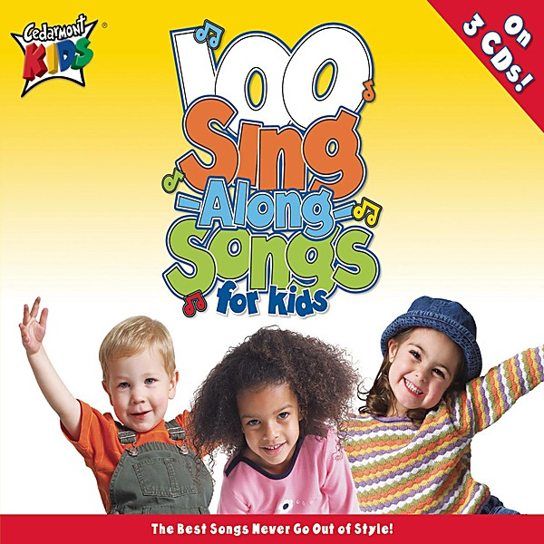

# 101 # 1 hits cd 4 Disc 4

By **Various Artists**

## Album Data

- **Catalog:** Beets
- **Format:** Digital, Album
- **Album:** 101 # 1 hits cd 4 Disc 4
- **Artist:** Various Artists
- **Albumartist:** Various Artists
- **Genre:** Soul
- **MusicBrainz Album Artist ID:** 
- **MusicBrainz Album ID:** 
- **MusicBrainz Release Group ID:** 
- **Year:** 0000
- **Catalog #:** 
- **Label:** 
- **Total Tracks:** 00

## Album Tracks

### Track 14 - Ebb Tide

- **Artist:** Frank Chacksfield
- **Format:** MP3
- **Genre:** Ambient
- **Length:** 3:39
- **MusicBrainz Track ID:** 
- **Title:** Ebb Tide
- **Track:** 14
- **Year:** 1953

### Track 07 - I Saw Mommy Kissing Santa Clau

- **Artist:** Jimmy Boyd
- **Format:** AAC
- **Genre:** Rockabilly
- **Length:** 2:31
- **MusicBrainz Track ID:** 
- **Title:** I Saw Mommy Kissing Santa Clau
- **Track:** 07
- **Year:** 1953

### Track 12 - How Much Is That

- **Artist:** Patti Page
- **Format:** AAC
- **Genre:** Pop
- **Length:** 2:25
- **MusicBrainz Track ID:** 
- **Title:** How Much Is That
- **Track:** 12
- **Year:** 1953

### Track 10 - The Song From Moulin Rouge

- **Artist:** Percy Faith And Orchestra
- **Format:** AAC
- **Genre:** Orchestra
- **Length:** 3:19
- **MusicBrainz Track ID:** 
- **Title:** The Song From Moulin Rouge
- **Track:** 10
- **Year:** 1953

### Track 06 - Don't let the stars get in You

- **Artist:** Perry Como
- **Format:** AAC
- **Genre:** Swing
- **Length:** 2:40
- **MusicBrainz Track ID:** 
- **Title:** Don't let the stars get in You
- **Track:** 06
- **Year:** 1953

### Track 08 - No Other Love

- **Artist:** Perry Como
- **Format:** MP3
- **Genre:** Rock
- **Length:** 3:13
- **MusicBrainz Track ID:** 
- **Title:** No Other Love
- **Track:** 08
- **Year:** 1953

### Track 09 - Ricochet

- **Artist:** Teresa Brewer
- **Format:** AAC
- **Genre:** Pop
- **Length:** 2:43
- **MusicBrainz Track ID:** 
- **Title:** Ricochet
- **Track:** 09
- **Year:** 1953

### Track 15 - You, You, You

- **Artist:** The Ames Brothers
- **Format:** AAC
- **Genre:** Close Harmony
- **Length:** 2:52
- **MusicBrainz Track ID:** 
- **Title:** You, You, You
- **Track:** 15
- **Year:** 1953

### Track 01 - 1953-03 Teresa Brewer - Till I Waltz Again With You

- **Artist:** Various Artists
- **Format:** AAC
- **Genre:** Emo
- **Length:** 3:02
- **MusicBrainz Track ID:** 
- **Title:** 1953-03 Teresa Brewer - Till I Waltz Again With You
- **Track:** 01
- **Year:** 1953

### Track 02 - 02 - 1953-05 Frankie Laine - I Believe

- **Artist:** Various Artists
- **Format:** MP3
- **Genre:** Emo
- **Length:** 2:07
- **MusicBrainz Track ID:** 
- **Title:** 02 - 1953-05 Frankie Laine - I Believe
- **Track:** 02
- **Year:** 1953

### Track 03 - 1953-08 Les Baxter Orchestra - April In Portugal 0

- **Artist:** Various Artists
- **Format:** MP3
- **Genre:** Emo
- **Length:** 2:46
- **MusicBrainz Track ID:** 
- **Title:** 1953-08 Les Baxter Orchestra - April In Portugal 0
- **Track:** 03
- **Year:** 1953

### Track 04 - 1953-09 Eddie Fisher - I'm Walking Behind You

- **Artist:** Various Artists
- **Format:** AAC
- **Genre:** Emo
- **Length:** 3:05
- **MusicBrainz Track ID:** 
- **Title:** 1953-09 Eddie Fisher - I'm Walking Behind You
- **Track:** 04
- **Year:** 1953

### Track 05 - 1953-11 Les Paul and Mary Ford - Vaya Con Dios

- **Artist:** Various Artists
- **Format:** AAC
- **Genre:** Emo
- **Length:** 2:53
- **MusicBrainz Track ID:** 
- **Title:** 1953-11 Les Paul and Mary Ford - Vaya Con Dios
- **Track:** 05
- **Year:** 1953

