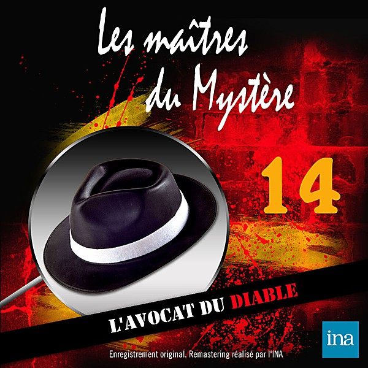

# 1957

By **Various Artists**

## Album Data

- **Catalog:** Beets
- **Format:** Digital, Album
- **Album:** 1957
- **Artist:** Various Artists
- **Albumartist:** Various Artists
- **Genre:** Vocal Jazz
- **MusicBrainz Album Artist ID:** 
- **MusicBrainz Album ID:** 
- **MusicBrainz Release Group ID:** 
- **Year:** 1957
- **Catalog #:** 
- **Label:** 
- **Total Tracks:** 00

## Album Tracks

### Track 20 - At The Hop

- **Artist:** Danny & The Juniors
- **Format:** AAC
- **Genre:** Rock And Roll
- **Length:** 2:32
- **MusicBrainz Track ID:** 
- **Title:** At The Hop
- **Track:** 20
- **Year:** 1958

### Track 17 - Volare

- **Artist:** Domenico Modugno
- **Format:** MP3
- **Genre:** Pop
- **Length:** 3:37
- **MusicBrainz Track ID:** 
- **Title:** Volare
- **Track:** 17
- **Year:** 1958

### Track 00 - Tequila

- **Artist:** The Champs
- **Format:** MP3
- **Genre:** Rock And Roll
- **Length:** 2:16
- **MusicBrainz Track ID:** 
- **Title:** Tequila
- **Track:** 00
- **Year:** 0000

### Track 13 - It's All In The Game

- **Artist:** Tommy Edwards
- **Format:** AAC
- **Genre:** Pop
- **Length:** 2:38
- **MusicBrainz Track ID:** 
- **Title:** It's All In The Game
- **Track:** 13
- **Year:** 1958

### Track 01 - The Platters - Twilight Time (

- **Artist:** Various Artists
- **Format:** AAC
- **Genre:** Emo
- **Length:** 2:44
- **MusicBrainz Track ID:** 
- **Title:** The Platters - Twilight Time (
- **Track:** 01
- **Year:** 1958

### Track 03 - 1958-14 Perez Prado - Patricia

- **Artist:** Various Artists
- **Format:** AAC
- **Genre:** Emo
- **Length:** 2:10
- **MusicBrainz Track ID:** 
- **Title:** 1958-14 Perez Prado - Patricia
- **Track:** 03
- **Year:** 1958

