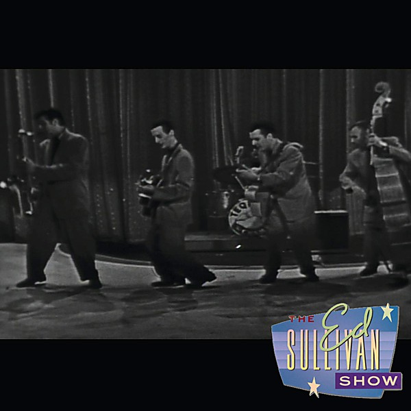

# 1958

By **Various Artists**

## Album Data

- **Catalog:** Beets
- **Format:** Digital, Album
- **Album:** 1958
- **Artist:** Various Artists
- **Albumartist:** Various Artists
- **Genre:** Rock And Roll
- **MusicBrainz Album Artist ID:** 
- **MusicBrainz Album ID:** 
- **MusicBrainz Release Group ID:** 
- **Year:** 0000
- **Catalog #:** 
- **Label:** 
- **Total Tracks:** 00

## Album Tracks

### Track 21 - Dream Lover

- **Artist:** Bobby Darin
- **Format:** MP3
- **Genre:** Pop
- **Length:** 2:30
- **MusicBrainz Track ID:** 
- **Title:** Dream Lover
- **Track:** 21
- **Year:** 1959

### Track 13 - The Three Bells

- **Artist:** The Browns
- **Format:** AAC
- **Genre:** Nashville Sound
- **Length:** 2:50
- **MusicBrainz Track ID:** 
- **Title:** The Three Bells
- **Track:** 13
- **Year:** 1959

### Track 04 - 1959-19 Bobby Darin - Mack The Knife 0

- **Artist:** Various Artists
- **Format:** MP3
- **Genre:** Emo
- **Length:** 3:08
- **MusicBrainz Track ID:** 
- **Title:** 1959-19 Bobby Darin - Mack The Knife 0
- **Track:** 04
- **Year:** 1959

### Track 18 - Crests - Sixteen Candles

- **Artist:** Various Artists
- **Format:** AAC
- **Genre:** Emo
- **Length:** 2:52
- **MusicBrainz Track ID:** 
- **Title:** Crests - Sixteen Candles
- **Track:** 18
- **Year:** 1959

