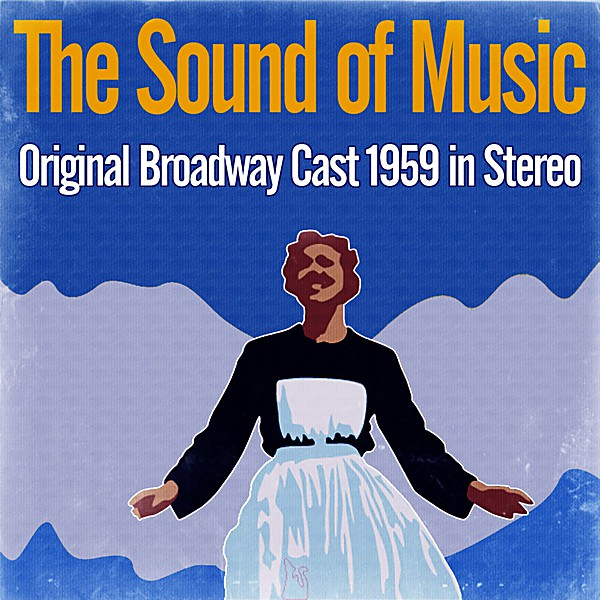

# 1959

By **Various Artists**

## Album Data

- **Catalog:** Beets
- **Format:** Digital, Album
- **Album:** 1959
- **Artist:** Various Artists
- **Albumartist:** Various Artists
- **Genre:** Emo
- **MusicBrainz Album Artist ID:** 
- **MusicBrainz Album ID:** 
- **MusicBrainz Release Group ID:** 
- **Year:** 1959
- **Catalog #:** 
- **Label:** 
- **Total Tracks:** 00

## Album Tracks

### Track 17 - My Heart Has A Mind Of Its Own

- **Artist:** Connie Francis
- **Format:** AAC
- **Genre:** Classic Country
- **Length:** 2:34
- **MusicBrainz Track ID:** 
- **Title:** My Heart Has A Mind Of Its Own
- **Track:** 17
- **Year:** 1960

### Track 10 - Cathy's Clown

- **Artist:** Everly Brothers
- **Format:** MP3
- **Genre:** Rockabilly
- **Length:** 2:26
- **MusicBrainz Track ID:** 
- **Title:** Cathy's Clown
- **Track:** 10
- **Year:** 1960

### Track 23 - Why

- **Artist:** Frankie Avalon
- **Format:** AAC
- **Genre:** Pop
- **Length:** 2:36
- **MusicBrainz Track ID:** 
- **Title:** Why
- **Track:** 23
- **Year:** 1960

### Track 11 - El Paso

- **Artist:** Marty Robbins
- **Format:** AAC
- **Genre:** Classic Country
- **Length:** 4:39
- **MusicBrainz Track ID:** 
- **Title:** El Paso
- **Track:** 11
- **Year:** 1960

### Track 20 - Teen Angel - Mark Dinning

- **Artist:** Various Artists
- **Format:** AAC
- **Genre:** Emo
- **Length:** 2:42
- **MusicBrainz Track ID:** 
- **Title:** Teen Angel - Mark Dinning
- **Track:** 20
- **Year:** 1960

