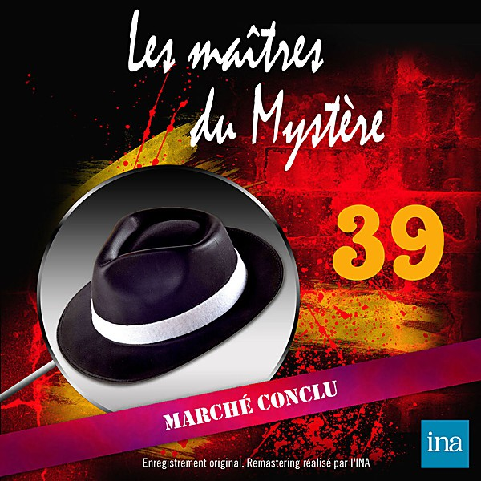

# 1962

By **Various Artists**

## Album Data

- **Catalog:** Beets
- **Format:** Digital, Album
- **Album:** 1962
- **Artist:** Various Artists
- **Albumartist:** Various Artists
- **Genre:** Emo
- **MusicBrainz Album Artist ID:** 
- **MusicBrainz Album ID:** 
- **MusicBrainz Release Group ID:** 
- **Year:** 1962
- **Catalog #:** 
- **Label:** 
- **Total Tracks:** 00

## Album Tracks

### Track 18 - Surfin' U.S.A.

- **Artist:** Beach Boys
- **Format:** AAC
- **Genre:** Surf Rock
- **Length:** 2:28
- **MusicBrainz Track ID:** 
- **Title:** Surfin' U.S.A.
- **Track:** 18
- **Year:** 1963

### Track 11 - He's So Fine by The Chiffons

- **Artist:** Chiffons
- **Format:** MP3
- **Genre:** Soul
- **Length:** 1:49
- **MusicBrainz Track ID:** 
- **Title:** He's So Fine by The Chiffons
- **Track:** 11
- **Year:** 1963

### Track 16 - Surf City

- **Artist:** Jan & Dean
- **Format:** AAC
- **Genre:** Surf Rock
- **Length:** 2:27
- **MusicBrainz Track ID:** 
- **Title:** Surf City
- **Track:** 16
- **Year:** 1963

### Track 10 - If You Want To Be Happy

- **Artist:** Jimmy Soul
- **Format:** AAC
- **Genre:** Black Metal
- **Length:** 2:19
- **MusicBrainz Track ID:** 
- **Title:** If You Want To Be Happy
- **Track:** 10
- **Year:** 1963

### Track 13 - Louie, Louie

- **Artist:** Kingsmen
- **Format:** AAC
- **Genre:** Rock And Roll
- **Length:** 2:47
- **MusicBrainz Track ID:** 
- **Title:** Louie, Louie
- **Track:** 13
- **Year:** 1963

### Track 01 - Sukiyaki

- **Artist:** Kyu Sakamoto
- **Format:** AAC
- **Genre:** Pop
- **Length:** 3:09
- **MusicBrainz Track ID:** 
- **Title:** Sukiyaki
- **Track:** 01
- **Year:** 1963

### Track 12 - It's My Party

- **Artist:** Lesley Gore
- **Format:** AAC
- **Genre:** Pop
- **Length:** 2:20
- **MusicBrainz Track ID:** 
- **Title:** It's My Party
- **Track:** 12
- **Year:** 1963

### Track 20 - Puff the Magic Dragon

- **Artist:** Peter, Paul, and Mary
- **Format:** AAC
- **Genre:** Easy Listening
- **Length:** 3:26
- **MusicBrainz Track ID:** 
- **Title:** Puff the Magic Dragon
- **Track:** 20
- **Year:** 1963

### Track 08 - The End Of The World

- **Artist:** Skeeter Davis
- **Format:** AAC
- **Genre:** Pop
- **Length:** 2:38
- **MusicBrainz Track ID:** 
- **Title:** The End Of The World
- **Track:** 08
- **Year:** 1963

### Track 06 - Go Away Little Girl

- **Artist:** Steve Lawrence
- **Format:** AAC
- **Genre:** Pop
- **Length:** 2:16
- **MusicBrainz Track ID:** 
- **Title:** Go Away Little Girl
- **Track:** 06
- **Year:** 1963

### Track 21 - Walk Like a Man

- **Artist:** The Four Seasons
- **Format:** AAC
- **Genre:** Rock
- **Length:** 2:17
- **MusicBrainz Track ID:** 
- **Title:** Walk Like a Man
- **Track:** 21
- **Year:** 1963

### Track 05 - DOMINIQUE

- **Artist:** The_Singing_Nun
- **Format:** MP3
- **Genre:** Pop
- **Length:** 2:59
- **MusicBrainz Track ID:** 
- **Title:** DOMINIQUE
- **Track:** 05
- **Year:** 1963

