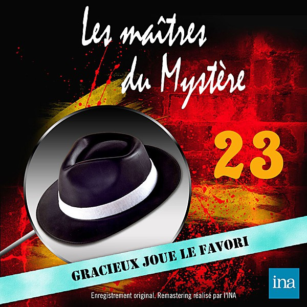

# 1964

By **Various Artists**

## Album Data

- **Catalog:** Beets
- **Format:** Digital, Album
- **Album:** 1964
- **Artist:** Various Artists
- **Albumartist:** Various Artists
- **Genre:** Rock
- **MusicBrainz Album Artist ID:** 
- **MusicBrainz Album ID:** 
- **MusicBrainz Release Group ID:** 
- **Year:** 1964
- **Catalog #:** 
- **Label:** 
- **Total Tracks:** 00

## Album Tracks

### Track 00 - Help Me Rhonda

- **Artist:** Beach Boys
- **Format:** AAC
- **Genre:** Surf Rock
- **Length:** 2:47
- **MusicBrainz Track ID:** 
- **Title:** Help Me Rhonda
- **Track:** 00
- **Year:** 1965

### Track 22 - Over and Over (1965)

- **Artist:** Dave Clark Five
- **Format:** AAC
- **Genre:** Rock And Roll
- **Length:** 2:01
- **MusicBrainz Track ID:** 
- **Title:** Over and Over (1965)
- **Track:** 22
- **Year:** 1965

### Track 19 - I'm Telling You Now

- **Artist:** Freddie & the Dreamers
- **Format:** AAC
- **Genre:** Rock
- **Length:** 2:10
- **MusicBrainz Track ID:** 
- **Title:** I'm Telling You Now
- **Track:** 19
- **Year:** 1965

### Track 00 - This Diamond Ring

- **Artist:** Gary Lewis and the Playboys
- **Format:** AAC
- **Genre:** Rock
- **Length:** 2:14
- **MusicBrainz Track ID:** 
- **Title:** This Diamond Ring
- **Track:** 00
- **Year:** 1965

### Track 27 - I'm Henry the Eighth I Am

- **Artist:** Herman's Hermits
- **Format:** AAC
- **Genre:** Rock
- **Length:** 1:54
- **MusicBrainz Track ID:** 
- **Title:** I'm Henry the Eighth I Am
- **Track:** 27
- **Year:** 1965

### Track 10 - Downtown

- **Artist:** Petula Clark
- **Format:** AAC
- **Genre:** Pop
- **Length:** 3:07
- **MusicBrainz Track ID:** 
- **Title:** Downtown
- **Track:** 10
- **Year:** 1965

### Track 28 - The 'In' Crowd

- **Artist:** Ramsey Lewis Trio
- **Format:** AAC
- **Genre:** Jazz
- **Length:** 5:51
- **MusicBrainz Track ID:** 
- **Title:** The 'In' Crowd
- **Track:** 28
- **Year:** 1965

### Track 25 - Wolly Bully (2)

- **Artist:** Sam The Sham & The Pharohs
- **Format:** AAC
- **Genre:** Rock And Roll
- **Length:** 2:18
- **MusicBrainz Track ID:** 
- **Title:** Wolly Bully (2)
- **Track:** 25
- **Year:** 1965

### Track 00 - I've Got You Babe

- **Artist:** Sonny and Cher
- **Format:** MP3
- **Genre:** Pop
- **Length:** 3:13
- **MusicBrainz Track ID:** 
- **Title:** I've Got You Babe
- **Track:** 00
- **Year:** 1965

### Track 02 - My Girl

- **Artist:** Temptations
- **Format:** AAC
- **Genre:** Soul
- **Length:** 2:54
- **MusicBrainz Track ID:** 
- **Title:** My Girl
- **Track:** 02
- **Year:** 1965

### Track 00 - Ticket To Ride

- **Artist:** The Beatles
- **Format:** AAC
- **Genre:** Rock And Roll
- **Length:** 3:10
- **MusicBrainz Track ID:** 
- **Title:** Ticket To Ride
- **Track:** 00
- **Year:** 1965

### Track 00 - Yesterday

- **Artist:** The Beatles
- **Format:** AAC
- **Genre:** Rock
- **Length:** 2:05
- **MusicBrainz Track ID:** 
- **Title:** Yesterday
- **Track:** 00
- **Year:** 1965

### Track 08 - Eight Days A Week

- **Artist:** The Beatles
- **Format:** MP3
- **Genre:** Rock And Roll
- **Length:** 2:44
- **MusicBrainz Track ID:** 
- **Title:** Eight Days A Week
- **Track:** 08
- **Year:** 1965

### Track 01 - Mr. Tambourine Man

- **Artist:** The Byrds
- **Format:** AAC
- **Genre:** Psychedelic Rock
- **Length:** 2:29
- **MusicBrainz Track ID:** 
- **Title:** Mr. Tambourine Man
- **Track:** 01
- **Year:** 1965

### Track 12 - Turn! Turn! Turn!

- **Artist:** The Byrds
- **Format:** MP3
- **Genre:** Folk Rock
- **Length:** 3:46
- **MusicBrainz Track ID:** 
- **Title:** Turn! Turn! Turn!
- **Track:** 12
- **Year:** 1965

### Track 00 - Let's Hang On

- **Artist:** The Four Seasons
- **Format:** MP3
- **Genre:** Soft Rock
- **Length:** 3:17
- **MusicBrainz Track ID:** 
- **Title:** Let's Hang On
- **Track:** 00
- **Year:** 1965

### Track 17 - I Can't Help Myself (Sugar Pie Honey Bunch)

- **Artist:** The Four Tops
- **Format:** AAC
- **Genre:** Soul
- **Length:** 2:44
- **MusicBrainz Track ID:** 
- **Title:** I Can't Help Myself (Sugar Pie Honey Bunch)
- **Track:** 17
- **Year:** 1965

### Track 00 - I Hear A Symphony

- **Artist:** The Supremes
- **Format:** AAC
- **Genre:** Soul
- **Length:** 2:43
- **MusicBrainz Track ID:** 
- **Title:** I Hear A Symphony
- **Track:** 00
- **Year:** 1965

### Track 19 - Back In My Arms Again

- **Artist:** The Supremes
- **Format:** AAC
- **Genre:** Soul
- **Length:** 2:55
- **MusicBrainz Track ID:** 
- **Title:** Back In My Arms Again
- **Track:** 19
- **Year:** 1965

### Track 00 - 1965-08 Supremes - Stop! In The Name Of Love

- **Artist:** Various Artists
- **Format:** AAC
- **Genre:** Emo
- **Length:** 2:53
- **MusicBrainz Track ID:** 
- **Title:** 1965-08 Supremes - Stop! In The Name Of Love
- **Track:** 00
- **Year:** 1965

### Track 00 - 1965-11 Herman's Hermits - Mrs. Brown You've Got A Lovely Da

- **Artist:** Various Artists
- **Format:** AAC
- **Genre:** Emo
- **Length:** 2:48
- **MusicBrainz Track ID:** 
- **Title:** 1965-11 Herman's Hermits - Mrs. Brown You've Got A Lovely Da
- **Track:** 00
- **Year:** 1965

### Track 00 - 1965-18 Rolling Stones - Satisfaction

- **Artist:** Various Artists
- **Format:** AAC
- **Genre:** Emo
- **Length:** 3:43
- **MusicBrainz Track ID:** 
- **Title:** 1965-18 Rolling Stones - Satisfaction
- **Track:** 00
- **Year:** 1965

### Track 00 - 1965-21 Beatles - Help

- **Artist:** Various Artists
- **Format:** AAC
- **Genre:** Emo
- **Length:** 2:19
- **MusicBrainz Track ID:** 
- **Title:** 1965-21 Beatles - Help
- **Track:** 00
- **Year:** 1965

### Track 00 - 1965-22 Barry McGuire - Eve Of Destruction

- **Artist:** Various Artists
- **Format:** MP3
- **Genre:** Emo
- **Length:** 3:37
- **MusicBrainz Track ID:** 
- **Title:** 1965-22 Barry McGuire - Eve Of Destruction
- **Track:** 00
- **Year:** 1965

### Track 00 - 1965-27 Rolling Stones - Get Off Of My Cloud

- **Artist:** Various Artists
- **Format:** MP3
- **Genre:** Emo
- **Length:** 3:01
- **MusicBrainz Track ID:** 
- **Title:** 1965-27 Rolling Stones - Get Off Of My Cloud
- **Track:** 00
- **Year:** 1965

### Track 02 - The McCoys - Hang On Sloopy

- **Artist:** Various Artists
- **Format:** AAC
- **Genre:** Emo
- **Length:** 3:02
- **MusicBrainz Track ID:** 
- **Title:** The McCoys - Hang On Sloopy
- **Track:** 02
- **Year:** 1965

### Track 03 - 1965-03 Righteous Brothers - You've Lost That Lovin' Feeling

- **Artist:** Various Artists
- **Format:** AAC
- **Genre:** Emo
- **Length:** 3:43
- **MusicBrainz Track ID:** 
- **Title:** 1965-03 Righteous Brothers - You've Lost That Lovin' Feeling
- **Track:** 03
- **Year:** 1965

### Track 26 - 1965-01 Jewel Akens - The Birds and The Bees

- **Artist:** Various Artists
- **Format:** AAC
- **Genre:** Emo
- **Length:** 2:09
- **MusicBrainz Track ID:** 
- **Title:** 1965-01 Jewel Akens - The Birds and The Bees
- **Track:** 26
- **Year:** 1965

### Track 06 - Game Of Love

- **Artist:** Wayne Fontana and the Mindbend
- **Format:** AAC
- **Genre:** Pop Rock
- **Length:** 2:06
- **MusicBrainz Track ID:** 
- **Title:** Game Of Love
- **Track:** 06
- **Year:** 1965

### Track 20 - You Were On My Mind

- **Artist:** We Five
- **Format:** AAC
- **Genre:** Folk Rock
- **Length:** 2:37
- **MusicBrainz Track ID:** 
- **Title:** You Were On My Mind
- **Track:** 20
- **Year:** 1965

