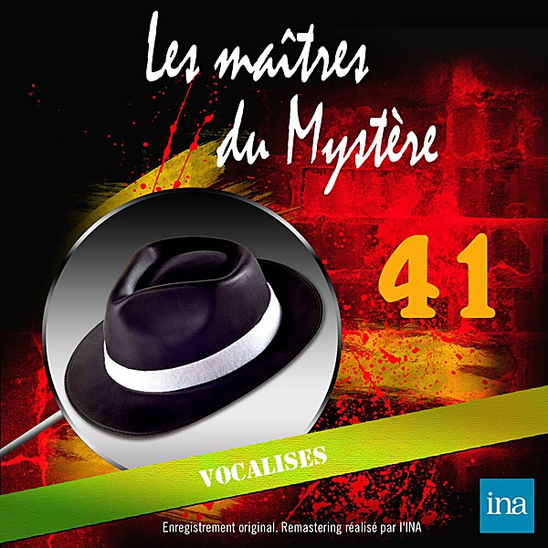

# 1965

By **Various Artists**

## Album Data

- **Catalog:** Beets
- **Format:** Digital, Album
- **Album:** 1965
- **Artist:** Various Artists
- **Albumartist:** Various Artists
- **Genre:** Emo
- **MusicBrainz Album Artist ID:** 
- **MusicBrainz Album ID:** 
- **MusicBrainz Release Group ID:** 
- **Year:** 1965
- **Catalog #:** 
- **Label:** 
- **Total Tracks:** 00

## Album Tracks

### Track 13 - we can work it out

- **Artist:** The Beatles
- **Format:** AAC
- **Genre:** Rock
- **Length:** 2:15
- **MusicBrainz Track ID:** 
- **Title:** we can work it out
- **Track:** 13
- **Year:** 1966

### Track 19 - You Can't Hurry Love

- **Artist:** Diana Ross & the Supremes
- **Format:** AAC
- **Genre:** Soul
- **Length:** 2:46
- **MusicBrainz Track ID:** 
- **Title:** You Can't Hurry Love
- **Track:** 19
- **Year:** 1966

### Track 07 - Poor Side of Town

- **Artist:** Johnny Rivers
- **Format:** AAC
- **Genre:** Soul
- **Length:** 3:37
- **MusicBrainz Track ID:** 
- **Title:** Poor Side of Town
- **Track:** 07
- **Year:** 1966

### Track 24 - Lightnin' Strikes

- **Artist:** Lou Christie
- **Format:** AAC
- **Genre:** Northern Soul
- **Length:** 2:56
- **MusicBrainz Track ID:** 
- **Title:** Lightnin' Strikes
- **Track:** 24
- **Year:** 1966

### Track 02 - These Boots Are Made For Walkin'

- **Artist:** Nancy Sinatra
- **Format:** AAC
- **Genre:** Rock
- **Length:** 2:42
- **MusicBrainz Track ID:** 
- **Title:** These Boots Are Made For Walkin'
- **Track:** 02
- **Year:** 1966

### Track 11 - When A Man Loves A Woman

- **Artist:** Percy Sledge
- **Format:** AAC
- **Genre:** Soul
- **Length:** 2:53
- **MusicBrainz Track ID:** 
- **Title:** When A Man Loves A Woman
- **Track:** 11
- **Year:** 1966

### Track 11 - My Love

- **Artist:** Petula Clark
- **Format:** MP3
- **Genre:** Pop
- **Length:** 2:47
- **MusicBrainz Track ID:** 
- **Title:** My Love
- **Track:** 11
- **Year:** 1966

### Track 00 - 96 Tears

- **Artist:** Question Mark And The Mysteria
- **Format:** AAC
- **Genre:** Garage Rock
- **Length:** 2:56
- **MusicBrainz Track ID:** 
- **Title:** 96 Tears
- **Track:** 00
- **Year:** 1966

### Track 15 - (You're My) Soul and Inspirati

- **Artist:** Righteous Brothers
- **Format:** AAC
- **Genre:** Soul
- **Length:** 3:23
- **MusicBrainz Track ID:** 
- **Title:** (You're My) Soul and Inspirati
- **Track:** 15
- **Year:** 1966

### Track 19 - Ballad Of The Green Berets

- **Artist:** SSG Barry Sadler
- **Format:** AAC
- **Genre:** Rock
- **Length:** 2:28
- **MusicBrainz Track ID:** 
- **Title:** Ballad Of The Green Berets
- **Track:** 19
- **Year:** 1966

### Track 15 - Cherish

- **Artist:** The Association
- **Format:** AAC
- **Genre:** Sunshine Pop
- **Length:** 3:25
- **MusicBrainz Track ID:** 
- **Title:** Cherish
- **Track:** 15
- **Year:** 1966

### Track 21 - Good Vibrations

- **Artist:** The Beach Boys
- **Format:** AAC
- **Genre:** Surf Rock
- **Length:** 3:35
- **MusicBrainz Track ID:** 
- **Title:** Good Vibrations
- **Track:** 21
- **Year:** 1966

### Track 08 - Summer in The City

- **Artist:** The Lovin' Spoonful
- **Format:** AAC
- **Genre:** Rock
- **Length:** 2:43
- **MusicBrainz Track ID:** 
- **Title:** Summer in The City
- **Track:** 08
- **Year:** 1966

### Track 05 - California Dreamin' - The Mamas & the Papas

- **Artist:** The Mamas & the Papas
- **Format:** AAC
- **Genre:** Sunshine Pop
- **Length:** 2:38
- **MusicBrainz Track ID:** 
- **Title:** California Dreamin' - The Mamas & the Papas
- **Track:** 05
- **Year:** 1966

### Track 00 - Monday, Monday

- **Artist:** The Mamas And The Papas
- **Format:** AAC
- **Genre:** Rock
- **Length:** 3:20
- **MusicBrainz Track ID:** 
- **Title:** Monday, Monday
- **Track:** 00
- **Year:** 1966

### Track 00 - I'm a Believer

- **Artist:** The Monkees
- **Format:** AAC
- **Genre:** Rock
- **Length:** 2:45
- **MusicBrainz Track ID:** 
- **Title:** I'm a Believer
- **Track:** 00
- **Year:** 1966

### Track 24 - Winchester Cathedral

- **Artist:** The New Vaudeville Band
- **Format:** MP3
- **Genre:** Pop
- **Length:** 2:26
- **MusicBrainz Track ID:** 
- **Title:** Winchester Cathedral
- **Track:** 24
- **Year:** 1966

### Track 00 - 1966-01 Simon and Garfunkel - Sounds Of Silence

- **Artist:** Various Artists
- **Format:** AAC
- **Genre:** Emo
- **Length:** 3:04
- **MusicBrainz Track ID:** 
- **Title:** 1966-01 Simon and Garfunkel - Sounds Of Silence
- **Track:** 00
- **Year:** 0000

### Track 00 - 1966-12 Rolling Stones - Paint It Black

- **Artist:** Various Artists
- **Format:** MP3
- **Genre:** Emo
- **Length:** 3:50
- **MusicBrainz Track ID:** 
- **Title:** 1966-12 Rolling Stones - Paint It Black
- **Track:** 00
- **Year:** 0000

### Track 00 - 1966-13 Beatles - Paperback Writer

- **Artist:** Various Artists
- **Format:** AAC
- **Genre:** Emo
- **Length:** 2:18
- **MusicBrainz Track ID:** 
- **Title:** 1966-13 Beatles - Paperback Writer
- **Track:** 00
- **Year:** 0000

### Track 00 - 1966-14 Frank Sinatra - Strangers In The Night

- **Artist:** Various Artists
- **Format:** AAC
- **Genre:** Emo
- **Length:** 2:38
- **MusicBrainz Track ID:** 
- **Title:** 1966-14 Frank Sinatra - Strangers In The Night
- **Track:** 00
- **Year:** 0000

### Track 00 - 1966-21 Four Tops - Reach Out I'll Be There

- **Artist:** Various Artists
- **Format:** AAC
- **Genre:** Emo
- **Length:** 2:55
- **MusicBrainz Track ID:** 
- **Title:** 1966-21 Four Tops - Reach Out I'll Be There
- **Track:** 00
- **Year:** 0000

### Track 00 - 1966-23 Monkees - Last Train To Clarksville

- **Artist:** Various Artists
- **Format:** MP3
- **Genre:** Emo
- **Length:** 2:46
- **MusicBrainz Track ID:** 
- **Title:** 1966-23 Monkees - Last Train To Clarksville
- **Track:** 00
- **Year:** 0000

### Track 00 - 1966-26 Mitch Ryder and The Detroit Wheels - Devil With A Bl

- **Artist:** Various Artists
- **Format:** AAC
- **Genre:** Emo
- **Length:** 3:31
- **MusicBrainz Track ID:** 
- **Title:** 1966-26 Mitch Ryder and The Detroit Wheels - Devil With A Bl
- **Track:** 00
- **Year:** 0000

### Track 00 - Good Lovin

- **Artist:** Various Artists
- **Format:** AAC
- **Genre:** Emo
- **Length:** 2:28
- **MusicBrainz Track ID:** 
- **Title:** Good Lovin
- **Track:** 00
- **Year:** 1966

### Track 00 - Hanky Panky

- **Artist:** Various Artists
- **Format:** AAC
- **Genre:** Emo
- **Length:** 2:54
- **MusicBrainz Track ID:** 
- **Title:** Hanky Panky
- **Track:** 00
- **Year:** 1966

### Track 01 - Born Free

- **Artist:** Various Artists
- **Format:** AAC
- **Genre:** Emo
- **Length:** 2:25
- **MusicBrainz Track ID:** 
- **Title:** Born Free
- **Track:** 01
- **Year:** 1966

### Track 12 - 12 - 1966-18 Donovan - Sunshine Superman

- **Artist:** Various Artists
- **Format:** MP3
- **Genre:** Emo
- **Length:** 4:36
- **MusicBrainz Track ID:** 
- **Title:** 12 - 1966-18 Donovan - Sunshine Superman
- **Track:** 12
- **Year:** 1966

### Track 14 - You Keep Me Hangin On

- **Artist:** Various Artists
- **Format:** AAC
- **Genre:** Emo
- **Length:** 2:43
- **MusicBrainz Track ID:** 
- **Title:** You Keep Me Hangin On
- **Track:** 14
- **Year:** 1966

### Track 26 - Wild Thing

- **Artist:** Various Artists
- **Format:** AAC
- **Genre:** Rock
- **Length:** 2:36
- **MusicBrainz Track ID:** 
- **Title:** Wild Thing
- **Track:** 26
- **Year:** 1966

