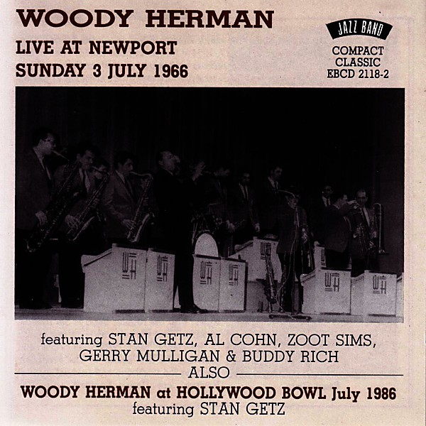

# 1966

By **Various Artists**

## Album Data

- **Catalog:** Beets
- **Format:** Digital, Album
- **Album:** 1966
- **Artist:** Various Artists
- **Albumartist:** Various Artists
- **Genre:** Emo
- **MusicBrainz Album Artist ID:** 
- **MusicBrainz Album ID:** 
- **MusicBrainz Release Group ID:** 
- **Year:** 0000
- **Catalog #:** 
- **Label:** 
- **Total Tracks:** 00

## Album Tracks

### Track 21 - Tell It Like It Is

- **Artist:** Aaron Neville
- **Format:** MP3
- **Genre:** Soul
- **Length:** 3:08
- **MusicBrainz Track ID:** 
- **Title:** Tell It Like It Is
- **Track:** 21
- **Year:** 1967

### Track 21 - Ode To Billy Joe

- **Artist:** Bobbie Gentry
- **Format:** AAC
- **Genre:** Country
- **Length:** 4:12
- **MusicBrainz Track ID:** 
- **Title:** Ode To Billy Joe
- **Track:** 21
- **Year:** 1967

### Track 19 - Come Back When You Grow Up

- **Artist:** Bobby Vee
- **Format:** AAC
- **Genre:** Soft Rock
- **Length:** 2:50
- **MusicBrainz Track ID:** 
- **Title:** Come Back When You Grow Up
- **Track:** 19
- **Year:** 1967

### Track 00 - Love Is Here a Now You're Gone

- **Artist:** Diana Ross and the Supremes
- **Format:** AAC
- **Genre:** Soul
- **Length:** 2:45
- **MusicBrainz Track ID:** 
- **Title:** Love Is Here a Now You're Gone
- **Track:** 00
- **Year:** 1967

### Track 17 - Light My Fire

- **Artist:** Doors
- **Format:** AAC
- **Genre:** Psychedelic Rock
- **Length:** 7:05
- **MusicBrainz Track ID:** 
- **Title:** Light My Fire
- **Track:** 17
- **Year:** 1967

### Track 00 - Something stupid (with Nancy S

- **Artist:** Frank Sinatra
- **Format:** AAC
- **Genre:** Pop
- **Length:** 2:40
- **MusicBrainz Track ID:** 
- **Title:** Something stupid (with Nancy S
- **Track:** 00
- **Year:** 1967

### Track 14 - I Heard It Throught The Grapevine

- **Artist:** Gladys Knight & The Pips
- **Format:** AAC
- **Genre:** Soul
- **Length:** 2:47
- **MusicBrainz Track ID:** 
- **Title:** I Heard It Throught The Grapevine
- **Track:** 14
- **Year:** 1967

### Track 01 - I Was Made To Love Her

- **Artist:** Stevie Wonder
- **Format:** MP3
- **Genre:** Soul
- **Length:** 2:35
- **MusicBrainz Track ID:** 
- **Title:** I Was Made To Love Her
- **Track:** 01
- **Year:** 1967

### Track 00 - Hello Goodbye

- **Artist:** The Beatles
- **Format:** AAC
- **Genre:** Rock
- **Length:** 3:28
- **MusicBrainz Track ID:** 
- **Title:** Hello Goodbye
- **Track:** 00
- **Year:** 1967

### Track 13 - All You Need Is Love

- **Artist:** The Beatles
- **Format:** AAC
- **Genre:** Rock
- **Length:** 3:47
- **MusicBrainz Track ID:** 
- **Title:** All You Need Is Love
- **Track:** 13
- **Year:** 1967

### Track 17 - Penny Lane

- **Artist:** The Beatles
- **Format:** AAC
- **Genre:** Rock
- **Length:** 3:01
- **MusicBrainz Track ID:** 
- **Title:** Penny Lane
- **Track:** 17
- **Year:** 1967

### Track 00 - The Rain, The Park & Other Things

- **Artist:** The Cowsills
- **Format:** AAC
- **Genre:** Pop
- **Length:** 3:04
- **MusicBrainz Track ID:** 
- **Title:** The Rain, The Park & Other Things
- **Track:** 00
- **Year:** 1967

### Track 13 - Daydream Believer

- **Artist:** The Monkees
- **Format:** AAC
- **Genre:** Rock
- **Length:** 2:58
- **MusicBrainz Track ID:** 
- **Title:** Daydream Believer
- **Track:** 13
- **Year:** 1967

### Track 00 - Happy Together

- **Artist:** The Turtles
- **Format:** AAC
- **Genre:** Rock
- **Length:** 2:53
- **MusicBrainz Track ID:** 
- **Title:** Happy Together
- **Track:** 00
- **Year:** 1967

### Track 00 - Groovin'

- **Artist:** The Young Rascals
- **Format:** AAC
- **Genre:** Soul
- **Length:** 2:29
- **MusicBrainz Track ID:** 
- **Title:** Groovin'
- **Track:** 00
- **Year:** 1967

### Track 00 - 1967-03 Rolling Stones - Ruby Tuesday

- **Artist:** Various Artists
- **Format:** MP3
- **Genre:** Emo
- **Length:** 3:20
- **MusicBrainz Track ID:** 
- **Title:** 1967-03 Rolling Stones - Ruby Tuesday
- **Track:** 00
- **Year:** 1967

### Track 00 - 1967-10 Aretha Franklin - Respect

- **Artist:** Various Artists
- **Format:** AAC
- **Genre:** Emo
- **Length:** 2:24
- **MusicBrainz Track ID:** 
- **Title:** 1967-10 Aretha Franklin - Respect
- **Track:** 00
- **Year:** 1967

### Track 00 - 1967-11 Association - Windy

- **Artist:** Various Artists
- **Format:** AAC
- **Genre:** Emo
- **Length:** 2:55
- **MusicBrainz Track ID:** 
- **Title:** 1967-11 Association - Windy
- **Track:** 00
- **Year:** 1967

### Track 00 - 1967-15 Music Explosion - Little Bit O Soul

- **Artist:** Various Artists
- **Format:** AAC
- **Genre:** Emo
- **Length:** 2:21
- **MusicBrainz Track ID:** 
- **Title:** 1967-15 Music Explosion - Little Bit O Soul
- **Track:** 00
- **Year:** 1967

### Track 00 - 1967-20 Association - Never My Love

- **Artist:** Various Artists
- **Format:** AAC
- **Genre:** Emo
- **Length:** 3:13
- **MusicBrainz Track ID:** 
- **Title:** 1967-20 Association - Never My Love
- **Track:** 00
- **Year:** 1967

### Track 00 - 1967-21 Lulu - To Sir With Love

- **Artist:** Various Artists
- **Format:** AAC
- **Genre:** Emo
- **Length:** 2:43
- **MusicBrainz Track ID:** 
- **Title:** 1967-21 Lulu - To Sir With Love
- **Track:** 00
- **Year:** 1967

### Track 00 - 1967-22 Strawberry Alarm Clock - Incense And Peppermint

- **Artist:** Various Artists
- **Format:** AAC
- **Genre:** Emo
- **Length:** 2:49
- **MusicBrainz Track ID:** 
- **Title:** 1967-22 Strawberry Alarm Clock - Incense And Peppermint
- **Track:** 00
- **Year:** 1967

### Track 03 - Kind of a Drag - The Buckinghams

- **Artist:** Various Artists
- **Format:** MP3
- **Genre:** Emo
- **Length:** 2:10
- **MusicBrainz Track ID:** 
- **Title:** Kind of a Drag - The Buckinghams
- **Track:** 03
- **Year:** 1967

### Track 04 - 04 - 1967-08 Supremes - The Happening

- **Artist:** Various Artists
- **Format:** MP3
- **Genre:** Emo
- **Length:** 2:48
- **MusicBrainz Track ID:** 
- **Title:** 04 - 1967-08 Supremes - The Happening
- **Track:** 04
- **Year:** 1967

### Track 07 - 1967-12 Frankie Valli - Can't Take My Eyes Off You 0

- **Artist:** Various Artists
- **Format:** AAC
- **Genre:** Emo
- **Length:** 3:23
- **MusicBrainz Track ID:** 
- **Title:** 1967-12 Frankie Valli - Can't Take My Eyes Off You 0
- **Track:** 07
- **Year:** 1967

### Track 09 - 09 - 1967-19 BoxTops - The Letter

- **Artist:** Various Artists
- **Format:** MP3
- **Genre:** Emo
- **Length:** 1:56
- **MusicBrainz Track ID:** 
- **Title:** 09 - 1967-19 BoxTops - The Letter
- **Track:** 09
- **Year:** 1967

