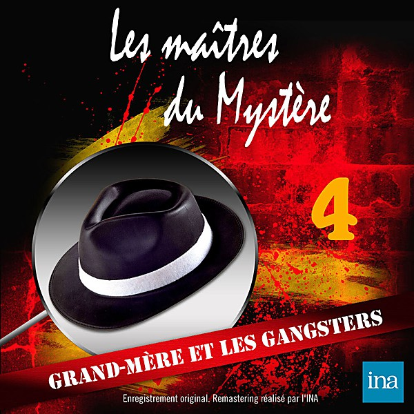

# 1967

By **Various Artists**

## Album Data

- **Catalog:** Beets
- **Format:** Digital, Album
- **Album:** 1967
- **Artist:** Various Artists
- **Albumartist:** Various Artists
- **Genre:** Emo
- **MusicBrainz Album Artist ID:** 
- **MusicBrainz Album ID:** 
- **MusicBrainz Release Group ID:** 
- **Year:** 1967
- **Catalog #:** 
- **Label:** 
- **Total Tracks:** 00

## Album Tracks

### Track 01 - Those Were The Days

- **Artist:** Various Artists
- **Format:** MP3
- **Genre:** Pop
- **Length:** 4:55
- **MusicBrainz Track ID:** 
- **Title:** Those Were The Days
- **Track:** 01
- **Year:** 1968

### Track 02 - 1968-07 Dionne Warwick - Theme From Valley Of The Dolls

- **Artist:** Various Artists
- **Format:** MP3
- **Genre:** Emo
- **Length:** 3:38
- **MusicBrainz Track ID:** 
- **Title:** 1968-07 Dionne Warwick - Theme From Valley Of The Dolls
- **Track:** 02
- **Year:** 1968

### Track 03 - 1968-10 Gary Puckett and the Union Gap - Young Girl

- **Artist:** Various Artists
- **Format:** AAC
- **Genre:** Emo
- **Length:** 3:10
- **MusicBrainz Track ID:** 
- **Title:** 1968-10 Gary Puckett and the Union Gap - Young Girl
- **Track:** 03
- **Year:** 1968

### Track 04 - 04 1968-11 Bobby Goldsboro - Honey

- **Artist:** Various Artists
- **Format:** AAC
- **Genre:** Emo
- **Length:** 3:58
- **MusicBrainz Track ID:** 
- **Title:** 04 1968-11 Bobby Goldsboro - Honey
- **Track:** 04
- **Year:** 1968

### Track 05 - 05 1968-18 Herb Alpert - This Guy's In Love With You

- **Artist:** Various Artists
- **Format:** AAC
- **Genre:** Emo
- **Length:** 3:59
- **MusicBrainz Track ID:** 
- **Title:** 05 1968-18 Herb Alpert - This Guy's In Love With You
- **Track:** 05
- **Year:** 1968

### Track 06 - 06 1968-21 Rolling Stones - Jumpin Jack Flash

- **Artist:** Various Artists
- **Format:** MP3
- **Genre:** Emo
- **Length:** 3:45
- **MusicBrainz Track ID:** 
- **Title:** 06 1968-21 Rolling Stones - Jumpin Jack Flash
- **Track:** 06
- **Year:** 1968

### Track 07 - 07 1968-22 Gary Puckett and the Union Gap - Lady Willpower

- **Artist:** Various Artists
- **Format:** AAC
- **Genre:** Emo
- **Length:** 2:45
- **MusicBrainz Track ID:** 
- **Title:** 07 1968-22 Gary Puckett and the Union Gap - Lady Willpower
- **Track:** 07
- **Year:** 1968

### Track 08 - 08 1968-27 Rascals - People Got To Be Free

- **Artist:** Various Artists
- **Format:** AAC
- **Genre:** Emo
- **Length:** 3:00
- **MusicBrainz Track ID:** 
- **Title:** 08 1968-27 Rascals - People Got To Be Free
- **Track:** 08
- **Year:** 1968

### Track 09 - 09 1968-17 Tommy James and the Shondells - Mony Mony

- **Artist:** Various Artists
- **Format:** AAC
- **Genre:** Emo
- **Length:** 2:49
- **MusicBrainz Track ID:** 
- **Title:** 09 1968-17 Tommy James and the Shondells - Mony Mony
- **Track:** 09
- **Year:** 1968

### Track 10 - 10 1968-32 Crazy World of Arthur Brown - Fire

- **Artist:** Various Artists
- **Format:** AAC
- **Genre:** Emo
- **Length:** 2:55
- **MusicBrainz Track ID:** 
- **Title:** 10 1968-32 Crazy World of Arthur Brown - Fire
- **Track:** 10
- **Year:** 1968

### Track 11 - 11 1968-35 Steppenwolf - Magic Carpet Ride

- **Artist:** Various Artists
- **Format:** MP3
- **Genre:** Emo
- **Length:** 4:27
- **MusicBrainz Track ID:** 
- **Title:** 11 1968-35 Steppenwolf - Magic Carpet Ride
- **Track:** 11
- **Year:** 1968

### Track 12 - 12 1968-36 Supremes - Love Child

- **Artist:** Various Artists
- **Format:** AAC
- **Genre:** Emo
- **Length:** 2:54
- **MusicBrainz Track ID:** 
- **Title:** 12 1968-36 Supremes - Love Child
- **Track:** 12
- **Year:** 1968

### Track 13 - 13 1968-37 Marvin Gaye - I Heard It Through the Grapevine

- **Artist:** Various Artists
- **Format:** AAC
- **Genre:** Emo
- **Length:** 3:12
- **MusicBrainz Track ID:** 
- **Title:** 13 1968-37 Marvin Gaye - I Heard It Through the Grapevine
- **Track:** 13
- **Year:** 1968

### Track 14 - 14 1968-38 Stevie Wonder - For Once In My Life

- **Artist:** Various Artists
- **Format:** AAC
- **Genre:** Emo
- **Length:** 2:51
- **MusicBrainz Track ID:** 
- **Title:** 14 1968-38 Stevie Wonder - For Once In My Life
- **Track:** 14
- **Year:** 1968

### Track 15 - Green Tambourine

- **Artist:** Various Artists
- **Format:** MP3
- **Genre:** Emo
- **Length:** 2:29
- **MusicBrainz Track ID:** 
- **Title:** Green Tambourine
- **Track:** 15
- **Year:** 1968

### Track 16 - Harper Valley P.T.A.

- **Artist:** Various Artists
- **Format:** AAC
- **Genre:** Emo
- **Length:** 3:14
- **MusicBrainz Track ID:** 
- **Title:** Harper Valley P.T.A.
- **Track:** 16
- **Year:** 1968

### Track 17 - Judy in Disguise

- **Artist:** Various Artists
- **Format:** AAC
- **Genre:** Emo
- **Length:** 2:56
- **MusicBrainz Track ID:** 
- **Title:** Judy in Disguise
- **Track:** 17
- **Year:** 1968

### Track 18 - Little Green Apples

- **Artist:** Various Artists
- **Format:** MP3
- **Genre:** Emo
- **Length:** 3:56
- **MusicBrainz Track ID:** 
- **Title:** Little Green Apples
- **Track:** 18
- **Year:** 1968

### Track 19 - Love is blue

- **Artist:** Various Artists
- **Format:** AAC
- **Genre:** Emo
- **Length:** 2:36
- **MusicBrainz Track ID:** 
- **Title:** Love is blue
- **Track:** 19
- **Year:** 1968

### Track 20 - Classical Gas

- **Artist:** Various Artists
- **Format:** AAC
- **Genre:** Emo
- **Length:** 3:06
- **MusicBrainz Track ID:** 
- **Title:** Classical Gas
- **Track:** 20
- **Year:** 1968

### Track 21 - Sitting On the Dock of the Ba

- **Artist:** Various Artists
- **Format:** AAC
- **Genre:** Emo
- **Length:** 2:42
- **MusicBrainz Track ID:** 
- **Title:** Sitting On the Dock of the Ba
- **Track:** 21
- **Year:** 1968

### Track 22 - Valerie

- **Artist:** Various Artists
- **Format:** AAC
- **Genre:** Emo
- **Length:** 2:19
- **MusicBrainz Track ID:** 
- **Title:** Valerie
- **Track:** 22
- **Year:** 1968

### Track 23 - 1968-01 Aretha Franklin - Chain Of Fools

- **Artist:** Various Artists
- **Format:** AAC
- **Genre:** Emo
- **Length:** 2:46
- **MusicBrainz Track ID:** 
- **Title:** 1968-01 Aretha Franklin - Chain Of Fools
- **Track:** 23
- **Year:** 1968

### Track 24 - Hugh Masekela - Grazing In The Grass

- **Artist:** Various Artists
- **Format:** AAC
- **Genre:** Emo
- **Length:** 2:37
- **MusicBrainz Track ID:** 
- **Title:** Hugh Masekela - Grazing In The Grass
- **Track:** 24
- **Year:** 1968

### Track 25 - Light My Fire

- **Artist:** Various Artists
- **Format:** MP3
- **Genre:** Easy Listening
- **Length:** 3:37
- **MusicBrainz Track ID:** 
- **Title:** Light My Fire
- **Track:** 25
- **Year:** 1968

### Track 26 - Woman, Woman

- **Artist:** Various Artists
- **Format:** AAC
- **Genre:** Emo
- **Length:** 3:17
- **MusicBrainz Track ID:** 
- **Title:** Woman, Woman
- **Track:** 26
- **Year:** 1968

### Track 27 - Cry Like a Baby

- **Artist:** Various Artists
- **Format:** AAC
- **Genre:** Emo
- **Length:** 2:35
- **MusicBrainz Track ID:** 
- **Title:** Cry Like a Baby
- **Track:** 27
- **Year:** 1968

### Track 28 - Born To Be Wild

- **Artist:** Various Artists
- **Format:** AAC
- **Genre:** Emo
- **Length:** 3:28
- **MusicBrainz Track ID:** 
- **Title:** Born To Be Wild
- **Track:** 28
- **Year:** 1968

### Track 29 - Hello, I Love You

- **Artist:** Various Artists
- **Format:** AAC
- **Genre:** Emo
- **Length:** 2:14
- **MusicBrainz Track ID:** 
- **Title:** Hello, I Love You
- **Track:** 29
- **Year:** 1968

### Track 30 - 30 - 30 1968-31 Beatles - Hey Jude

- **Artist:** Various Artists
- **Format:** MP3
- **Genre:** Emo
- **Length:** 7:08
- **MusicBrainz Track ID:** 
- **Title:** 30 - 30 1968-31 Beatles - Hey Jude
- **Track:** 30
- **Year:** 1968

### Track 31 - The Horse

- **Artist:** Various Artists
- **Format:** MP3
- **Genre:** Emo
- **Length:** 2:47
- **MusicBrainz Track ID:** 
- **Title:** The Horse
- **Track:** 31
- **Year:** 1968

### Track 32 - Mrs. Robinson

- **Artist:** Various Artists
- **Format:** AAC
- **Genre:** Emo
- **Length:** 3:50
- **MusicBrainz Track ID:** 
- **Title:** Mrs. Robinson
- **Track:** 32
- **Year:** 1968

### Track 33 - Hugo Montenegro, His Orchestra And Chorus - The Good, The Bad And The Ugly

- **Artist:** Various Artists
- **Format:** AAC
- **Genre:** Emo
- **Length:** 2:43
- **MusicBrainz Track ID:** 
- **Title:** Hugo Montenegro, His Orchestra And Chorus - The Good, The Bad And The Ugly
- **Track:** 33
- **Year:** 1968

### Track 34 - It's a Beautiful Morning

- **Artist:** Various Artists
- **Format:** AAC
- **Genre:** Emo
- **Length:** 2:31
- **MusicBrainz Track ID:** 
- **Title:** It's a Beautiful Morning
- **Track:** 34
- **Year:** 1968

### Track 35 - Tighten up

- **Artist:** Various Artists
- **Format:** MP3
- **Genre:** Emo
- **Length:** 3:01
- **MusicBrainz Track ID:** 
- **Title:** Tighten up
- **Track:** 35
- **Year:** 1968

### Track 36 - MacArthur Park

- **Artist:** Various Artists
- **Format:** AAC
- **Genre:** Emo
- **Length:** 7:30
- **MusicBrainz Track ID:** 
- **Title:** MacArthur Park
- **Track:** 36
- **Year:** 1968

### Track 37 - Stoned Soul Picnic

- **Artist:** Various Artists
- **Format:** MP3
- **Genre:** Emo
- **Length:** 3:26
- **MusicBrainz Track ID:** 
- **Title:** Stoned Soul Picnic
- **Track:** 37
- **Year:** 1968

### Track 38 - Spooky

- **Artist:** Various Artists
- **Format:** AAC
- **Genre:** Emo
- **Length:** 2:52
- **MusicBrainz Track ID:** 
- **Title:** Spooky
- **Track:** 38
- **Year:** 1968

