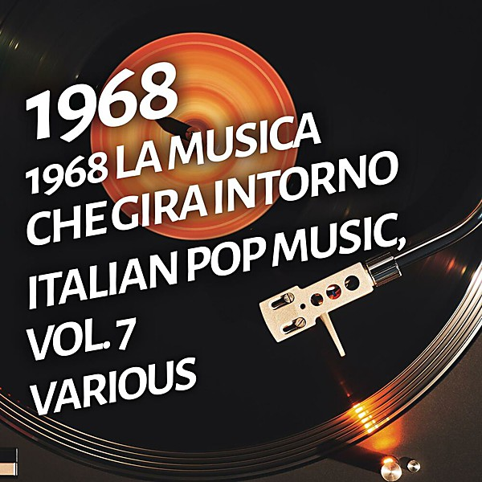

# 1968

By **Various Artists**

## Album Data

- **Catalog:** Beets
- **Format:** Digital, Album
- **Album:** 1968
- **Artist:** Various Artists
- **Albumartist:** Various Artists
- **Genre:** Emo
- **MusicBrainz Album Artist ID:** 
- **MusicBrainz Album ID:** 
- **MusicBrainz Release Group ID:** 
- **Year:** 1968
- **Catalog #:** 
- **Label:** 
- **Total Tracks:** 00

## Album Tracks

### Track 79 - Age of Aquarius (L)

- **Artist:** 5th Dimension
- **Format:** AAC
- **Genre:** Sunshine Pop
- **Length:** 4:49
- **MusicBrainz Track ID:** 
- **Title:** Age of Aquarius (L)
- **Track:** 79
- **Year:** 1969

### Track 39 - Worst That Could Happen

- **Artist:** Brooklyn Bridge
- **Format:** MP3
- **Genre:** Easy Listening
- **Length:** 3:01
- **MusicBrainz Track ID:** 
- **Title:** Worst That Could Happen
- **Track:** 39
- **Year:** 1969

### Track 33 - Love (Can Make You Happy)

- **Artist:** Mercy
- **Format:** AAC
- **Genre:** Pop
- **Length:** 3:17
- **MusicBrainz Track ID:** 
- **Title:** Love (Can Make You Happy)
- **Track:** 33
- **Year:** 1969

### Track 01 - Isley Brothers - It's Your Thi

- **Artist:** Various Artists
- **Format:** AAC
- **Genre:** Emo
- **Length:** 2:42
- **MusicBrainz Track ID:** 
- **Title:** Isley Brothers - It's Your Thi
- **Track:** 01
- **Year:** 1969

### Track 01 - Oldies - Tina Turner & Ike - P

- **Artist:** Various Artists
- **Format:** AAC
- **Genre:** Emo
- **Length:** 3:21
- **MusicBrainz Track ID:** 
- **Title:** Oldies - Tina Turner & Ike - P
- **Track:** 01
- **Year:** 1969

### Track 12 - 12 1969-37 Creedence Clearwater Revival - Down On The Corner

- **Artist:** Various Artists
- **Format:** MP3
- **Genre:** Emo
- **Length:** 2:44
- **MusicBrainz Track ID:** 
- **Title:** 12 1969-37 Creedence Clearwater Revival - Down On The Corner
- **Track:** 12
- **Year:** 1969

### Track 16 - 16 1969-46 Diana Ross And The Supremes - Someday We'll Be Toget

- **Artist:** Various Artists
- **Format:** AAC
- **Genre:** Emo
- **Length:** 3:32
- **MusicBrainz Track ID:** 
- **Title:** 16 1969-46 Diana Ross And The Supremes - Someday We'll Be Toget
- **Track:** 16
- **Year:** 1969

### Track 1969 - 1969 - 1969-11 Tommy Roe - Dizzy

- **Artist:** Various Artists
- **Format:** MP3
- **Genre:** Emo
- **Length:** 2:58
- **MusicBrainz Track ID:** 
- **Title:** 1969 - 1969-11 Tommy Roe - Dizzy
- **Track:** 1969
- **Year:** 1969

### Track 1969 - 1969-03 Glen Campbell - Wichita Lineman

- **Artist:** Various Artists
- **Format:** AAC
- **Genre:** Emo
- **Length:** 3:06
- **MusicBrainz Track ID:** 
- **Title:** 1969-03 Glen Campbell - Wichita Lineman
- **Track:** 1969
- **Year:** 1969

### Track 1969 - 1969-08 The Doors - Touch me

- **Artist:** Various Artists
- **Format:** AAC
- **Genre:** Emo
- **Length:** 3:12
- **MusicBrainz Track ID:** 
- **Title:** 1969-08 The Doors - Touch me
- **Track:** 1969
- **Year:** 1969

### Track 1969 - 1969-20 Elvis Presley - In The Ghetto

- **Artist:** Various Artists
- **Format:** MP3
- **Genre:** Emo
- **Length:** 2:49
- **MusicBrainz Track ID:** 
- **Title:** 1969-20 Elvis Presley - In The Ghetto
- **Track:** 1969
- **Year:** 1969

### Track 1969 - 1969-21 Creedence Clearwater Revival - Bad Moon Rising

- **Artist:** Various Artists
- **Format:** AAC
- **Genre:** Emo
- **Length:** 2:21
- **MusicBrainz Track ID:** 
- **Title:** 1969-21 Creedence Clearwater Revival - Bad Moon Rising
- **Track:** 1969
- **Year:** 1969

### Track 1969 - 1969-24 Oliver - Good Morning Starshine

- **Artist:** Various Artists
- **Format:** MP3
- **Genre:** Emo
- **Length:** 3:39
- **MusicBrainz Track ID:** 
- **Title:** 1969-24 Oliver - Good Morning Starshine
- **Track:** 1969
- **Year:** 1969

### Track 1969 - 1969-28 Rolling Stones - Honky Tonk Woman

- **Artist:** Various Artists
- **Format:** AAC
- **Genre:** Emo
- **Length:** 3:03
- **MusicBrainz Track ID:** 
- **Title:** 1969-28 Rolling Stones - Honky Tonk Woman
- **Track:** 1969
- **Year:** 1969

### Track 1969 - 1969-30 Creedence Clearwater Revival - Green River

- **Artist:** Various Artists
- **Format:** AAC
- **Genre:** Emo
- **Length:** 2:34
- **MusicBrainz Track ID:** 
- **Title:** 1969-30 Creedence Clearwater Revival - Green River
- **Track:** 1969
- **Year:** 1969

### Track 1969 - 1969-35 Elvis Presley - Suspicious Minds

- **Artist:** Various Artists
- **Format:** AAC
- **Genre:** Emo
- **Length:** 4:29
- **MusicBrainz Track ID:** 
- **Title:** 1969-35 Elvis Presley - Suspicious Minds
- **Track:** 1969
- **Year:** 1969

### Track 1969 - 1969-36 5th Dimension - Wedding Bell Blues

- **Artist:** Various Artists
- **Format:** AAC
- **Genre:** Emo
- **Length:** 2:43
- **MusicBrainz Track ID:** 
- **Title:** 1969-36 5th Dimension - Wedding Bell Blues
- **Track:** 1969
- **Year:** 1969

### Track 1969 - 1969-38 Creedence Clearwater Revival - Fortunate Son

- **Artist:** Various Artists
- **Format:** AAC
- **Genre:** Emo
- **Length:** 2:18
- **MusicBrainz Track ID:** 
- **Title:** 1969-38 Creedence Clearwater Revival - Fortunate Son
- **Track:** 1969
- **Year:** 1969

### Track 1969 - 1969-39 R B Greaves - Take A Letter Maria

- **Artist:** Various Artists
- **Format:** AAC
- **Genre:** Emo
- **Length:** 2:44
- **MusicBrainz Track ID:** 
- **Title:** 1969-39 R B Greaves - Take A Letter Maria
- **Track:** 1969
- **Year:** 1969

### Track 1969 - 1969-41 Beatles - Something

- **Artist:** Various Artists
- **Format:** AAC
- **Genre:** Emo
- **Length:** 3:01
- **MusicBrainz Track ID:** 
- **Title:** 1969-41 Beatles - Something
- **Track:** 1969
- **Year:** 1969

