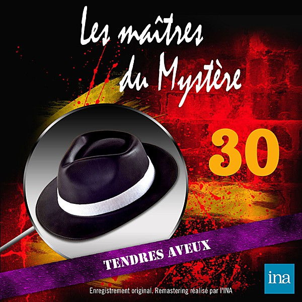

# 1972

By **Various Artists**

## Album Data

- **Catalog:** Beets
- **Format:** Digital, Album
- **Album:** 1972
- **Artist:** Various Artists
- **Albumartist:** Various Artists
- **Genre:** Emo
- **MusicBrainz Album Artist ID:** 
- **MusicBrainz Album ID:** 
- **MusicBrainz Release Group ID:** 
- **Year:** 1972
- **Catalog #:** 
- **Label:** 
- **Total Tracks:** 00

## Album Tracks

### Track 1973 - 1973 - 1973-08 Stories - Brother Louie

- **Artist:** Various Artists
- **Format:** MP3
- **Genre:** Emo
- **Length:** 3:57
- **MusicBrainz Track ID:** 
- **Title:** 1973 - 1973-08 Stories - Brother Louie
- **Track:** 1973
- **Year:** 1973

### Track 1973 - 1973-04 Paul McCartney and Wings - My Love

- **Artist:** Various Artists
- **Format:** AAC
- **Genre:** Emo
- **Length:** 4:10
- **MusicBrainz Track ID:** 
- **Title:** 1973-04 Paul McCartney and Wings - My Love
- **Track:** 1973
- **Year:** 1973

