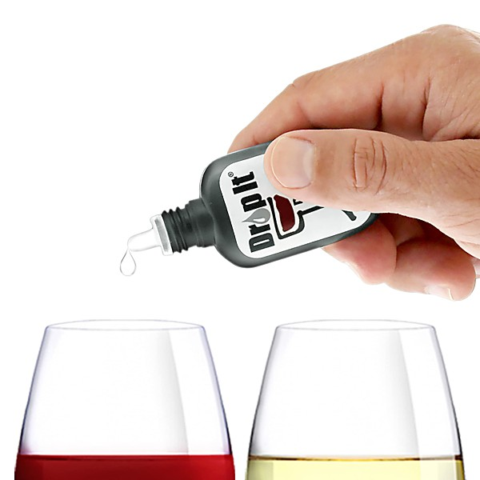

# 2005 Summer Soiree Mix

By **Various Artists**

## Album Data

- **Catalog:** Beets
- **Format:** Digital, Album
- **Album:** 2005 Summer Soiree Mix
- **Artist:** Various Artists
- **Albumartist:** Various Artists
- **Genre:** Indie Rock
- **MusicBrainz Album Artist ID:** 
- **MusicBrainz Album ID:** 
- **MusicBrainz Release Group ID:** 
- **Year:** 2005
- **Catalog #:** 
- **Label:** Madacy
- **Total Tracks:** 00

## Album Tracks

### Track 16 - Playgound in My Mind

- **Artist:** Clint Holmes
- **Format:** MP3
- **Genre:** Pop
- **Length:** 2:58
- **MusicBrainz Track ID:** 
- **Title:** Playgound in My Mind
- **Track:** 16
- **Year:** 2001

