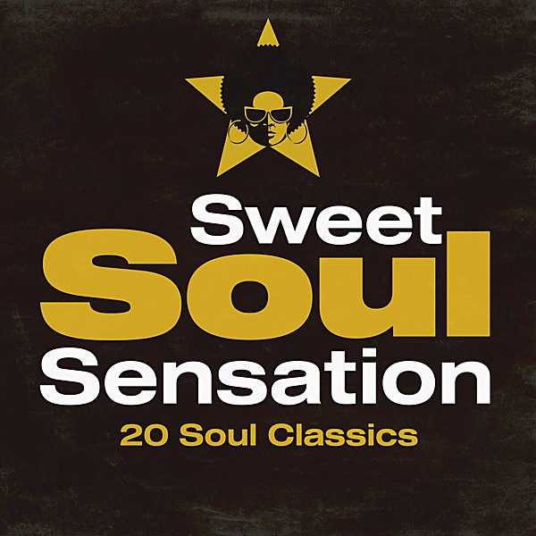

# 20 Sweet Soul Classics

By **Various Artists**

## Album Data

- **Catalog:** Beets
- **Format:** Digital, Album
- **Album:** 20 Sweet Soul Classics
- **Artist:** Various Artists
- **Albumartist:** Various Artists
- **Genre:** Soul
- **MusicBrainz Album Artist ID:** 
- **MusicBrainz Album ID:** 
- **MusicBrainz Release Group ID:** 
- **Year:** 1998
- **Catalog #:** 
- **Label:** 
- **Total Tracks:** 00

## Album Tracks

### Track 10 - Speed of Sound

- **Artist:** Coldplay
- **Format:** MP3
- **Genre:** Indie Rock
- **Length:** 4:51
- **MusicBrainz Track ID:** 
- **Title:** Speed of Sound
- **Track:** 10
- **Year:** 2005

### Track 02 - Take Me Out

- **Artist:** Franz Ferdinand
- **Format:** MP3
- **Genre:** Indie Rock
- **Length:** 3:58
- **MusicBrainz Track ID:** 
- **Title:** Take Me Out
- **Track:** 02
- **Year:** 2005

### Track 11 - Bleed Like Me

- **Artist:** Garbage
- **Format:** MP3
- **Genre:** Emo
- **Length:** 3:59
- **MusicBrainz Track ID:** 
- **Title:** Bleed Like Me
- **Track:** 11
- **Year:** 2005

### Track 03 - Feel Good Inc

- **Artist:** Gorillaz
- **Format:** MP3
- **Genre:** Alternative Rock
- **Length:** 3:45
- **MusicBrainz Track ID:** 
- **Title:** Feel Good Inc
- **Track:** 03
- **Year:** 2005

### Track 17 - Pain

- **Artist:** Jimmy Eat World
- **Format:** MP3
- **Genre:** Emo
- **Length:** 3:03
- **MusicBrainz Track ID:** 
- **Title:** Pain
- **Track:** 17
- **Year:** 2005

### Track 18 - Somewhere Only We Know

- **Artist:** Keane
- **Format:** MP3
- **Genre:** Indie Rock
- **Length:** 3:59
- **MusicBrainz Track ID:** 
- **Title:** Somewhere Only We Know
- **Track:** 18
- **Year:** 2005

### Track 15 - Finding Out True Love Is Blind

- **Artist:** Louis XIV
- **Format:** MP3
- **Genre:** Indie Rock
- **Length:** 4:14
- **MusicBrainz Track ID:** 
- **Title:** Finding Out True Love Is Blind
- **Track:** 15
- **Year:** 2005

### Track 16 - The Widow

- **Artist:** Mars Volta
- **Format:** MP3
- **Genre:** Progressive Rock
- **Length:** 3:22
- **MusicBrainz Track ID:** 
- **Title:** The Widow
- **Track:** 16
- **Year:** 2005

### Track 01 - Hysteria

- **Artist:** Muse
- **Format:** MP3
- **Genre:** Indie Rock
- **Length:** 3:49
- **MusicBrainz Track ID:** 
- **Title:** Hysteria
- **Track:** 01
- **Year:** 2005

### Track 09 - Time Is Running Out

- **Artist:** Muse
- **Format:** MP3
- **Genre:** Indie Rock
- **Length:** 3:58
- **MusicBrainz Track ID:** 
- **Title:** Time Is Running Out
- **Track:** 09
- **Year:** 2005

### Track 19 - Stokholm syndrome

- **Artist:** Muse
- **Format:** MP3
- **Genre:** Indie Rock
- **Length:** 5:00
- **MusicBrainz Track ID:** 
- **Title:** Stokholm syndrome
- **Track:** 19
- **Year:** 2005

### Track 06 - NonPhoto-Blue

- **Artist:** Pinback
- **Format:** MP3
- **Genre:** Indie Rock
- **Length:** 3:45
- **MusicBrainz Track ID:** 
- **Title:** NonPhoto-Blue
- **Track:** 06
- **Year:** 2005

### Track 14 - So Alive

- **Artist:** Ryan Adams
- **Format:** MP3
- **Genre:** Indie Rock
- **Length:** 4:00
- **MusicBrainz Track ID:** 
- **Title:** So Alive
- **Track:** 14
- **Year:** 2005

### Track 07 - Highway 101

- **Artist:** Social Distortion
- **Format:** MP3
- **Genre:** Hardcore Punk
- **Length:** 3:46
- **MusicBrainz Track ID:** 
- **Title:** Highway 101
- **Track:** 07
- **Year:** 2005

### Track 08 - Honest Mistake

- **Artist:** The Bravery
- **Format:** MP3
- **Genre:** Indie Rock
- **Length:** 3:42
- **MusicBrainz Track ID:** 
- **Title:** Honest Mistake
- **Track:** 08
- **Year:** 2005

### Track 04 - Mr. Brightside

- **Artist:** The Killers
- **Format:** MP3
- **Genre:** Indie Rock
- **Length:** 3:44
- **MusicBrainz Track ID:** 
- **Title:** Mr. Brightside
- **Track:** 04
- **Year:** 2005

### Track 12 - Smile Like You Mean It

- **Artist:** The Killers
- **Format:** MP3
- **Genre:** Indie Rock
- **Length:** 3:56
- **MusicBrainz Track ID:** 
- **Title:** Smile Like You Mean It
- **Track:** 12
- **Year:** 2005

### Track 20 - All These Things That I've Done

- **Artist:** The Killers
- **Format:** MP3
- **Genre:** Indie Rock
- **Length:** 5:01
- **MusicBrainz Track ID:** 
- **Title:** All These Things That I've Done
- **Track:** 20
- **Year:** 2005

### Track 05 - Love In a Trashcan

- **Artist:** The Raveonettes
- **Format:** MP3
- **Genre:** Indie Rock
- **Length:** 2:54
- **MusicBrainz Track ID:** 
- **Title:** Love In a Trashcan
- **Track:** 05
- **Year:** 2005

### Track 13 - Blue Orchid

- **Artist:** The White Stripes
- **Format:** MP3
- **Genre:** Indie Rock
- **Length:** 2:38
- **MusicBrainz Track ID:** 
- **Title:** Blue Orchid
- **Track:** 13
- **Year:** 2005

