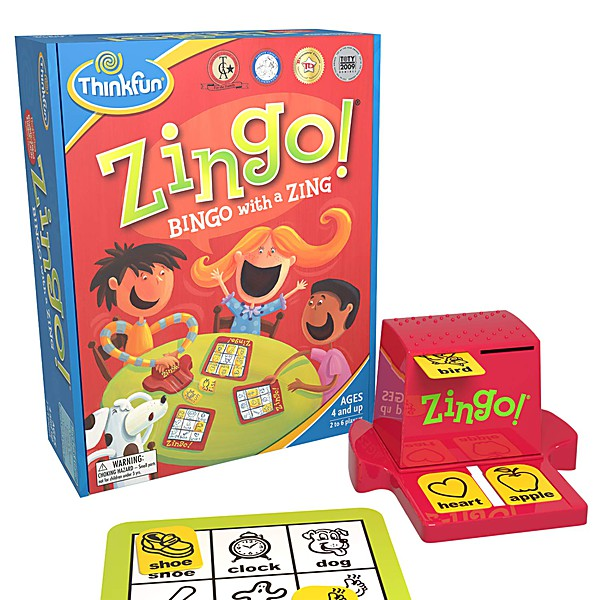

# 24 Original Happening Hits

By **Various Artists**

## Album Data

- **Catalog:** Beets
- **Format:** Digital, Album
- **Album:** 24 Original Happening Hits
- **Artist:** Various Artists
- **Albumartist:** Various Artists
- **Genre:** Soul
- **MusicBrainz Album Artist ID:** 
- **MusicBrainz Album ID:** 
- **MusicBrainz Release Group ID:** 
- **Year:** 1967
- **Catalog #:** 
- **Label:** Not Lame Recordings
- **Total Tracks:** 21

## Album Tracks

### Track 19 - Tonight She Comes

- **Artist:** Action Action
- **Format:** MP3
- **Genre:** Emo
- **Length:** 4:06
- **MusicBrainz Track ID:** 
- **Title:** Tonight She Comes
- **Track:** 19
- **Year:** 2005

### Track 15 - Since You're Gone

- **Artist:** Andersons, The
- **Format:** MP3
- **Genre:** Indie Rock
- **Length:** 3:33
- **MusicBrainz Track ID:** 
- **Title:** Since You're Gone
- **Track:** 15
- **Year:** 2005

### Track 01 - Hello Again

- **Artist:** Argument
- **Format:** MP3
- **Genre:** Rock
- **Length:** 3:37
- **MusicBrainz Track ID:** 
- **Title:** Hello Again
- **Track:** 01
- **Year:** 2005

### Track 06 - You Might Think

- **Artist:** Bleu
- **Format:** MP3
- **Genre:** Indie Rock
- **Length:** 2:55
- **MusicBrainz Track ID:** 
- **Title:** You Might Think
- **Track:** 06
- **Year:** 2005

### Track 12 - It's All I Can Do

- **Artist:** Bravery, The
- **Format:** MP3
- **Genre:** Indie Rock
- **Length:** 2:47
- **MusicBrainz Track ID:** 
- **Title:** It's All I Can Do
- **Track:** 12
- **Year:** 2005

### Track 04 - My Best Friend's Magic Girlfriend

- **Artist:** Butch Walker
- **Format:** MP3
- **Genre:** Pop Rock
- **Length:** 3:22
- **MusicBrainz Track ID:** 
- **Title:** My Best Friend's Magic Girlfriend
- **Track:** 04
- **Year:** 2005

### Track 20 - Night Spots

- **Artist:** Cautions, The
- **Format:** MP3
- **Genre:** Indie Rock
- **Length:** 3:01
- **MusicBrainz Track ID:** 
- **Title:** Night Spots
- **Track:** 20
- **Year:** 2005

### Track 09 - Drive

- **Artist:** Chris Von Sneidern
- **Format:** MP3
- **Genre:** Indie Pop
- **Length:** 3:52
- **MusicBrainz Track ID:** 
- **Title:** Drive
- **Track:** 09
- **Year:** 2005

### Track 02 - Just What I Needed

- **Artist:** Damone
- **Format:** MP3
- **Genre:** Power Pop
- **Length:** 3:29
- **MusicBrainz Track ID:** 
- **Title:** Just What I Needed
- **Track:** 02
- **Year:** 2005

### Track 21 - Good Times Roll

- **Artist:** Daybirds
- **Format:** MP3
- **Genre:** Indie Rock
- **Length:** 4:43
- **MusicBrainz Track ID:** 
- **Title:** Good Times Roll
- **Track:** 21
- **Year:** 2005

### Track 14 - Candy-O

- **Artist:** Doug Powell
- **Format:** MP3
- **Genre:** Indie Pop
- **Length:** 2:43
- **MusicBrainz Track ID:** 
- **Title:** Candy-O
- **Track:** 14
- **Year:** 2005

### Track 16 - Let's Go

- **Artist:** Dum Dog Run
- **Format:** MP3
- **Genre:** Indie Rock
- **Length:** 3:31
- **MusicBrainz Track ID:** 
- **Title:** Let's Go
- **Track:** 16
- **Year:** 2005

### Track 03 - Touch and Go

- **Artist:** Jason Falkner
- **Format:** MP3
- **Genre:** Indie Rock
- **Length:** 4:39
- **MusicBrainz Track ID:** 
- **Title:** Touch and Go
- **Track:** 03
- **Year:** 2005

### Track 10 - Dangerous Type

- **Artist:** Johnny Monaco
- **Format:** MP3
- **Genre:** Power Pop
- **Length:** 3:58
- **MusicBrainz Track ID:** 
- **Title:** Dangerous Type
- **Track:** 10
- **Year:** 2005

### Track 18 - Misfit Kid

- **Artist:** Jon Auer
- **Format:** MP3
- **Genre:** Indie Pop
- **Length:** 4:57
- **MusicBrainz Track ID:** 
- **Title:** Misfit Kid
- **Track:** 18
- **Year:** 2005

### Track 13 - I'm Not the One

- **Artist:** Kid Lightning/Gigolo Aunts
- **Format:** MP3
- **Genre:** Indie Rock
- **Length:** 3:53
- **MusicBrainz Track ID:** 
- **Title:** I'm Not the One
- **Track:** 13
- **Year:** 2005

### Track 05 - You're All I've Got Tonight

- **Artist:** Millions, The
- **Format:** MP3
- **Genre:** Post-Hardcore
- **Length:** 3:54
- **MusicBrainz Track ID:** 
- **Title:** You're All I've Got Tonight
- **Track:** 05
- **Year:** 2005

### Track 07 - Got a Lot on My Head

- **Artist:** Owsley
- **Format:** MP3
- **Genre:** Power Pop
- **Length:** 2:57
- **MusicBrainz Track ID:** 
- **Title:** Got a Lot on My Head
- **Track:** 07
- **Year:** 2005

### Track 08 - Shake It Up

- **Artist:** Purr Box
- **Format:** MP3
- **Genre:** Indie Rock
- **Length:** 3:11
- **MusicBrainz Track ID:** 
- **Title:** Shake It Up
- **Track:** 08
- **Year:** 2005

### Track 17 - Slip Away

- **Artist:** Sparkle*Jets U.K.
- **Format:** MP3
- **Genre:** Indie Rock
- **Length:** 3:48
- **MusicBrainz Track ID:** 
- **Title:** Slip Away
- **Track:** 17
- **Year:** 2005

### Track 11 - Bye Bye Love

- **Artist:** Spiraling
- **Format:** MP3
- **Genre:** Progressive Rock
- **Length:** 3:51
- **MusicBrainz Track ID:** 
- **Title:** Bye Bye Love
- **Track:** 11
- **Year:** 2005

