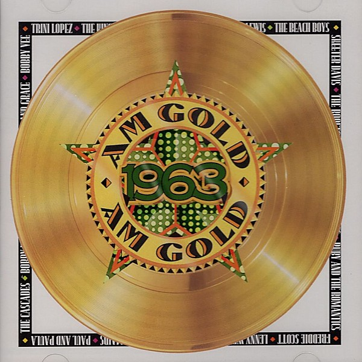

# AM Gold

By **Various Artists**

## Album Data

- **Catalog:** Beets
- **Format:** Digital, Album
- **Album:** AM Gold
- **Artist:** Various Artists
- **Albumartist:** Various Artists
- **Genre:** Pop
- **MusicBrainz Album Artist ID:** 
- **MusicBrainz Album ID:** 
- **MusicBrainz Release Group ID:** 
- **Year:** 1991
- **Catalog #:** 
- **Label:** Time Life Music
- **Total Tracks:** 00

## Album Tracks

### Track 20 - We'll Sing in the Sunshine

- **Artist:** Gale Garnett
- **Format:** MP3
- **Genre:** Rock
- **Length:** 2:59
- **MusicBrainz Track ID:** 
- **Title:** We'll Sing in the Sunshine
- **Track:** 20
- **Year:** 1991

### Track 14 - My Guy

- **Artist:** Mary Wells
- **Format:** AAC
- **Genre:** Soul
- **Length:** 2:54
- **MusicBrainz Track ID:** 
- **Title:** My Guy
- **Track:** 14
- **Year:** 1991

