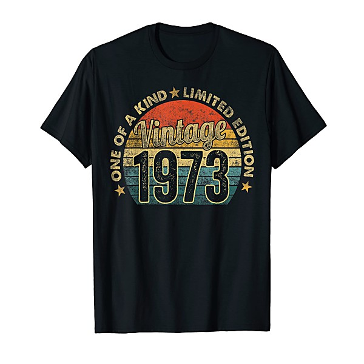

# AM Gold

By **Various Artists**

## Album Data

- **Catalog:** Beets
- **Format:** Digital, Album
- **Album:** AM Gold
- **Artist:** Various Artists
- **Albumartist:** Various Artists
- **Genre:** Rock
- **MusicBrainz Album Artist ID:** 
- **MusicBrainz Album ID:** 
- **MusicBrainz Release Group ID:** 
- **Year:** 1992
- **Catalog #:** 
- **Label:** 
- **Total Tracks:** 00

## Album Tracks

### Track 06 - Without You

- **Artist:** Harry Nilsson
- **Format:** AAC
- **Genre:** Soft Rock
- **Length:** 3:16
- **MusicBrainz Track ID:** 
- **Title:** Without You
- **Track:** 06
- **Year:** 1999

### Track 11 - In the Year 2525

- **Artist:** Zager and Evans
- **Format:** MP3
- **Genre:** Rock
- **Length:** 3:19
- **MusicBrainz Track ID:** 
- **Title:** In the Year 2525
- **Track:** 11
- **Year:** 1999

