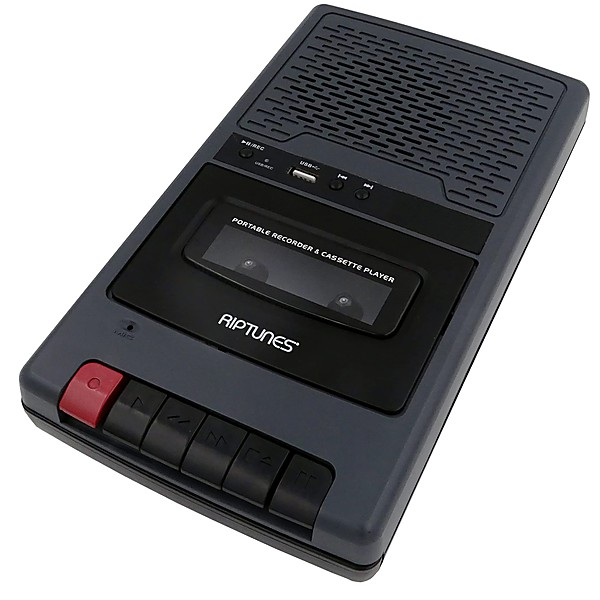

# AM Gold

By **Various Artists**

## Album Data

- **Catalog:** Beets
- **Format:** Digital, Album
- **Album:** AM Gold
- **Artist:** Various Artists
- **Albumartist:** Various Artists
- **Genre:** Soft Rock
- **MusicBrainz Album Artist ID:** 
- **MusicBrainz Album ID:** 
- **MusicBrainz Release Group ID:** 
- **Year:** 1999
- **Catalog #:** 
- **Label:** 
- **Total Tracks:** 14

## Album Tracks

### Track 09 - You're Gonna Crawl

- **Artist:** Barnacle Choir
- **Format:** MP3
- **Genre:** Indie Rock
- **Length:** 2:37
- **MusicBrainz Track ID:** 
- **Title:** You're Gonna Crawl
- **Track:** 09
- **Year:** 1987

### Track 07 - Pope Festival

- **Artist:** Camper Van Beethoven
- **Format:** MP3
- **Genre:** Indie Rock
- **Length:** 3:05
- **MusicBrainz Track ID:** 
- **Title:** Pope Festival
- **Track:** 07
- **Year:** 1987

### Track 11 - Blank Verse

- **Artist:** Carmaig de Forest
- **Format:** MP3
- **Genre:** Folk Punk
- **Length:** 3:08
- **MusicBrainz Track ID:** 
- **Title:** Blank Verse
- **Track:** 11
- **Year:** 1987

### Track 08 - Return of the Extinct Mammoths

- **Artist:** Raining House
- **Format:** MP3
- **Genre:** Indie Rock
- **Length:** 3:42
- **MusicBrainz Track ID:** 
- **Title:** Return of the Extinct Mammoths
- **Track:** 08
- **Year:** 1987

### Track 04 - Crazy

- **Artist:** Spot 1019
- **Format:** MP3
- **Genre:** Indie Rock
- **Length:** 1:09
- **MusicBrainz Track ID:** 
- **Title:** Crazy
- **Track:** 04
- **Year:** 1987

### Track 02 - You're Blowin' My High

- **Artist:** Ten Foot Faces
- **Format:** MP3
- **Genre:** Power Pop
- **Length:** 3:18
- **MusicBrainz Track ID:** 
- **Title:** You're Blowin' My High
- **Track:** 02
- **Year:** 1987

### Track 03 - Purple Haze

- **Artist:** The Catheads
- **Format:** MP3
- **Genre:** Post-Punk
- **Length:** 1:38
- **MusicBrainz Track ID:** 
- **Title:** Purple Haze
- **Track:** 03
- **Year:** 1987

### Track 06 - Terrible World

- **Artist:** The Donner Party
- **Format:** MP3
- **Genre:** Powerviolence
- **Length:** 2:32
- **MusicBrainz Track ID:** 
- **Title:** Terrible World
- **Track:** 06
- **Year:** 1987

### Track 13 - Round and Round

- **Artist:** The Holy Sisters Of The Gaga Dada
- **Format:** MP3
- **Genre:** Psychedelic Rock
- **Length:** 3:56
- **MusicBrainz Track ID:** 
- **Title:** Round and Round
- **Track:** 13
- **Year:** 1987

### Track 05 - Flaming Heart - Wolfman - 7-11

- **Artist:** The Nice Guys
- **Format:** MP3
- **Genre:** Electronic
- **Length:** 2:40
- **MusicBrainz Track ID:** 
- **Title:** Flaming Heart - Wolfman - 7-11
- **Track:** 05
- **Year:** 1987

### Track 01 - Living Skull

- **Artist:** The Nimoys
- **Format:** MP3
- **Genre:** Indie Rock
- **Length:** 3:35
- **MusicBrainz Track ID:** 
- **Title:** Living Skull
- **Track:** 01
- **Year:** 1987

### Track 10 - Gnarly Reef

- **Artist:** The Thongs
- **Format:** MP3
- **Genre:** Indie Rock
- **Length:** 2:15
- **MusicBrainz Track ID:** 
- **Title:** Gnarly Reef
- **Track:** 10
- **Year:** 1987

### Track 14 - Swelling Admiration

- **Artist:** Vomit Launch
- **Format:** MP3
- **Genre:** Indie Rock
- **Length:** 5:18
- **MusicBrainz Track ID:** 
- **Title:** Swelling Admiration
- **Track:** 14
- **Year:** 1987

### Track 12 - Vegetable Tune

- **Artist:** Wrestling Worms
- **Format:** MP3
- **Genre:** Indie Rock
- **Length:** 3:58
- **MusicBrainz Track ID:** 
- **Title:** Vegetable Tune
- **Track:** 12
- **Year:** 1987

