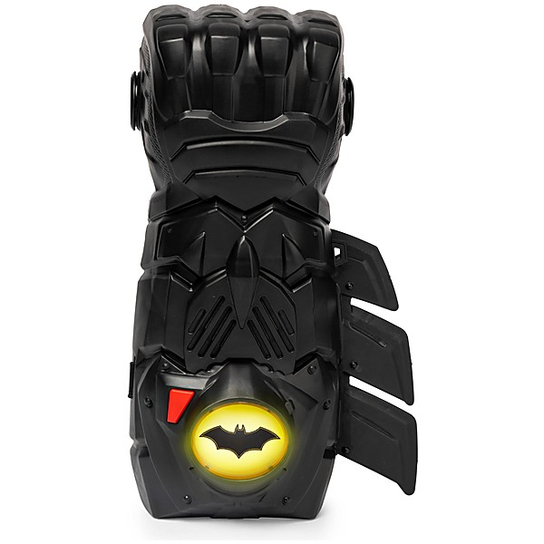

# Best of Bootie 2008

By **Various Artists**

## Album Data

- **Catalog:** Beets
- **Format:** Digital, Album
- **Album:** Best of Bootie 2008
- **Artist:** Various Artists
- **Albumartist:** Various Artists
- **Genre:** Disco
- **MusicBrainz Album Artist ID:** 
- **MusicBrainz Album ID:** 
- **MusicBrainz Release Group ID:** 
- **Year:** 2008
- **Catalog #:** 
- **Label:** 
- **Total Tracks:** 14

## Album Tracks

### Track 12 - Mushroom Boy

- **Artist:** 4 Out of 5 Doctors
- **Format:** MP3
- **Genre:** Power Pop
- **Length:** 4:31
- **MusicBrainz Track ID:** 
- **Title:** Mushroom Boy
- **Track:** 12
- **Year:** 2004

### Track 13 - Stolen Love

- **Artist:** Advertising
- **Format:** MP3
- **Genre:** Punk Rock
- **Length:** 2:25
- **MusicBrainz Track ID:** 
- **Title:** Stolen Love
- **Track:** 13
- **Year:** 0000

### Track 02 - This is Your Life

- **Artist:** Berlin Airlift
- **Format:** MP3
- **Genre:** New Wave
- **Length:** 2:53
- **MusicBrainz Track ID:** 
- **Title:** This is Your Life
- **Track:** 02
- **Year:** 0000

### Track 08 - When I'm Gone

- **Artist:** Circus
- **Format:** MP3
- **Genre:** J-Pop
- **Length:** 2:46
- **MusicBrainz Track ID:** 
- **Title:** When I'm Gone
- **Track:** 08
- **Year:** 0000

### Track 11 - I'm Sorry

- **Artist:** Straight Eight
- **Format:** MP3
- **Genre:** Indie Rock
- **Length:** 3:10
- **MusicBrainz Track ID:** 
- **Title:** I'm Sorry
- **Track:** 11
- **Year:** 0000

### Track 05 - Rue De Chance

- **Artist:** Sweeney Todd
- **Format:** MP3
- **Genre:** Glam Rock
- **Length:** 2:55
- **MusicBrainz Track ID:** 
- **Title:** Rue De Chance
- **Track:** 05
- **Year:** 2008

### Track 06 - She's A Mystery

- **Artist:** The Bottles
- **Format:** MP3
- **Genre:** Indie Rock
- **Length:** 3:54
- **MusicBrainz Track ID:** 
- **Title:** She's A Mystery
- **Track:** 06
- **Year:** 2007

### Track 01 - The Kids Are Alright

- **Artist:** The Boyfriends
- **Format:** MP3
- **Genre:** Indie Rock
- **Length:** 2:51
- **MusicBrainz Track ID:** 
- **Title:** The Kids Are Alright
- **Track:** 01
- **Year:** 0000

### Track 04 - Moving Target

- **Artist:** The Furys
- **Format:** MP3
- **Genre:** Northern Soul
- **Length:** 2:34
- **MusicBrainz Track ID:** 
- **Title:** Moving Target
- **Track:** 04
- **Year:** 0000

### Track 07 - High School Sweater

- **Artist:** The Heat
- **Format:** MP3
- **Genre:** Heavy Metal
- **Length:** 3:03
- **MusicBrainz Track ID:** 
- **Title:** High School Sweater
- **Track:** 07
- **Year:** 2007

### Track 03 - The Young Reporter

- **Artist:** The Nits
- **Format:** AAC
- **Genre:** Indie Pop
- **Length:** 2:44
- **MusicBrainz Track ID:** 
- **Title:** The Young Reporter
- **Track:** 03
- **Year:** 0000

### Track 09 - Slow Motion

- **Artist:** The Orbits
- **Format:** MP3
- **Genre:** Rockabilly
- **Length:** 3:07
- **MusicBrainz Track ID:** 
- **Title:** Slow Motion
- **Track:** 09
- **Year:** 2007

### Track 10 - I've Got A Heart

- **Artist:** The Realists
- **Format:** MP3
- **Genre:** Rock
- **Length:** 2:20
- **MusicBrainz Track ID:** 
- **Title:** I've Got A Heart
- **Track:** 10
- **Year:** 0000

### Track 14 - Falling

- **Artist:** The Scooters
- **Format:** MP3
- **Genre:** Rockabilly
- **Length:** 3:04
- **MusicBrainz Track ID:** 
- **Title:** Falling
- **Track:** 14
- **Year:** 2008

