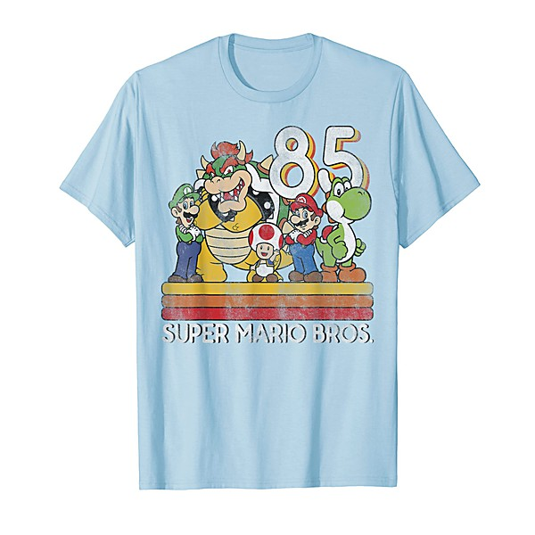

# Best of Doo Wop Uptempo

By **Various Artists**

## Album Data

- **Catalog:** Beets
- **Format:** Digital, Album
- **Album:** Best of Doo Wop Uptempo
- **Artist:** Various Artists
- **Albumartist:** Various Artists
- **Genre:** Soul
- **MusicBrainz Album Artist ID:** 
- **MusicBrainz Album ID:** 
- **MusicBrainz Release Group ID:** 
- **Year:** 1989
- **Catalog #:** 
- **Label:** Not Lame Recordings
- **Total Tracks:** 22

## Album Tracks

### Track 04 - Evolution Queen

- **Artist:** 10 Heads High
- **Format:** MP3
- **Genre:** Power Pop
- **Length:** 3:24
- **MusicBrainz Track ID:** 
- **Title:** Evolution Queen
- **Track:** 04
- **Year:** 2003

### Track 11 - One Way

- **Artist:** 9-Fifty
- **Format:** MP3
- **Genre:** Indie Rock
- **Length:** 3:10
- **MusicBrainz Track ID:** 
- **Title:** One Way
- **Track:** 11
- **Year:** 2003

### Track 08 - Your Gravity

- **Artist:** Adam Daniel
- **Format:** MP3
- **Genre:** Power Pop
- **Length:** 3:21
- **MusicBrainz Track ID:** 
- **Title:** Your Gravity
- **Track:** 08
- **Year:** 2013

### Track 14 - Winston Jones

- **Artist:** Adam Power
- **Format:** MP3
- **Genre:** Drum And Bass
- **Length:** 3:05
- **MusicBrainz Track ID:** 
- **Title:** Winston Jones
- **Track:** 14
- **Year:** 2002

### Track 06 - Be the Show

- **Artist:** Admiral Twin
- **Format:** MP3
- **Genre:** Indie Rock
- **Length:** 4:34
- **MusicBrainz Track ID:** 
- **Title:** Be the Show
- **Track:** 06
- **Year:** 2001

### Track 01 - Well, It's Only Pain

- **Artist:** Beagle
- **Format:** MP3
- **Genre:** Speedcore
- **Length:** 3:39
- **MusicBrainz Track ID:** 
- **Title:** Well, It's Only Pain
- **Track:** 01
- **Year:** 2001

### Track 02 - When I Met the Girl

- **Artist:** Big Kid
- **Format:** MP3
- **Genre:** Power Pop
- **Length:** 3:54
- **MusicBrainz Track ID:** 
- **Title:** When I Met the Girl
- **Track:** 02
- **Year:** 2006

### Track 12 - The World Goes By

- **Artist:** Blue Cartoon
- **Format:** MP3
- **Genre:** Progressive Rock
- **Length:** 4:16
- **MusicBrainz Track ID:** 
- **Title:** The World Goes By
- **Track:** 12
- **Year:** 2005

### Track 15 - Just About as I Don't Know What as I Think You Can Get

- **Artist:** Brian Lovely
- **Format:** MP3
- **Genre:** Power Pop
- **Length:** 3:38
- **MusicBrainz Track ID:** 
- **Title:** Just About as I Don't Know What as I Think You Can Get
- **Track:** 15
- **Year:** 2003

### Track 06 - Dead Battery

- **Artist:** Brookings, David
- **Format:** MP3
- **Genre:** Power Pop
- **Length:** 3:01
- **MusicBrainz Track ID:** 
- **Title:** Dead Battery
- **Track:** 06
- **Year:** 2011

### Track 06 - Call Along The Coast

- **Artist:** Carousels, The
- **Format:** MP3
- **Genre:** Power Pop
- **Length:** 2:45
- **MusicBrainz Track ID:** 
- **Title:** Call Along The Coast
- **Track:** 06
- **Year:** 2011

### Track 12 - Cardiac Arrest

- **Artist:** Checkpoint Charley
- **Format:** MP3
- **Genre:** Power Pop
- **Length:** 3:17
- **MusicBrainz Track ID:** 
- **Title:** Cardiac Arrest
- **Track:** 12
- **Year:** 2006

### Track 08 - All My Rivals

- **Artist:** Chris Brown
- **Format:** MP3
- **Genre:** Pop
- **Length:** 3:12
- **MusicBrainz Track ID:** 
- **Title:** All My Rivals
- **Track:** 08
- **Year:** 2006

### Track 08 - Coming Out Alive

- **Artist:** Cliff Hillis
- **Format:** MP3
- **Genre:** Power Pop
- **Length:** 2:59
- **MusicBrainz Track ID:** 
- **Title:** Coming Out Alive
- **Track:** 08
- **Year:** 2001

### Track 02 - Nothing Lasts Forever

- **Artist:** Copperpot
- **Format:** MP3
- **Genre:** Emo
- **Length:** 3:39
- **MusicBrainz Track ID:** 
- **Title:** Nothing Lasts Forever
- **Track:** 02
- **Year:** 2002

### Track 04 - Modern Cinderella

- **Artist:** Cry!, The
- **Format:** MP3
- **Genre:** Power Pop
- **Length:** 3:28
- **MusicBrainz Track ID:** 
- **Title:** Modern Cinderella
- **Track:** 04
- **Year:** 2012

### Track 09 - Just Enough

- **Artist:** Dave Stephens
- **Format:** MP3
- **Genre:** Symphonic
- **Length:** 4:00
- **MusicBrainz Track ID:** 
- **Title:** Just Enough
- **Track:** 09
- **Year:** 2007

### Track 10 - Rocketship

- **Artist:** Ed James
- **Format:** MP3
- **Genre:** Indie Rock
- **Length:** 3:09
- **MusicBrainz Track ID:** 
- **Title:** Rocketship
- **Track:** 10
- **Year:** 2000

### Track 03 - Can't Stop Saying Yes

- **Artist:** Evan Hillhouse
- **Format:** MP3
- **Genre:** Power Pop
- **Length:** 3:28
- **MusicBrainz Track ID:** 
- **Title:** Can't Stop Saying Yes
- **Track:** 03
- **Year:** 2007

### Track 18 - Something Unreal (single version)

- **Artist:** Ex Norwegian
- **Format:** MP3
- **Genre:** Indie Pop
- **Length:** 2:21
- **MusicBrainz Track ID:** 
- **Title:** Something Unreal (single version)
- **Track:** 18
- **Year:** 2010

### Track 02 - Do You Ever Think of Me

- **Artist:** Farrah
- **Format:** MP3
- **Genre:** Indie Rock
- **Length:** 2:55
- **MusicBrainz Track ID:** 
- **Title:** Do You Ever Think of Me
- **Track:** 02
- **Year:** 2007

### Track 01 - She Makes the Make-Up Look Good

- **Artist:** Feel
- **Format:** MP3
- **Genre:** Emo
- **Length:** 2:36
- **MusicBrainz Track ID:** 
- **Title:** She Makes the Make-Up Look Good
- **Track:** 01
- **Year:** 2004

### Track 09 - Give Me A Chance

- **Artist:** Flowers, Lannie
- **Format:** MP3
- **Genre:** Power Pop
- **Length:** 2:58
- **MusicBrainz Track ID:** 
- **Title:** Give Me A Chance
- **Track:** 09
- **Year:** 2011

### Track 23 - Sweet Sorrow

- **Artist:** Foreign Films, The
- **Format:** MP3
- **Genre:** Power Pop
- **Length:** 4:53
- **MusicBrainz Track ID:** 
- **Title:** Sweet Sorrow
- **Track:** 23
- **Year:** 2012

### Track 01 - Calilfornia Sex Lawyer

- **Artist:** Fountains of Wayne
- **Format:** MP3
- **Genre:** Indie Rock
- **Length:** 2:59
- **MusicBrainz Track ID:** 
- **Title:** Calilfornia Sex Lawyer
- **Track:** 01
- **Year:** 2000

### Track 13 - Ciao to the Beauty

- **Artist:** Harkness
- **Format:** MP3
- **Genre:** Indie Pop
- **Length:** 3:37
- **MusicBrainz Track ID:** 
- **Title:** Ciao to the Beauty
- **Track:** 13
- **Year:** 2005

### Track 02 - All of Our Crimes

- **Artist:** Headset
- **Format:** MP3
- **Genre:** Indietronica
- **Length:** 4:11
- **MusicBrainz Track ID:** 
- **Title:** All of Our Crimes
- **Track:** 02
- **Year:** 2000

### Track 23 - Anna

- **Artist:** Jeff Litman
- **Format:** MP3
- **Genre:** Power Pop
- **Length:** 3:36
- **MusicBrainz Track ID:** 
- **Title:** Anna
- **Track:** 23
- **Year:** 2009

### Track 15 - (She's A) Tasty Freeze

- **Artist:** John McMullan
- **Format:** MP3
- **Genre:** Power Pop
- **Length:** 3:18
- **MusicBrainz Track ID:** 
- **Title:** (She's A) Tasty Freeze
- **Track:** 15
- **Year:** 2000

### Track 15 - Cold Summer

- **Artist:** Kai Reiner
- **Format:** MP3
- **Genre:** Indie Pop
- **Length:** 3:00
- **MusicBrainz Track ID:** 
- **Title:** Cold Summer
- **Track:** 15
- **Year:** 2008

### Track 13 - O-Jayne

- **Artist:** Kelly's Heels
- **Format:** MP3
- **Genre:** Power Pop
- **Length:** 2:11
- **MusicBrainz Track ID:** 
- **Title:** O-Jayne
- **Track:** 13
- **Year:** 2007

### Track 02 - Shiner

- **Artist:** Ken Kase Group
- **Format:** MP3
- **Genre:** Power Pop
- **Length:** 4:08
- **MusicBrainz Track ID:** 
- **Title:** Shiner
- **Track:** 02
- **Year:** 2008

### Track 01 - The Gears

- **Artist:** King Washington
- **Format:** MP3
- **Genre:** Power Pop
- **Length:** 4:19
- **MusicBrainz Track ID:** 
- **Title:** The Gears
- **Track:** 01
- **Year:** 2012

### Track 02 - On With The Show

- **Artist:** Laurie Biagini
- **Format:** MP3
- **Genre:** Go-Go
- **Length:** 3:48
- **MusicBrainz Track ID:** 
- **Title:** On With The Show
- **Track:** 02
- **Year:** 2013

### Track 06 - Say Hello to Another Goodbye

- **Artist:** Linus of Hollywood
- **Format:** MP3
- **Genre:** Alternative Rock
- **Length:** 2:39
- **MusicBrainz Track ID:** 
- **Title:** Say Hello to Another Goodbye
- **Track:** 06
- **Year:** 2000

### Track 04 - Hearts Beat in Stereo

- **Artist:** Lisa Mychols
- **Format:** MP3
- **Genre:** Power Pop
- **Length:** 3:20
- **MusicBrainz Track ID:** 
- **Title:** Hearts Beat in Stereo
- **Track:** 04
- **Year:** 2009

### Track 17 - The King of Big Mistakes

- **Artist:** Mark Watson
- **Format:** MP3
- **Genre:** Ambient
- **Length:** 3:04
- **MusicBrainz Track ID:** 
- **Title:** The King of Big Mistakes
- **Track:** 17
- **Year:** 2002

### Track 02 - Can't Go Back

- **Artist:** Michael Carpenter
- **Format:** MP3
- **Genre:** Power Pop
- **Length:** 3:08
- **MusicBrainz Track ID:** 
- **Title:** Can't Go Back
- **Track:** 02
- **Year:** 2009

### Track 06 - You

- **Artist:** Millicent Friendly
- **Format:** MP3
- **Genre:** Power Pop
- **Length:** 3:33
- **MusicBrainz Track ID:** 
- **Title:** You
- **Track:** 06
- **Year:** 2006

### Track 01 - Shame It Always Rains

- **Artist:** Mothboxer
- **Format:** MP3
- **Genre:** Power Pop
- **Length:** 3:57
- **MusicBrainz Track ID:** 
- **Title:** Shame It Always Rains
- **Track:** 01
- **Year:** 2013

### Track 05 - Loveblind

- **Artist:** Myhr, David
- **Format:** MP3
- **Genre:** Power Pop
- **Length:** 3:15
- **MusicBrainz Track ID:** 
- **Title:** Loveblind
- **Track:** 05
- **Year:** 2011

### Track 04 - I'd Rather Be

- **Artist:** Myracle Brah
- **Format:** MP3
- **Genre:** Indie Rock
- **Length:** 2:55
- **MusicBrainz Track ID:** 
- **Title:** I'd Rather Be
- **Track:** 04
- **Year:** 2001

### Track 04 - There's Only So Much A Man Can Take

- **Artist:** NRWY
- **Format:** MP3
- **Genre:** Power Pop
- **Length:** 4:26
- **MusicBrainz Track ID:** 
- **Title:** There's Only So Much A Man Can Take
- **Track:** 04
- **Year:** 2012

### Track 03 - Matriarch

- **Artist:** Owsley
- **Format:** MP3
- **Genre:** Power Pop
- **Length:** 3:58
- **MusicBrainz Track ID:** 
- **Title:** Matriarch
- **Track:** 03
- **Year:** 2004

### Track 11 - Seeds and Stems

- **Artist:** Paranoid Lovesick
- **Format:** MP3
- **Genre:** Indie Pop
- **Length:** 3:03
- **MusicBrainz Track ID:** 
- **Title:** Seeds and Stems
- **Track:** 11
- **Year:** 2009

### Track 02 - Sweet Amnisia

- **Artist:** Pat Buchanan
- **Format:** MP3
- **Genre:** Power Pop
- **Length:** 3:31
- **MusicBrainz Track ID:** 
- **Title:** Sweet Amnisia
- **Track:** 02
- **Year:** 2005

### Track 13 - Jeff Lynne

- **Artist:** Paul Melançon
- **Format:** MP3
- **Genre:** Power Pop
- **Length:** 4:09
- **MusicBrainz Track ID:** 
- **Title:** Jeff Lynne
- **Track:** 13
- **Year:** 2002

### Track 02 - Two Possible Answers (The Road)

- **Artist:** Paula Kelley
- **Format:** MP3
- **Genre:** Indie Pop
- **Length:** 3:15
- **MusicBrainz Track ID:** 
- **Title:** Two Possible Answers (The Road)
- **Track:** 02
- **Year:** 2002

### Track 13 - Natalie Would

- **Artist:** Peaces, The
- **Format:** MP3
- **Genre:** Power Pop
- **Length:** 2:36
- **MusicBrainz Track ID:** 
- **Title:** Natalie Would
- **Track:** 13
- **Year:** 2010

### Track 21 - A Different Side of You

- **Artist:** Phamous Phaces
- **Format:** MP3
- **Genre:** Power Pop
- **Length:** 4:57
- **MusicBrainz Track ID:** 
- **Title:** A Different Side of You
- **Track:** 21
- **Year:** 2007

### Track 16 - Since Mountains Have Risen

- **Artist:** Philip Vandermost
- **Format:** MP3
- **Genre:** Power Pop
- **Length:** 3:54
- **MusicBrainz Track ID:** 
- **Title:** Since Mountains Have Risen
- **Track:** 16
- **Year:** 2008

### Track 07 - All Messed Up

- **Artist:** Popgun
- **Format:** MP3
- **Genre:** Power Pop
- **Length:** 2:52
- **MusicBrainz Track ID:** 
- **Title:** All Messed Up
- **Track:** 07
- **Year:** 2010

### Track 11 - Little Jimmy the Giant

- **Artist:** Preoccupied Pipers
- **Format:** MP3
- **Genre:** Power Pop
- **Length:** 2:21
- **MusicBrainz Track ID:** 
- **Title:** Little Jimmy the Giant
- **Track:** 11
- **Year:** 2008

### Track 04 - Extraordinary Sensations

- **Artist:** Private Jets
- **Format:** MP3
- **Genre:** Power Pop
- **Length:** 3:58
- **MusicBrainz Track ID:** 
- **Title:** Extraordinary Sensations
- **Track:** 04
- **Year:** 2008

### Track 12 - Medley

- **Artist:** Randell Kirsch
- **Format:** MP3
- **Genre:** Power Pop
- **Length:** 4:36
- **MusicBrainz Track ID:** 
- **Title:** Medley
- **Track:** 12
- **Year:** 2003

### Track 03 - How Do You Know

- **Artist:** Ray Paul
- **Format:** MP3
- **Genre:** Power Pop
- **Length:** 3:44
- **MusicBrainz Track ID:** 
- **Title:** How Do You Know
- **Track:** 03
- **Year:** 2000

### Track 08 - Time Warp

- **Artist:** Rosenbergs
- **Format:** MP3
- **Genre:** Indie Pop
- **Length:** 2:11
- **MusicBrainz Track ID:** 
- **Title:** Time Warp
- **Track:** 08
- **Year:** 2000

### Track 04 - Travel Agent

- **Artist:** Sax, Scot
- **Format:** MP3
- **Genre:** Power Pop
- **Length:** 3:30
- **MusicBrainz Track ID:** 
- **Title:** Travel Agent
- **Track:** 04
- **Year:** 2010

### Track 01 - Hard Habit

- **Artist:** Scott, Zoe
- **Format:** MP3
- **Genre:** Power Pop
- **Length:** 4:00
- **MusicBrainz Track ID:** 
- **Title:** Hard Habit
- **Track:** 01
- **Year:** 2010

### Track 04 - Tangerine

- **Artist:** Secret Powers
- **Format:** MP3
- **Genre:** Power Pop
- **Length:** 2:59
- **MusicBrainz Track ID:** 
- **Title:** Tangerine
- **Track:** 04
- **Year:** 2011

### Track 02 - If You'll Be My Adam

- **Artist:** Skeleton Staff
- **Format:** MP3
- **Genre:** Neo-Psychedelia
- **Length:** 3:25
- **MusicBrainz Track ID:** 
- **Title:** If You'll Be My Adam
- **Track:** 02
- **Year:** 2011

### Track 12 - Steal Her Thunder

- **Artist:** Smash Palace
- **Format:** MP3
- **Genre:** Indie Pop
- **Length:** 3:01
- **MusicBrainz Track ID:** 
- **Title:** Steal Her Thunder
- **Track:** 12
- **Year:** 2005

### Track 05 - Princess Needy

- **Artist:** Sparkle-Jets U.K
- **Format:** MP3
- **Genre:** Power Pop
- **Length:** 3:40
- **MusicBrainz Track ID:** 
- **Title:** Princess Needy
- **Track:** 05
- **Year:** 2005

### Track 01 - Where She Ought to Be

- **Artist:** Sparkwood
- **Format:** MP3
- **Genre:** Indie Pop
- **Length:** 3:11
- **MusicBrainz Track ID:** 
- **Title:** Where She Ought to Be
- **Track:** 01
- **Year:** 2005

### Track 02 - What Are We Gonna Do?

- **Artist:** Stanleys, The
- **Format:** MP3
- **Genre:** Power Pop
- **Length:** 2:39
- **MusicBrainz Track ID:** 
- **Title:** What Are We Gonna Do?
- **Track:** 02
- **Year:** 2010

### Track 04 - Fade

- **Artist:** Static Halo
- **Format:** MP3
- **Genre:** Indie Rock
- **Length:** 3:05
- **MusicBrainz Track ID:** 
- **Title:** Fade
- **Track:** 04
- **Year:** 2004

### Track 04 - Jumpstart The Heart

- **Artist:** Stormy Strong
- **Format:** MP3
- **Genre:** Indie Rock
- **Length:** 3:00
- **MusicBrainz Track ID:** 
- **Title:** Jumpstart The Heart
- **Track:** 04
- **Year:** 2013

### Track 12 - My Star

- **Artist:** Sugar High
- **Format:** MP3
- **Genre:** Electropop
- **Length:** 4:00
- **MusicBrainz Track ID:** 
- **Title:** My Star
- **Track:** 12
- **Year:** 2009

### Track 08 - Ordinary Mary

- **Artist:** Supermint
- **Format:** MP3
- **Genre:** Power Pop
- **Length:** 3:19
- **MusicBrainz Track ID:** 
- **Title:** Ordinary Mary
- **Track:** 08
- **Year:** 2000

### Track 05 - What She Needs

- **Artist:** Supremium
- **Format:** MP3
- **Genre:** Power Pop
- **Length:** 3:06
- **MusicBrainz Track ID:** 
- **Title:** What She Needs
- **Track:** 05
- **Year:** 2000

### Track 13 - Girls Like This

- **Artist:** TENNISCOURTS
- **Format:** MP3
- **Genre:** Power Pop
- **Length:** 1:55
- **MusicBrainz Track ID:** 
- **Title:** Girls Like This
- **Track:** 13
- **Year:** 2006

### Track 12 - Holly

- **Artist:** Terry Carolan
- **Format:** MP3
- **Genre:** Power Pop
- **Length:** 3:31
- **MusicBrainz Track ID:** 
- **Title:** Holly
- **Track:** 12
- **Year:** 2002

### Track 02 - See You Again

- **Artist:** The Afternoons
- **Format:** MP3
- **Genre:** Twee Pop
- **Length:** 2:53
- **MusicBrainz Track ID:** 
- **Title:** See You Again
- **Track:** 02
- **Year:** 2004

### Track 03 - Baby, You Know the Deal

- **Artist:** The Afternoons
- **Format:** MP3
- **Genre:** Twee Pop
- **Length:** 2:21
- **MusicBrainz Track ID:** 
- **Title:** Baby, You Know the Deal
- **Track:** 03
- **Year:** 2005

### Track 15 - Falling Out

- **Artist:** The Andersons
- **Format:** MP3
- **Genre:** Indie Rock
- **Length:** 3:57
- **MusicBrainz Track ID:** 
- **Title:** Falling Out
- **Track:** 15
- **Year:** 2000

### Track 12 - Yes You Can

- **Artist:** The Bottle Kids
- **Format:** MP3
- **Genre:** Power Pop
- **Length:** 2:25
- **MusicBrainz Track ID:** 
- **Title:** Yes You Can
- **Track:** 12
- **Year:** 2013

### Track 05 - The Pilot

- **Artist:** The Confusions
- **Format:** MP3
- **Genre:** Indie Rock
- **Length:** 3:55
- **MusicBrainz Track ID:** 
- **Title:** The Pilot
- **Track:** 05
- **Year:** 2005

### Track 05 - Allyson Fell Off the Bike

- **Artist:** The Crayons
- **Format:** MP3
- **Genre:** Rock
- **Length:** 3:45
- **MusicBrainz Track ID:** 
- **Title:** Allyson Fell Off the Bike
- **Track:** 05
- **Year:** 2003

### Track 07 - Hi-Tech Low Life

- **Artist:** The Davenports
- **Format:** MP3
- **Genre:** Indie Rock
- **Length:** 2:53
- **MusicBrainz Track ID:** 
- **Title:** Hi-Tech Low Life
- **Track:** 07
- **Year:** 2001

### Track 02 - Electrocute!

- **Artist:** The Fletcher Pratt
- **Format:** MP3
- **Genre:** Power Pop
- **Length:** 2:00
- **MusicBrainz Track ID:** 
- **Title:** Electrocute!
- **Track:** 02
- **Year:** 2001

### Track 10 - Girls From the Mall

- **Artist:** The General Store
- **Format:** MP3
- **Genre:** Southern Rock
- **Length:** 4:28
- **MusicBrainz Track ID:** 
- **Title:** Girls From the Mall
- **Track:** 10
- **Year:** 2004

### Track 02 - Your Precious Touch

- **Artist:** The Innocents
- **Format:** MP3
- **Genre:** Rock And Roll
- **Length:** 3:35
- **MusicBrainz Track ID:** 
- **Title:** Your Precious Touch
- **Track:** 02
- **Year:** 2006

### Track 05 - Telephone Operator

- **Artist:** The Leftovers
- **Format:** MP3
- **Genre:** Pop Punk
- **Length:** 2:07
- **MusicBrainz Track ID:** 
- **Title:** Telephone Operator
- **Track:** 05
- **Year:** 2009

### Track 05 - Abacus (Count On You)

- **Artist:** The Maladaptive Solution
- **Format:** MP3
- **Genre:** Power Pop
- **Length:** 4:04
- **MusicBrainz Track ID:** 
- **Title:** Abacus (Count On You)
- **Track:** 05
- **Year:** 2013

### Track 09 - Don't Believe

- **Artist:** The Mirrors
- **Format:** MP3
- **Genre:** Shoegaze
- **Length:** 2:45
- **MusicBrainz Track ID:** 
- **Title:** Don't Believe
- **Track:** 09
- **Year:** 2004

### Track 19 - Boycott

- **Artist:** The Mood Elevator
- **Format:** MP3
- **Genre:** Power Pop
- **Length:** 3:55
- **MusicBrainz Track ID:** 
- **Title:** Boycott
- **Track:** 19
- **Year:** 2001

### Track 07 - Charged by the Minute

- **Artist:** The Respectables
- **Format:** MP3
- **Genre:** Power Pop
- **Length:** 2:35
- **MusicBrainz Track ID:** 
- **Title:** Charged by the Minute
- **Track:** 07
- **Year:** 2008

### Track 01 - Bring It On

- **Artist:** The Royalties
- **Format:** MP3
- **Genre:** Pop
- **Length:** 4:02
- **MusicBrainz Track ID:** 
- **Title:** Bring It On
- **Track:** 01
- **Year:** 2010

### Track 08 - Do Whatever

- **Artist:** The Scooters
- **Format:** MP3
- **Genre:** Rockabilly
- **Length:** 2:44
- **MusicBrainz Track ID:** 
- **Title:** Do Whatever
- **Track:** 08
- **Year:** 2001

### Track 03 - Garden of Weeds

- **Artist:** The Shamus Twins
- **Format:** MP3
- **Genre:** Power Pop
- **Length:** 2:46
- **MusicBrainz Track ID:** 
- **Title:** Garden of Weeds
- **Track:** 03
- **Year:** 2007

### Track 05 - Fly

- **Artist:** The Skies Of America
- **Format:** MP3
- **Genre:** Pop Rock
- **Length:** 4:57
- **MusicBrainz Track ID:** 
- **Title:** Fly
- **Track:** 05
- **Year:** 2006

### Track 17 - She's Under My Skin

- **Artist:** The Smith Bros.
- **Format:** MP3
- **Genre:** Power Pop
- **Length:** 3:30
- **MusicBrainz Track ID:** 
- **Title:** She's Under My Skin
- **Track:** 17
- **Year:** 2008

### Track 07 - Only a Night

- **Artist:** The Sun Kings
- **Format:** MP3
- **Genre:** Indie Rock
- **Length:** 4:18
- **MusicBrainz Track ID:** 
- **Title:** Only a Night
- **Track:** 07
- **Year:** 2003

### Track 01 - Miss I Don't Understand You

- **Artist:** The Syrups
- **Format:** MP3
- **Genre:** Power Pop
- **Length:** 2:33
- **MusicBrainz Track ID:** 
- **Title:** Miss I Don't Understand You
- **Track:** 01
- **Year:** 2009

### Track 13 - Rock n Roll Girl

- **Artist:** The Tangerines
- **Format:** MP3
- **Genre:** Power Pop
- **Length:** 2:44
- **MusicBrainz Track ID:** 
- **Title:** Rock n Roll Girl
- **Track:** 13
- **Year:** 2009

### Track 01 - Effortless Lee

- **Artist:** The Tomorrows
- **Format:** MP3
- **Genre:** Power Pop
- **Length:** 4:57
- **MusicBrainz Track ID:** 
- **Title:** Effortless Lee
- **Track:** 01
- **Year:** 2008

### Track 10 - Hanging On

- **Artist:** The Vinyl Skyway
- **Format:** MP3
- **Genre:** Power Pop
- **Length:** 4:52
- **MusicBrainz Track ID:** 
- **Title:** Hanging On
- **Track:** 10
- **Year:** 2006

### Track 03 - Whispered News

- **Artist:** The Waking Hours
- **Format:** MP3
- **Genre:** Indie Rock
- **Length:** 3:55
- **MusicBrainz Track ID:** 
- **Title:** Whispered News
- **Track:** 03
- **Year:** 2002

### Track 01 - There You Go

- **Artist:** Tudor Lodge
- **Format:** MP3
- **Genre:** Progressive Rock
- **Length:** 3:18
- **MusicBrainz Track ID:** 
- **Title:** There You Go
- **Track:** 01
- **Year:** 2013

### Track 01 - Beyond Belief

- **Artist:** Turnback, The
- **Format:** MP3
- **Genre:** Power Pop
- **Length:** 3:57
- **MusicBrainz Track ID:** 
- **Title:** Beyond Belief
- **Track:** 01
- **Year:** 2011

### Track 01 - Black Saturday

- **Artist:** Vanilla
- **Format:** MP3
- **Genre:** Screamo
- **Length:** 3:46
- **MusicBrainz Track ID:** 
- **Title:** Black Saturday
- **Track:** 01
- **Year:** 2006

### Track 10 - Nikki's Plan

- **Artist:** Vegas With Randolph
- **Format:** MP3
- **Genre:** Power Pop
- **Length:** 3:47
- **MusicBrainz Track ID:** 
- **Title:** Nikki's Plan
- **Track:** 10
- **Year:** 2012

### Track 03 - Big Coat

- **Artist:** Wiretree
- **Format:** MP3
- **Genre:** Indie Pop
- **Length:** 3:38
- **MusicBrainz Track ID:** 
- **Title:** Big Coat
- **Track:** 03
- **Year:** 2008

## See also

- [101 # 1 hits cd 4 Disc 4](101__1_hits_cd_4_Disc_4.md)
- [10 Best From The 60s](10_Best_From_The_60s.md)
- [1953](1953.md)
- [1955](1955.md)
- [1957](1957.md)
- [1958](1958.md)
- [1959](1959.md)
- [1960](1960.md)
- [1961](1961.md)
- [1962](1962.md)
- [1963](1963.md)
- [1964](1964.md)
- [1965](1965.md)
- [1966](1966.md)
- [1967](1967.md)
- [1968](1968.md)
- [1969](1969.md)
- [1970](1970.md)
- [1972](1972.md)
- [1973](1973.md)
- [2005 Summer Soiree Mix](2005_Summer_Soiree_Mix.md)
- [20 Sweet Soul Classics](20_Sweet_Soul_Classics.md)
- [21 Winners](21_Winners.md)
- [24 Original Happening Hits](24_Original_Happening_Hits.md)
- [Absolutely the Best of Gospel, Vol. 3](Absolutely_the_Best_of_Gospel__Vol_3.md)
- [Action All-Stars](Action_All-Stars.md)
- [AM Gold](AM_Gold_2_3_4.md)
- [AM Gold](AM_Gold_2_3.md)
- [AM Gold](AM_Gold_2.md)
- [AM Gold](AM_Gold.md)
- [At Dianne's Place](At_Diannes_Place.md)
- [A Tribute to the Cars](A_Tribute_to_the_Cars.md)
- [A Year in Your Life](A_Year_in_Your_Life.md)
- [Backstage Pass All Access](Backstage_Pass_All_Access.md)
- [Best of Bootie 2008](Best_of_Bootie_2008.md)
- [Best of Bundle Bonus Trax](Best_of_Bundle_Bonus_Trax.md)
- [Best of International Pop Overthrow](Best_of_International_Pop_Overthrow.md)
- [Best Power Pop Bundle - 2012 Part 1](Best_Power_Pop_Bundle_-_2012_Part_1.md)
- [Billboard Pop Memories](Billboard_Pop_Memories.md)
- [Billboard Top Rock & Roll Hits](Billboard_Top_Rock_and_Roll_Hits_2.md)
- [Billboard Top Rock & Roll Hits](Billboard_Top_Rock_and_Roll_Hits.md)
- [Bonnaroo 2004](Bonnaroo_2004.md)
- [Bonnaroo 2004 - Sweet Sounds vol. 6 (Silver Disc)](Bonnaroo_2004_-_Sweet_Sounds_vol_6_Silver_Disc.md)
- [Brokedown Palace](Brokedown_Palace.md)
- [Bruce Steinberg Casette Tape](Bruce_Steinberg_Casette_Tape.md)
- [Chart Toppers](Chart_Toppers_2.md)
- [Chart Toppers](Chart_Toppers.md)
- [Christmas Music 2016](Christmas_Music_2016.md)
- [Club Mix '96, Vol. 1](Club_Mix_96__Vol_1.md)
- [Cool Country Hits - Volume 2](Cool_Country_Hits_-_Volume_2.md)
- [Double Dose of Pop!](Double_Dose_of_Pop!.md)
- [Double Take](Double_Take.md)
- [English Cats & Others](English_Cats_and_Others.md)
- [For Our Children](For_Our_Children.md)
- [Full Circle](Full_Circle.md)
- [Garden State](Garden_State.md)
- [Goa 2011 Vol. 1 [Disc 1]](Goa_2011_Vol_1_[Disc_1].md)
- [Golden Age of American Rock 'n' Roll, Vol. 7](Golden_Age_of_American_Rock_n_Roll__Vol_7.md)
- [Golden Rock'n Rollers](Golden_Rockn_Rollers.md)
- [Good Old Country](Good_Old_Country.md)
- [Greatest Hits of the 60's](Greatest_Hits_of_the_60s.md)
- [Happy Holidays from Drew](Happy_Holidays_from_Drew.md)
- [Hard to Find 45's on CD, Vol. 3](Hard_to_Find_45s_on_CD__Vol_3.md)
- [Hiram and Huddie](Hiram_and_Huddie.md)
- [Hit History Vol. 25 - 1979](Hit_History_Vol_25_-_1979.md)
- [Hook Heaven 2](Hook_Heaven_2.md)
- [Hook Heaven](Hook_Heaven.md)
- [I Love Rock & Roll](I_Love_Rock_and_Roll.md)
- [International Pop Overthrow](International_Pop_Overthrow.md)
- [International Pop Overthrow Vol. 20 - [Disc 3]](International_Pop_Overthrow_Vol_20_-_[Disc_3].md)
- [Jefferson Starship - The Box Set Series_Flights Beyond](Jefferson_Starship_-_The_Box_Set_Series_Flights_Beyond.md)
- [Johnny Depp's Favorites](Johnny_Depps_Favorites.md)
- [Jukebox Jive](Jukebox_Jive.md)
- [Keep On Movin' (April's Mix)](Keep_On_Movin_Aprils_Mix.md)
- [Kissing The Bride](Kissing_The_Bride.md)
- [KPIG Greatest Hits Volume 1](KPIG_Greatest_Hits_Volume_1.md)
- [KY Classics](KY_Classics.md)
- [Launch Issue No. 1](Launch_Issue_No_1.md)
- [Leaders Of The Pack](Leaders_Of_The_Pack.md)
- [Liquid Dreams](Liquid_Dreams.md)
- [Lost & Forgotten Power Pop](Lost_and_Forgotten_Power_Pop.md)
- [Lost & Forgotten Power Pop V9](Lost_and_Forgotten_Power_Pop_V9.md)
- [Lost & Forgotten Power Pop - Vol. 10](Lost_and_Forgotten_Power_Pop_-_Vol_10.md)
- [Lost & Forgotten Power Pop - Vol. 11](Lost_and_Forgotten_Power_Pop_-_Vol_11.md)
- [Lost & Forgotten Power Pop - Vol. 12](Lost_and_Forgotten_Power_Pop_-_Vol_12.md)
- [Lost & Forgotten Power Pop - Vol. 13](Lost_and_Forgotten_Power_Pop_-_Vol_13.md)
- [Lost & Forgotten Power Pop - Vol. 14](Lost_and_Forgotten_Power_Pop_-_Vol_14.md)
- [Lost & Forgotten Power Pop - Vol. 15](Lost_and_Forgotten_Power_Pop_-_Vol_15.md)
- [Lost & Forgotten Power Pop - Vol. 16](Lost_and_Forgotten_Power_Pop_-_Vol_16.md)
- [Lost & Forgotten Power Pop - Vol. 17](Lost_and_Forgotten_Power_Pop_-_Vol_17.md)
- [Lost & Forgotten Power Pop - Vol. 18](Lost_and_Forgotten_Power_Pop_-_Vol_18.md)
- [Lost & Forgotten Power Pop - Vol. 19](Lost_and_Forgotten_Power_Pop_-_Vol_19.md)
- [Lost & Forgotten Power Pop - Vol. 20](Lost_and_Forgotten_Power_Pop_-_Vol_20.md)
- [Lost & Forgotten Power Pop - Vol. 2](Lost_and_Forgotten_Power_Pop_-_Vol_2.md)
- [Lost & Forgotten Power Pop - Vol. 3](Lost_and_Forgotten_Power_Pop_-_Vol_3.md)
- [Lost & Forgotten Power Pop - Vol. 5](Lost_and_Forgotten_Power_Pop_-_Vol_5.md)
- [Lost & Forgotten Power Pop - Vol. 6](Lost_and_Forgotten_Power_Pop_-_Vol_6.md)
- [Lost & Forgotten Power Pop - Vol. 7](Lost_and_Forgotten_Power_Pop_-_Vol_7.md)
- [Lost & Forgotten Power Pop, Volume 8](Lost_and_Forgotten_Power_Pop__Volume_8.md)
- [Lost in the Haze Vol. 19](Lost_in_the_Haze_Vol_19.md)
- [Mashups](Mashups.md)
- [Midheaven .09 Sampler](Midheaven_09_Sampler.md)
- [Mix Tape from Linda](Mix_Tape_from_Linda.md)
- [Monster Mash Party Time](Monster_Mash_Party_Time.md)
- [More Action!](More_Action!.md)
- [Motown](Motown.md)
- [Moulin Rouge](Moulin_Rouge.md)
- [Nashpop](Nashpop.md)
- [Nipper's Greatest Hits](Nippers_Greatest_Hits.md)
- [Not Lame Brand Super Charged Flash Light Pops](Not_Lame_Brand_Super_Charged_Flash_Light_Pops.md)
- [Now That's What I Call Music, Vol. 1](Now_Thats_What_I_Call_Music__Vol_1.md)
- [Now, Vol. 17](Now__Vol_17.md)
- [Number One Hits](Number_One_Hits.md)
- [Oldies But Goodies, Vol. 1](Oldies_But_Goodies__Vol_1.md)
- [Oldies But Goodies, Vol. 2](Oldies_But_Goodies__Vol_2.md)
- [Oldies But Goodies, Vol. 6](Oldies_But_Goodies__Vol_6.md)
- [Oldies But Goodies, Vol. 7](Oldies_But_Goodies__Vol_7.md)
- [Oldies But Goodies, Vol. 8](Oldies_But_Goodies__Vol_8.md)
- [One More For The Fans](One_More_For_The_Fans.md)
- [Only Rock 'N Roll 1960-1964](Only_Rock_N_Roll_1960-1964.md)
- [Paris in the Spring](Paris_in_the_Spring.md)
- [PGH October Compilation](PGH_October_Compilation.md)
- [Philharmania](Philharmania.md)
- [Phosphene River](Phosphene_River.md)
- [PopGeekHeaven Present Power Pop Prime Vol. 9 [Disc 3]](PopGeekHeaven_Present_Power_Pop_Prime_Vol_9_[Disc_3].md)
- [PopGeekHeaven Presents Power Pop Prime Volume 9 [Disc 2]](PopGeekHeaven_Presents_Power_Pop_Prime_Volume_9_[Disc_2].md)
- [PopGeekHeaven's The Best Of 2017](PopGeekHeavens_The_Best_Of_2017.md)
- [Pop Geek Heaven Surprise Box - Pt. 4](Pop_Geek_Heaven_Surprise_Box_-_Pt_4.md)
- [Pottery Barn](Pottery_Barn.md)
- [Power Pop Planet Volume 1 [Disc 2]](Power_Pop_Planet_Volume_1_[Disc_2].md)
- [Power Pop Planet Volume 2 [Disc 2]](Power_Pop_Planet_Volume_2_[Disc_2].md)
- [Power Pop Planet Volume 3 [Disc 2]](Power_Pop_Planet_Volume_3_[Disc_2].md)
- [Power Pop Planet Volume 4 [Disc 2]](Power_Pop_Planet_Volume_4_[Disc_2].md)
- [Power Pop Planet Volume 4](Power_Pop_Planet_Volume_4.md)
- [Power Pop Prime - Volume 1](Power_Pop_Prime_-_Volume_1.md)
- [Power Pop Prime - Volume 2](Power_Pop_Prime_-_Volume_2.md)
- [Power Pop Prime - Volume 3](Power_Pop_Prime_-_Volume_3.md)
- [Power Pop - The Best of 2015](Power_Pop_-_The_Best_of_2015.md)
- [Power Pop - The Best Of 2016](Power_Pop_-_The_Best_Of_2016.md)
- [Psychedelic Salon](Psychedelic_Salon.md)
- [Pure Love Moods Vol. 2](Pure_Love_Moods_Vol_2.md)
- [Pure Pop For Cool People - A Compilation of Not Lame 1999 Releases](Pure_Pop_For_Cool_People_-_A_Compilation_of_Not_Lame_1999_Releases.md)
- [Radio Gold [Compose]](Radio_Gold_[Compose].md)
- [Record Store Day April 22, 2017 (Blue CD Sampler)](Record_Store_Day_April_22__2017_Blue_CD_Sampler.md)
- [Record Store Day April 22, 2017 (Yellow CD Sampler)](Record_Store_Day_April_22__2017_Yellow_CD_Sampler.md)
- [Red Radio Vol. 3 - Happy Birthday](Red_Radio_Vol_3_-_Happy_Birthday.md)
- [Retrospace Podcasts](Retrospace_Podcasts.md)
- [Romantic Moments Of The 60's](Romantic_Moments_Of_The_60s.md)
- [Roots N' Blues - The Retrospective, Disc 4](Roots_N_Blues_-_The_Retrospective__Disc_4.md)
- [Sentimental Journey, Vol. 4](Sentimental_Journey__Vol_4.md)
- [Shake Some Action!](Shake_Some_Action!.md)
- [Shake Some Action](Shake_Some_Action.md)
- [Sisters of Soul [Crimson]](Sisters_of_Soul_[Crimson].md)
- [Six Years of Power Pop!](Six_Years_of_Power_Pop!.md)
- [Sliding Doors](Sliding_Doors.md)
- [Soul Hits of the 70s](Soul_Hits_of_the_70s.md)
- [Southland Tales](Southland_Tales.md)
- [Stax](Stax.md)
- [Steady, As She Goes](Steady__As_She_Goes.md)
- [Step Up 2 the Streets (Original Motion Picture Soundtrack)](Step_Up_2_the_Streets_Original_Motion_Picture_Soundtrack.md)
- [Stick With Me Baby](Stick_With_Me_Baby.md)
- [Super Charged Flashlight Pops V. II](Super_Charged_Flashlight_Pops_V_II.md)
- [Super Girls](Super_Girls.md)
- [Super Hits of the '70s](Super_Hits_of_the_70s.md)
- [Super Oldies Volume 3](Super_Oldies_Volume_3.md)
- [Surfin' Roots](Surfin_Roots.md)
- [Swingers Soundtrack](Swingers_Soundtrack.md)
- [Sympophony #1](Sympophony_1.md)
- [The Best Of Power Pop Vol. 8](The_Best_Of_Power_Pop_Vol_8.md)
- [The British Invasion](The_British_Invasion.md)
- [The Disco Years, Vol. 3](The_Disco_Years__Vol_3.md)
- [The Fabulous Fifties](The_Fabulous_Fifties.md)
- [The History of Space Age Pop, Vol. 2](The_History_of_Space_Age_Pop__Vol_2.md)
- [The Life Aquatic](The_Life_Aquatic.md)
- [The Life Aquatic With Steve Zissou](The_Life_Aquatic_With_Steve_Zissou.md)
- [The Look of Love](The_Look_of_Love.md)
- [The Lost & Forgotten Power Pop Collection Part 5](The_Lost_and_Forgotten_Power_Pop_Collection_Part_5.md)
- [There's a Riot Goin' On! The Rock 'N' Roll Classics of Lieber and Stoller](Theres_a_Riot_Goin_On!_The_Rock_N_Roll_Classics_of_Lieber_and_Stoller.md)
- [The Retrospace 2011 Xmas Mix](The_Retrospace_2011_Xmas_Mix.md)
- [The Rock 'N' Roll Era](The_Rock_N_Roll_Era_2_3.md)
- [The Rock 'N' Roll Era](The_Rock_N_Roll_Era_2.md)
- [The Rock 'N' Roll Era](The_Rock_N_Roll_Era.md)
- [The Rocky Horror Picture Show](The_Rocky_Horror_Picture_Show.md)
- [The Seventies Generation](The_Seventies_Generation.md)
- [Timeless](Timeless.md)
- [Town Hall Party 8-8-1959](Town_Hall_Party_8-8-1959.md)
- [Treasure Chest Of Awesome](Treasure_Chest_Of_Awesome.md)
- [Very Best of Country [Crimson] Disc 1](Very_Best_of_Country_[Crimson]_Disc_1.md)
- [Very Oldie Goldies Vol. 2](Very_Oldie_Goldies_Vol_2.md)
- [Very Oldie Goldies Vol. 3](Very_Oldie_Goldies_Vol_3.md)
- [Very Oldie Goldies Vol. 4](Very_Oldie_Goldies_Vol_4.md)
- [Wackiest Album in the Universe, Vol. 1](Wackiest_Album_in_the_Universe__Vol_1.md)
- [Wattstax](Wattstax.md)
- [What's Up Matador (Disc 2)](Whats_Up_Matador_Disc_2.md)
- [Willow YouTube Brown Bird Plus](Willow_YouTube_Brown_Bird_Plus.md)
- [Your Hit Parade](Your_Hit_Parade_2_3_4.md)
- [Your Hit Parade](Your_Hit_Parade_2_3.md)
- [Your Hit Parade](Your_Hit_Parade_2.md)
- [Your Hit Parade](Your_Hit_Parade.md)
- [CD: An Elpee's Worth Of Productions](../../CD/Various_Artists/An_Elpees_Worth_Of_Productions.md)
- [CD: Hank Williams Timeless](../../CD/Various_Artists/Hank_Williams_Timeless.md)
- [CD: Justin & Christina](../../CD/Various_Artists/Justin_and_Christina.md)
- [CD: Phantom Of The Paradise](../../CD/Various_Artists/Phantom_Of_The_Paradise.md)
- [CD: Sucker Punch](../../CD/Various_Artists/Sucker_Punch.md)
- [CD: ](../../CD/Various_Artists/Various_Artists.md)
