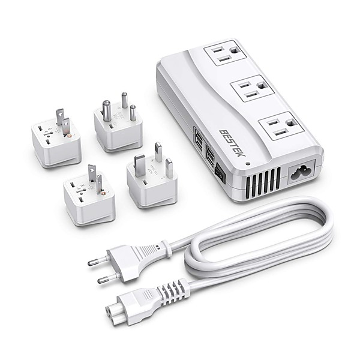

# Best of International Pop Overthrow

By **Various Artists**

## Album Data

- **Catalog:** Beets
- **Format:** Digital, Album
- **Album:** Best of International Pop Overthrow
- **Artist:** Various Artists
- **Albumartist:** Various Artists
- **Genre:** Power Pop
- **MusicBrainz Album Artist ID:** 
- **MusicBrainz Album ID:** 
- **MusicBrainz Release Group ID:** 
- **Year:** 2011
- **Catalog #:** 
- **Label:** 
- **Total Tracks:** 31

## Album Tracks

### Track 06 - Early Morning Night

- **Artist:** Brandon Schott
- **Format:** MP3
- **Genre:** Indie Pop
- **Length:** 2:37
- **MusicBrainz Track ID:** 
- **Title:** Early Morning Night
- **Track:** 06
- **Year:** 2011

### Track 01 - Time Bomb

- **Artist:** Brandon Wilde
- **Format:** MP3
- **Genre:** Power Pop
- **Length:** 1:57
- **MusicBrainz Track ID:** 
- **Title:** Time Bomb
- **Track:** 01
- **Year:** 0000

### Track 14 - Christmas Sun

- **Artist:** Cirrone
- **Format:** MP3
- **Genre:** Power Pop
- **Length:** 3:54
- **MusicBrainz Track ID:** 
- **Title:** Christmas Sun
- **Track:** 14
- **Year:** 0000

### Track 17 - Honey Badger Christmas

- **Artist:** Cliff Hillis
- **Format:** MP3
- **Genre:** Indie Rock
- **Length:** 3:14
- **MusicBrainz Track ID:** 
- **Title:** Honey Badger Christmas
- **Track:** 17
- **Year:** 2011

### Track 19 - Anne Marie

- **Artist:** Dave Rave
- **Format:** MP3
- **Genre:** Power Pop
- **Length:** 4:53
- **MusicBrainz Track ID:** 
- **Title:** Anne Marie
- **Track:** 19
- **Year:** 0000

### Track 12 - Breaking In Two

- **Artist:** Doug Gillard
- **Format:** MP3
- **Genre:** Indie Rock
- **Length:** 2:38
- **MusicBrainz Track ID:** 
- **Title:** Breaking In Two
- **Track:** 12
- **Year:** 0000

### Track 10 - The Basement

- **Artist:** Green Beetles
- **Format:** MP3
- **Genre:** Power Pop
- **Length:** 3:26
- **MusicBrainz Track ID:** 
- **Title:** The Basement
- **Track:** 10
- **Year:** 2011

### Track 22 - Money/Flying

- **Artist:** Hanna Cranna
- **Format:** MP3
- **Genre:** Power Pop
- **Length:** 5:37
- **MusicBrainz Track ID:** 
- **Title:** Money/Flying
- **Track:** 22
- **Year:** 2011

### Track 31 - Better From Here

- **Artist:** Joe Giddings
- **Format:** MP3
- **Genre:** Power Pop
- **Length:** 2:30
- **MusicBrainz Track ID:** 
- **Title:** Better From Here
- **Track:** 31
- **Year:** 0000

### Track 26 - Look Through Any Window

- **Artist:** Michael Carpenter & Rob Smith
- **Format:** MP3
- **Genre:** Power Pop
- **Length:** 3:19
- **MusicBrainz Track ID:** 
- **Title:** Look Through Any Window
- **Track:** 26
- **Year:** 2012

### Track 21 - Love While It Lasted

- **Artist:** Michael Oliver
- **Format:** MP3
- **Genre:** Power Pop
- **Length:** 3:46
- **MusicBrainz Track ID:** 
- **Title:** Love While It Lasted
- **Track:** 21
- **Year:** 0000

### Track 16 - A Christmas Song

- **Artist:** Mimi Betinis
- **Format:** MP3
- **Genre:** Power Pop
- **Length:** 2:36
- **MusicBrainz Track ID:** 
- **Title:** A Christmas Song
- **Track:** 16
- **Year:** 0000

### Track 30 - Start The Show

- **Artist:** One Like Son
- **Format:** MP3
- **Genre:** Power Pop
- **Length:** 3:24
- **MusicBrainz Track ID:** 
- **Title:** Start The Show
- **Track:** 30
- **Year:** 2012

### Track 05 - In The Dead Of Night

- **Artist:** Peter Baldrachi
- **Format:** MP3
- **Genre:** Power Pop
- **Length:** 3:29
- **MusicBrainz Track ID:** 
- **Title:** In The Dead Of Night
- **Track:** 05
- **Year:** 0000

### Track 18 - This Christmas

- **Artist:** Shoes
- **Format:** MP3
- **Genre:** Pop Punk
- **Length:** 3:13
- **MusicBrainz Track ID:** 
- **Title:** This Christmas
- **Track:** 18
- **Year:** 1991

### Track 07 - Couldn't Hear Me Through The Crowd

- **Artist:** Skeleton Staff
- **Format:** MP3
- **Genre:** Psychedelic Pop
- **Length:** 4:06
- **MusicBrainz Track ID:** 
- **Title:** Couldn't Hear Me Through The Crowd
- **Track:** 07
- **Year:** 2011

### Track 04 - I Don't Believe In Love (Anymore)

- **Artist:** The Campbell Apartment
- **Format:** MP3
- **Genre:** Power Pop
- **Length:** 2:58
- **MusicBrainz Track ID:** 
- **Title:** I Don't Believe In Love (Anymore)
- **Track:** 04
- **Year:** 2011

### Track 28 - All You Gotta Do

- **Artist:** The Connection
- **Format:** MP3
- **Genre:** Britpop
- **Length:** 2:14
- **MusicBrainz Track ID:** 
- **Title:** All You Gotta Do
- **Track:** 28
- **Year:** 2011

### Track 25 - Seventeen

- **Artist:** The Cry!
- **Format:** MP3
- **Genre:** Pop Punk
- **Length:** 3:08
- **MusicBrainz Track ID:** 
- **Title:** Seventeen
- **Track:** 25
- **Year:** 0000

### Track 03 - Sunshine Lifeline

- **Artist:** The Ditchflowers
- **Format:** MP3
- **Genre:** Power Pop
- **Length:** 5:13
- **MusicBrainz Track ID:** 
- **Title:** Sunshine Lifeline
- **Track:** 03
- **Year:** 2011

### Track 11 - Vicious Circle

- **Artist:** The Evil Eye
- **Format:** MP3
- **Genre:** Power Pop
- **Length:** 3:02
- **MusicBrainz Track ID:** 
- **Title:** Vicious Circle
- **Track:** 11
- **Year:** 2011

### Track 15 - ...Beatle V.02

- **Artist:** The JTG Implosion
- **Format:** MP3
- **Genre:** Power Pop
- **Length:** 3:37
- **MusicBrainz Track ID:** 
- **Title:** ...Beatle V.02
- **Track:** 15
- **Year:** 2002

### Track 02 - My Eyes Are Still Dry

- **Artist:** The Kik
- **Format:** MP3
- **Genre:** Indie Rock
- **Length:** 2:30
- **MusicBrainz Track ID:** 
- **Title:** My Eyes Are Still Dry
- **Track:** 02
- **Year:** 2011

### Track 23 - Spin Me Around

- **Artist:** The Modulators
- **Format:** MP3
- **Genre:** Power Pop
- **Length:** 2:03
- **MusicBrainz Track ID:** 
- **Title:** Spin Me Around
- **Track:** 23
- **Year:** 0000

### Track 20 - Funny Feeling

- **Artist:** The Stars Explode
- **Format:** MP3
- **Genre:** Power Pop
- **Length:** 3:19
- **MusicBrainz Track ID:** 
- **Title:** Funny Feeling
- **Track:** 20
- **Year:** 0000

### Track 13 - Little St. Nick

- **Artist:** The Villas
- **Format:** MP3
- **Genre:** Indie Pop
- **Length:** 2:06
- **MusicBrainz Track ID:** 
- **Title:** Little St. Nick
- **Track:** 13
- **Year:** 2001

### Track 29 - Give And Take

- **Artist:** Throwback Suburbia
- **Format:** MP3
- **Genre:** Power Pop
- **Length:** 3:47
- **MusicBrainz Track ID:** 
- **Title:** Give And Take
- **Track:** 29
- **Year:** 2012

### Track 24 - Today Didn't Go...

- **Artist:** Toxic Melons
- **Format:** MP3
- **Genre:** Power Pop
- **Length:** 2:56
- **MusicBrainz Track ID:** 
- **Title:** Today Didn't Go...
- **Track:** 24
- **Year:** 2011

### Track 27 - Beautiful Sunchild - feat. Rick Hromadka

- **Artist:** Two Sheds Jackson
- **Format:** MP3
- **Genre:** Britpop
- **Length:** 3:40
- **MusicBrainz Track ID:** 
- **Title:** Beautiful Sunchild - feat. Rick Hromadka
- **Track:** 27
- **Year:** 0000

### Track 08 - The Better Part

- **Artist:** Vegas With Randolph
- **Format:** MP3
- **Genre:** Power Pop
- **Length:** 4:07
- **MusicBrainz Track ID:** 
- **Title:** The Better Part
- **Track:** 08
- **Year:** 2011

### Track 09 - Escape The Light

- **Artist:** Well Wishers
- **Format:** MP3
- **Genre:** Indie Rock
- **Length:** 3:31
- **MusicBrainz Track ID:** 
- **Title:** Escape The Light
- **Track:** 09
- **Year:** 0000

