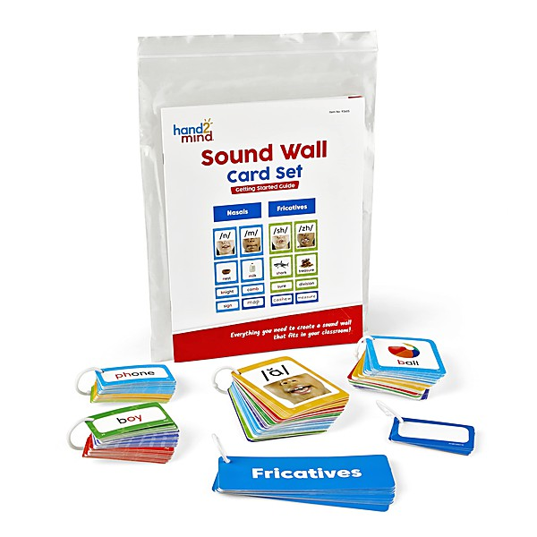

# Billboard Pop Memories

By **Various Artists**

## Album Data

- **Catalog:** Beets
- **Format:** Digital, Album
- **Album:** Billboard Pop Memories
- **Artist:** Various Artists
- **Albumartist:** Various Artists
- **Genre:** Unknown
- **MusicBrainz Album Artist ID:** 
- **MusicBrainz Album ID:** 
- **MusicBrainz Release Group ID:** 
- **Year:** 1950
- **Catalog #:** 
- **Label:** 
- **Total Tracks:** 00

## Album Tracks

### Track 08 - The Green Door

- **Artist:** Jim Lowe
- **Format:** AAC
- **Genre:** Rockabilly
- **Length:** 2:13
- **MusicBrainz Track ID:** 
- **Title:** The Green Door
- **Track:** 08
- **Year:** 1989

