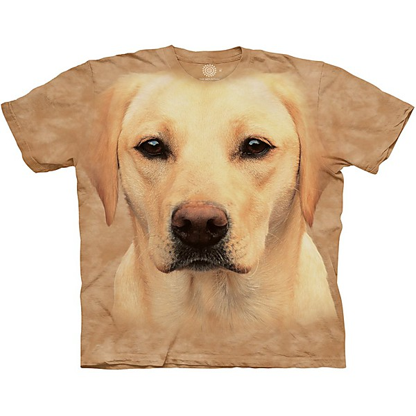

# Billboard Top Rock & Roll Hits

By **Various Artists**

## Album Data

- **Catalog:** Beets
- **Format:** Digital, Album
- **Album:** Billboard Top Rock & Roll Hits
- **Artist:** Various Artists
- **Albumartist:** Various Artists
- **Genre:** Swing
- **MusicBrainz Album Artist ID:** 
- **MusicBrainz Album ID:** 
- **MusicBrainz Release Group ID:** 
- **Year:** 1957
- **Catalog #:** 
- **Label:** 
- **Total Tracks:** 16

## Album Tracks

### Track 13 - What

- **Artist:** Antigone Rising
- **Format:** ALAC
- **Genre:** Indie Pop
- **Length:** 4:02
- **MusicBrainz Track ID:** 
- **Title:** What
- **Track:** 13
- **Year:** 2004

### Track 14 - Burned Down

- **Artist:** Assembly Of Dust
- **Format:** ALAC
- **Genre:** Country Rock
- **Length:** 3:52
- **MusicBrainz Track ID:** 
- **Title:** Burned Down
- **Track:** 14
- **Year:** 2004

### Track 09 - Burning In The Sun

- **Artist:** Blue Merle
- **Format:** ALAC
- **Genre:** Folk Rock
- **Length:** 4:01
- **MusicBrainz Track ID:** 
- **Title:** Burning In The Sun
- **Track:** 09
- **Year:** 2004

### Track 01 - Spanish Harlem Incident

- **Artist:** Bob Dylan
- **Format:** ALAC
- **Genre:** Folk Rock
- **Length:** 2:41
- **MusicBrainz Track ID:** 
- **Title:** Spanish Harlem Incident
- **Track:** 01
- **Year:** 2004

### Track 07 - The Blower's Daughter

- **Artist:** Damien Rice
- **Format:** ALAC
- **Genre:** Indie Rock
- **Length:** 4:46
- **MusicBrainz Track ID:** 
- **Title:** The Blower's Daughter
- **Track:** 07
- **Year:** 2002

### Track 16 - What'cha Know About

- **Artist:** Donovan Frankenreiter Feat. G. Love
- **Format:** ALAC
- **Genre:** Surf Rock
- **Length:** 3:06
- **MusicBrainz Track ID:** 
- **Title:** What'cha Know About
- **Track:** 16
- **Year:** 2004

### Track 04 - Got My Mojo Working

- **Artist:** Etta James
- **Format:** ALAC
- **Genre:** Country Rock
- **Length:** 3:36
- **MusicBrainz Track ID:** 
- **Title:** Got My Mojo Working
- **Track:** 04
- **Year:** 2004

### Track 06 - Paint

- **Artist:** Galactic
- **Format:** ALAC
- **Genre:** Acid Jazz
- **Length:** 3:21
- **MusicBrainz Track ID:** 
- **Title:** Paint
- **Track:** 06
- **Year:** 2004

### Track 03 - Bad Man Walking

- **Artist:** Gov't Mule
- **Format:** ALAC
- **Genre:** Stoner Rock
- **Length:** 4:07
- **MusicBrainz Track ID:** 
- **Title:** Bad Man Walking
- **Track:** 03
- **Year:** 2004

### Track 08 - The Problem

- **Artist:** J.J. Cale
- **Format:** ALAC
- **Genre:** Americana
- **Length:** 4:31
- **MusicBrainz Track ID:** 
- **Title:** The Problem
- **Track:** 08
- **Year:** 2004

### Track 10 - They

- **Artist:** Jem
- **Format:** ALAC
- **Genre:** Electronica
- **Length:** 3:18
- **MusicBrainz Track ID:** 
- **Title:** They
- **Track:** 10
- **Year:** 2004

### Track 05 - One Big Holiday

- **Artist:** My Morning Jacket
- **Format:** ALAC
- **Genre:** Indie Rock
- **Length:** 5:25
- **MusicBrainz Track ID:** 
- **Title:** One Big Holiday
- **Track:** 05
- **Year:** 2004

### Track 11 - Drugs

- **Artist:** Simple Kid
- **Format:** ALAC
- **Genre:** Rock
- **Length:** 4:59
- **MusicBrainz Track ID:** 
- **Title:** Drugs
- **Track:** 11
- **Year:** 2004

### Track 15 - Selfish

- **Artist:** Slum Village
- **Format:** ALAC
- **Genre:** Hip Hop
- **Length:** 3:46
- **MusicBrainz Track ID:** 
- **Title:** Selfish
- **Track:** 15
- **Year:** 2004

### Track 02 - The Inlaw Josey Wales

- **Artist:** Trey Anastasio
- **Format:** ALAC
- **Genre:** Funk
- **Length:** 2:48
- **MusicBrainz Track ID:** 
- **Title:** The Inlaw Josey Wales
- **Track:** 02
- **Year:** 2004

### Track 12 - Wife Soup

- **Artist:** Umphrey's McGee
- **Format:** ALAC
- **Genre:** Progressive Rock
- **Length:** 7:30
- **MusicBrainz Track ID:** 
- **Title:** Wife Soup
- **Track:** 12
- **Year:** 2004

