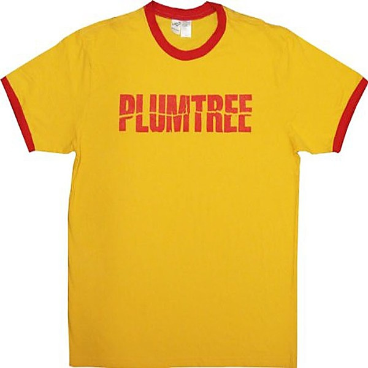

# Bonnaroo 2004

By **Various Artists**

## Album Data

- **Catalog:** Beets
- **Format:** Digital, Album
- **Album:** Bonnaroo 2004
- **Artist:** Various Artists
- **Albumartist:** Various Artists
- **Genre:** Rock
- **MusicBrainz Album Artist ID:** 
- **MusicBrainz Album ID:** 
- **MusicBrainz Release Group ID:** 
- **Year:** 2004
- **Catalog #:** 
- **Label:** 
- **Total Tracks:** 14

## Album Tracks

### Track 09 - Naxalite

- **Artist:** Asian Dub Foundation
- **Format:** AAC
- **Genre:** Dub
- **Length:** 4:45
- **MusicBrainz Track ID:** 
- **Title:** Naxalite
- **Track:** 09
- **Year:** 1999

### Track 03 - Policeman Skank (Story Of My Life)

- **Artist:** Audioweb
- **Format:** AAC
- **Genre:** Rock
- **Length:** 4:30
- **MusicBrainz Track ID:** 
- **Title:** Policeman Skank (Story Of My Life)
- **Track:** 03
- **Year:** 1999

### Track 11 - Bangkok (Thai Version)

- **Artist:** Brother Sun Sister Moon
- **Format:** AAC
- **Genre:** Ambient
- **Length:** 3:33
- **MusicBrainz Track ID:** 
- **Title:** Bangkok (Thai Version)
- **Track:** 11
- **Year:** 1999

### Track 14 - The Arrest/Darlene Goes Home

- **Artist:** David Newman
- **Format:** AAC
- **Genre:** Rock
- **Length:** 6:55
- **MusicBrainz Track ID:** 
- **Title:** The Arrest/Darlene Goes Home
- **Track:** 14
- **Year:** 1999

### Track 01 - Silence

- **Artist:** Delerium Feat. Sarah McLachlan
- **Format:** AAC
- **Genre:** Trance
- **Length:** 6:35
- **MusicBrainz Track ID:** 
- **Title:** Silence
- **Track:** 01
- **Year:** 1998

### Track 06 - Fingers

- **Artist:** Joi
- **Format:** AAC
- **Genre:** World Fusion
- **Length:** 6:33
- **MusicBrainz Track ID:** 
- **Title:** Fingers
- **Track:** 06
- **Year:** 1999

### Track 10 - Even When I'm Sleeping

- **Artist:** Leonardo's Bride
- **Format:** AAC
- **Genre:** Pop
- **Length:** 3:53
- **MusicBrainz Track ID:** 
- **Title:** Even When I'm Sleeping
- **Track:** 10
- **Year:** 1999

### Track 08 - Leave It Alone

- **Artist:** Moist
- **Format:** AAC
- **Genre:** Alternative Rock
- **Length:** 4:25
- **MusicBrainz Track ID:** 
- **Title:** Leave It Alone
- **Track:** 08
- **Year:** 1996

### Track 02 - Party's Just Begun

- **Artist:** Nelly Furtado
- **Format:** AAC
- **Genre:** Pop
- **Length:** 4:09
- **MusicBrainz Track ID:** 
- **Title:** Party's Just Begun
- **Track:** 02
- **Year:** 1999

### Track 12 - The Wind

- **Artist:** PJ Harvey
- **Format:** AAC
- **Genre:** Indie Rock
- **Length:** 3:59
- **MusicBrainz Track ID:** 
- **Title:** The Wind
- **Track:** 12
- **Year:** 1999

### Track 05 - Damaged

- **Artist:** Plumb
- **Format:** AAC
- **Genre:** Christian Rock
- **Length:** 3:55
- **MusicBrainz Track ID:** 
- **Title:** Damaged
- **Track:** 05
- **Year:** 1999

### Track 13 - Deliver Me

- **Artist:** Sarah Brightman
- **Format:** AAC
- **Genre:** Opera
- **Length:** 4:00
- **MusicBrainz Track ID:** 
- **Title:** Deliver Me
- **Track:** 13
- **Year:** 1998

### Track 04 - Rock The Casbah

- **Artist:** Solar Twins
- **Format:** AAC
- **Genre:** Electronic
- **Length:** 3:42
- **MusicBrainz Track ID:** 
- **Title:** Rock The Casbah
- **Track:** 04
- **Year:** 1999

### Track 07 - Contradictive

- **Artist:** Tricky With DJ Muggs & Grease
- **Format:** AAC
- **Genre:** Rock
- **Length:** 3:05
- **MusicBrainz Track ID:** 
- **Title:** Contradictive
- **Track:** 07
- **Year:** 1999

