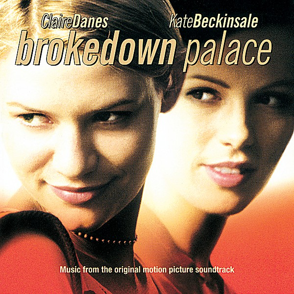

# Brokedown Palace

By **Various Artists**

## Album Data

- **Catalog:** Beets
- **Format:** Digital, Album
- **Album:** Brokedown Palace
- **Artist:** Various Artists
- **Albumartist:** Various Artists
- **Genre:** Rock
- **MusicBrainz Album Artist ID:** 
- **MusicBrainz Album ID:** 
- **MusicBrainz Release Group ID:** 
- **Year:** 1998
- **Catalog #:** 
- **Label:** 
- **Total Tracks:** 26

## Album Tracks

### Track 01 - Dorothy

- **Artist:** Dr. John
- **Format:** ALAC
- **Genre:** Jazz
- **Length:** 3:31
- **MusicBrainz Track ID:** 
- **Title:** Dorothy
- **Track:** 01
- **Year:** 0000

### Track 02 - Mac's Boogie

- **Artist:** Dr. John
- **Format:** ALAC
- **Genre:** Piano Blues
- **Length:** 4:08
- **MusicBrainz Track ID:** 
- **Title:** Mac's Boogie
- **Track:** 02
- **Year:** 0000

### Track 03 - Memories Of Professor

- **Artist:** Dr. John
- **Format:** ALAC
- **Genre:** Soul
- **Length:** 4:00
- **MusicBrainz Track ID:** 
- **Title:** Memories Of Professor
- **Track:** 03
- **Year:** 0000

### Track 04 - The Nearness Of You

- **Artist:** Dr. John
- **Format:** ALAC
- **Genre:** Piano Blues
- **Length:** 4:05
- **MusicBrainz Track ID:** 
- **Title:** The Nearness Of You
- **Track:** 04
- **Year:** 0000

### Track 05 - Delicado

- **Artist:** Dr. John
- **Format:** ALAC
- **Genre:** Piano Blues
- **Length:** 4:26
- **MusicBrainz Track ID:** 
- **Title:** Delicado
- **Track:** 05
- **Year:** 0000

### Track 06 - Honey Dripper

- **Artist:** Dr. John
- **Format:** ALAC
- **Genre:** Boogie
- **Length:** 3:42
- **MusicBrainz Track ID:** 
- **Title:** Honey Dripper
- **Track:** 06
- **Year:** 0000

### Track 07 - Big Mac

- **Artist:** Dr. John
- **Format:** ALAC
- **Genre:** Piano Blues
- **Length:** 5:12
- **MusicBrainz Track ID:** 
- **Title:** Big Mac
- **Track:** 07
- **Year:** 0000

### Track 08 - New Island Midnight

- **Artist:** Dr. John
- **Format:** ALAC
- **Genre:** Soul
- **Length:** 4:18
- **MusicBrainz Track ID:** 
- **Title:** New Island Midnight
- **Track:** 08
- **Year:** 0000

### Track 09 - Saints

- **Artist:** Dr. John
- **Format:** ALAC
- **Genre:** Piano Blues
- **Length:** 4:53
- **MusicBrainz Track ID:** 
- **Title:** Saints
- **Track:** 09
- **Year:** 0000

### Track 10 - Pinetop

- **Artist:** Dr. John
- **Format:** ALAC
- **Genre:** Soul
- **Length:** 3:15
- **MusicBrainz Track ID:** 
- **Title:** Pinetop
- **Track:** 10
- **Year:** 0000

### Track 26 - Baby, I Love You

- **Artist:** Howard Tate
- **Format:** ALAC
- **Genre:** Soul
- **Length:** 2:26
- **MusicBrainz Track ID:** 
- **Title:** Baby, I Love You
- **Track:** 26
- **Year:** 0000

### Track 22 - A Fool In Love

- **Artist:** IKe & Tina Turner
- **Format:** ALAC
- **Genre:** Soul
- **Length:** 2:57
- **MusicBrainz Track ID:** 
- **Title:** A Fool In Love
- **Track:** 22
- **Year:** 0000

### Track 24 - You've Been In Love Too Long

- **Artist:** Martha & The Vandellas
- **Format:** ALAC
- **Genre:** Soul
- **Length:** 3:03
- **MusicBrainz Track ID:** 
- **Title:** You've Been In Love Too Long
- **Track:** 24
- **Year:** 0000

### Track 23 - Bye Bye Baby

- **Artist:** Mary Wells
- **Format:** ALAC
- **Genre:** Soul
- **Length:** 2:57
- **MusicBrainz Track ID:** 
- **Title:** Bye Bye Baby
- **Track:** 23
- **Year:** 0000

### Track 11 - Big Chief

- **Artist:** Professor Longhair
- **Format:** ALAC
- **Genre:** Funk
- **Length:** 2:23
- **MusicBrainz Track ID:** 
- **Title:** Big Chief
- **Track:** 11
- **Year:** 0000

### Track 13 - Big Chief

- **Artist:** Professor Longhair
- **Format:** ALAC
- **Genre:** Funk
- **Length:** 3:17
- **MusicBrainz Track ID:** 
- **Title:** Big Chief
- **Track:** 13
- **Year:** 0000

### Track 14 - Her Mind Is Gone

- **Artist:** Professor Longhair
- **Format:** ALAC
- **Genre:** Soul
- **Length:** 4:29
- **MusicBrainz Track ID:** 
- **Title:** Her Mind Is Gone
- **Track:** 14
- **Year:** 0000

### Track 15 - Willie Fugal's Blues

- **Artist:** Professor Longhair
- **Format:** ALAC
- **Genre:** Funk
- **Length:** 2:10
- **MusicBrainz Track ID:** 
- **Title:** Willie Fugal's Blues
- **Track:** 15
- **Year:** 0000

### Track 16 - Crawfish Fiesta

- **Artist:** Professor Longhair
- **Format:** ALAC
- **Genre:** Blues
- **Length:** 3:15
- **MusicBrainz Track ID:** 
- **Title:** Crawfish Fiesta
- **Track:** 16
- **Year:** 0000

### Track 17 - Junco Partner

- **Artist:** Professor Longhair
- **Format:** ALAC
- **Genre:** Boogie
- **Length:** 3:40
- **MusicBrainz Track ID:** 
- **Title:** Junco Partner
- **Track:** 17
- **Year:** 0000

### Track 18 - Doin' It

- **Artist:** Professor Longhair
- **Format:** ALAC
- **Genre:** Boogie
- **Length:** 3:46
- **MusicBrainz Track ID:** 
- **Title:** Doin' It
- **Track:** 18
- **Year:** 0000

### Track 19 - How Long Has That Train Been Gone

- **Artist:** Professor Longhair
- **Format:** ALAC
- **Genre:** Boogie
- **Length:** 3:39
- **MusicBrainz Track ID:** 
- **Title:** How Long Has That Train Been Gone
- **Track:** 19
- **Year:** 0000

### Track 20 - Tipitina

- **Artist:** Professor Longhair
- **Format:** ALAC
- **Genre:** Rhythm And Blues
- **Length:** 3:41
- **MusicBrainz Track ID:** 
- **Title:** Tipitina
- **Track:** 20
- **Year:** 0000

### Track 21 - Rockin' Pneumonia

- **Artist:** Professor Longhair
- **Format:** ALAC
- **Genre:** Delta Blues
- **Length:** 3:28
- **MusicBrainz Track ID:** 
- **Title:** Rockin' Pneumonia
- **Track:** 21
- **Year:** 0000

### Track 12 - Big Chief

- **Artist:** Professor Longhair & Earl King
- **Format:** ALAC
- **Genre:** Soul
- **Length:** 2:31
- **MusicBrainz Track ID:** 
- **Title:** Big Chief
- **Track:** 12
- **Year:** 0000

### Track 25 - Danger Heartbreak Dead

- **Artist:** The Marvelettes
- **Format:** ALAC
- **Genre:** Soul
- **Length:** 2:33
- **MusicBrainz Track ID:** 
- **Title:** Danger Heartbreak Dead
- **Track:** 25
- **Year:** 0000

