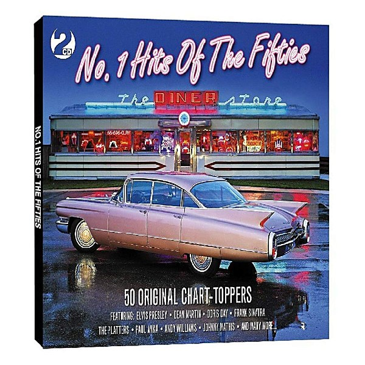

# Chart Toppers

By **Various Artists**

## Album Data

- **Catalog:** Beets
- **Format:** Digital, Album
- **Album:** Chart Toppers
- **Artist:** Various Artists
- **Albumartist:** Various Artists
- **Genre:** Pop
- **MusicBrainz Album Artist ID:** 
- **MusicBrainz Album ID:** 
- **MusicBrainz Release Group ID:** 
- **Year:** 1998
- **Catalog #:** 
- **Label:** 
- **Total Tracks:** 00

## Album Tracks

### Track 03 - Lost Winter's Dream

- **Artist:** Lisa Mychols & Wondermints
- **Format:** MP3
- **Genre:** Rock
- **Length:** 3:38
- **MusicBrainz Track ID:** 
- **Title:** Lost Winter's Dream
- **Track:** 03
- **Year:** 0000

### Track 04 - Merry Christmas Will Do

- **Artist:** Material Issue
- **Format:** MP3
- **Genre:** Power Pop
- **Length:** 3:30
- **MusicBrainz Track ID:** 
- **Title:** Merry Christmas Will Do
- **Track:** 04
- **Year:** 0000

### Track 05 - Jesus Christ

- **Artist:** Screaming Santas
- **Format:** MP3
- **Genre:** Rock
- **Length:** 2:20
- **MusicBrainz Track ID:** 
- **Title:** Jesus Christ
- **Track:** 05
- **Year:** 0000

### Track 06 - This Christmas

- **Artist:** Shoes
- **Format:** MP3
- **Genre:** Pop Punk
- **Length:** 3:10
- **MusicBrainz Track ID:** 
- **Title:** This Christmas
- **Track:** 06
- **Year:** 0000

### Track 07 - Turtlenecks & Eggnog

- **Artist:** Sketch Middle
- **Format:** MP3
- **Genre:** Rock
- **Length:** 3:47
- **MusicBrainz Track ID:** 
- **Title:** Turtlenecks & Eggnog
- **Track:** 07
- **Year:** 0000

### Track 08 - Merry Christmas Time

- **Artist:** Somerdale
- **Format:** MP3
- **Genre:** Indie Rock
- **Length:** 3:19
- **MusicBrainz Track ID:** 
- **Title:** Merry Christmas Time
- **Track:** 08
- **Year:** 2016

### Track 09 - Dear Mother Christmas

- **Artist:** Starbelly
- **Format:** MP3
- **Genre:** Power Pop
- **Length:** 3:16
- **MusicBrainz Track ID:** 
- **Title:** Dear Mother Christmas
- **Track:** 09
- **Year:** 0000

### Track 01 - Joy To The World

- **Artist:** The Fab Four
- **Format:** MP3
- **Genre:** Rock
- **Length:** 2:36
- **MusicBrainz Track ID:** 
- **Title:** Joy To The World
- **Track:** 01
- **Year:** 0000

### Track 02 - Rudolf, the Red Nosed Raindeer

- **Artist:** The Fab Four
- **Format:** MP3
- **Genre:** Rock
- **Length:** 2:05
- **MusicBrainz Track ID:** 
- **Title:** Rudolf, the Red Nosed Raindeer
- **Track:** 02
- **Year:** 0000

### Track 10 - Christmas, Bring Us

- **Artist:** The Grip Weeds
- **Format:** MP3
- **Genre:** Neo-Psychedelia
- **Length:** 3:50
- **MusicBrainz Track ID:** 
- **Title:** Christmas, Bring Us
- **Track:** 10
- **Year:** 0000

### Track 11 - Christmas Without Maria

- **Artist:** The JAC (featuring the Christmas Crew)
- **Format:** MP3
- **Genre:** Rock
- **Length:** 3:38
- **MusicBrainz Track ID:** 
- **Title:** Christmas Without Maria
- **Track:** 11
- **Year:** 2016

