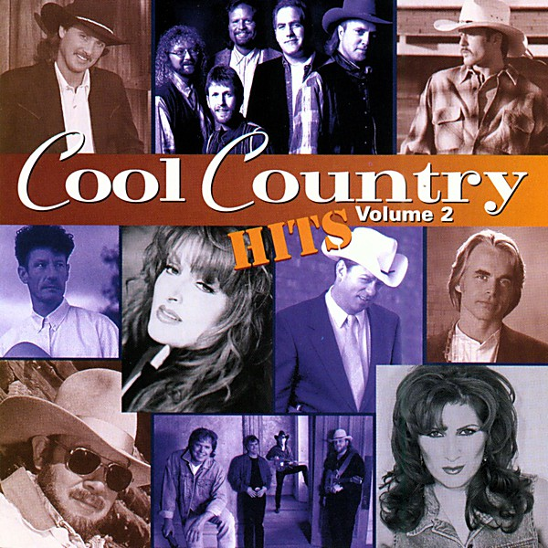

# Cool Country Hits - Volume 2

By **Various Artists**

## Album Data

- **Catalog:** Beets
- **Format:** Digital, Album
- **Album:** Cool Country Hits - Volume 2
- **Artist:** Various Artists
- **Albumartist:** Various Artists
- **Genre:** Emo
- **MusicBrainz Album Artist ID:** 
- **MusicBrainz Album ID:** 
- **MusicBrainz Release Group ID:** 
- **Year:** 1999
- **Catalog #:** 
- **Label:** Not Lame Recordings
- **Total Tracks:** 17

## Album Tracks

### Track 01 - Praises

- **Artist:** Rooks, The
- **Format:** MP3
- **Genre:** Pop Punk
- **Length:** 3:15
- **MusicBrainz Track ID:** 
- **Title:** Praises
- **Track:** 01
- **Year:** 1995

### Track 02 - Reasons

- **Artist:** Rooks, The
- **Format:** MP3
- **Genre:** Power Pop
- **Length:** 3:36
- **MusicBrainz Track ID:** 
- **Title:** Reasons
- **Track:** 02
- **Year:** 1995

### Track 03 - Music Sound Sensation

- **Artist:** Rooks, The
- **Format:** MP3
- **Genre:** Pop Punk
- **Length:** 3:32
- **MusicBrainz Track ID:** 
- **Title:** Music Sound Sensation
- **Track:** 03
- **Year:** 1995

### Track 04 - Waiting

- **Artist:** Rooks, The
- **Format:** MP3
- **Genre:** Pop Punk
- **Length:** 3:36
- **MusicBrainz Track ID:** 
- **Title:** Waiting
- **Track:** 04
- **Year:** 1995

### Track 05 - Love Said to Me

- **Artist:** Rooks, The
- **Format:** MP3
- **Genre:** Power Pop
- **Length:** 2:56
- **MusicBrainz Track ID:** 
- **Title:** Love Said to Me
- **Track:** 05
- **Year:** 1995

### Track 06 - Glitter Best

- **Artist:** Rooks, The
- **Format:** MP3
- **Genre:** Pop Punk
- **Length:** 4:26
- **MusicBrainz Track ID:** 
- **Title:** Glitter Best
- **Track:** 06
- **Year:** 1995

### Track 07 - In a Pinwheel Spin

- **Artist:** Rooks, The
- **Format:** MP3
- **Genre:** Pop Punk
- **Length:** 2:57
- **MusicBrainz Track ID:** 
- **Title:** In a Pinwheel Spin
- **Track:** 07
- **Year:** 1995

### Track 08 - Steeplechase

- **Artist:** Rooks, The
- **Format:** MP3
- **Genre:** Pop Punk
- **Length:** 1:55
- **MusicBrainz Track ID:** 
- **Title:** Steeplechase
- **Track:** 08
- **Year:** 1995

### Track 09 - Colors

- **Artist:** Rooks, The
- **Format:** MP3
- **Genre:** Pop Punk
- **Length:** 3:37
- **MusicBrainz Track ID:** 
- **Title:** Colors
- **Track:** 09
- **Year:** 1995

### Track 10 - Don't You Know

- **Artist:** Twenty Cent Crush
- **Format:** MP3
- **Genre:** Emo
- **Length:** 3:15
- **MusicBrainz Track ID:** 
- **Title:** Don't You Know
- **Track:** 10
- **Year:** 1995

### Track 11 - A Little Fortune and Fame

- **Artist:** Twenty Cent Crush
- **Format:** MP3
- **Genre:** Emo
- **Length:** 3:34
- **MusicBrainz Track ID:** 
- **Title:** A Little Fortune and Fame
- **Track:** 11
- **Year:** 1995

### Track 12 - Sunday Girl

- **Artist:** Twenty Cent Crush
- **Format:** MP3
- **Genre:** Emo
- **Length:** 3:22
- **MusicBrainz Track ID:** 
- **Title:** Sunday Girl
- **Track:** 12
- **Year:** 1995

### Track 13 - Tuesday Morning (Let's Just Stay in Bed)

- **Artist:** Twenty Cent Crush
- **Format:** MP3
- **Genre:** Emo
- **Length:** 3:24
- **MusicBrainz Track ID:** 
- **Title:** Tuesday Morning (Let's Just Stay in Bed)
- **Track:** 13
- **Year:** 1995

### Track 14 - She's Soooo Cool

- **Artist:** Twenty Cent Crush
- **Format:** MP3
- **Genre:** Emo
- **Length:** 3:28
- **MusicBrainz Track ID:** 
- **Title:** She's Soooo Cool
- **Track:** 14
- **Year:** 1995

### Track 15 - Life's So Strange

- **Artist:** Twenty Cent Crush
- **Format:** MP3
- **Genre:** Emo
- **Length:** 3:17
- **MusicBrainz Track ID:** 
- **Title:** Life's So Strange
- **Track:** 15
- **Year:** 1995

### Track 16 - Eye to Eye

- **Artist:** Twenty Cent Crush
- **Format:** MP3
- **Genre:** Emo
- **Length:** 4:15
- **MusicBrainz Track ID:** 
- **Title:** Eye to Eye
- **Track:** 16
- **Year:** 1995

### Track 17 - Lessons in Love

- **Artist:** Twenty Cent Crush
- **Format:** MP3
- **Genre:** Emo
- **Length:** 2:25
- **MusicBrainz Track ID:** 
- **Title:** Lessons in Love
- **Track:** 17
- **Year:** 1995

