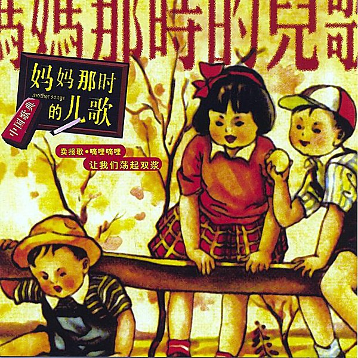

# For Our Children

By **Various Artists**

## Album Data

- **Catalog:** Beets
- **Format:** Digital, Album
- **Album:** For Our Children
- **Artist:** Various Artists
- **Albumartist:** Various Artists
- **Genre:** Soft Rock
- **MusicBrainz Album Artist ID:** 
- **MusicBrainz Album ID:** 
- **MusicBrainz Release Group ID:** 
- **Year:** 0000
- **Catalog #:** 
- **Label:** Discmedi
- **Total Tracks:** 18

## Album Tracks

### Track 03 - Couldn't Believe Her

- **Artist:** Barely Pink
- **Format:** MP3
- **Genre:** Power Pop
- **Length:** 2:38
- **MusicBrainz Track ID:** 
- **Title:** Couldn't Believe Her
- **Track:** 03
- **Year:** 2000

### Track 01 - The World Turns Her All Around

- **Artist:** Bill Lloyd
- **Format:** MP3
- **Genre:** Power Pop
- **Length:** 2:23
- **MusicBrainz Track ID:** 
- **Title:** The World Turns Her All Around
- **Track:** 01
- **Year:** 2000

### Track 08 - You Won't Have to Cry

- **Artist:** Blake, Frank "Jackson"
- **Format:** MP3
- **Genre:** Power Pop
- **Length:** 2:26
- **MusicBrainz Track ID:** 
- **Title:** You Won't Have to Cry
- **Track:** 08
- **Year:** 2000

### Track 13 - I Knew I'd Want You

- **Artist:** Bobby Sutliff
- **Format:** MP3
- **Genre:** Power Pop
- **Length:** 2:20
- **MusicBrainz Track ID:** 
- **Title:** I Knew I'd Want You
- **Track:** 13
- **Year:** 2000

### Track 17 - After The Storm

- **Artist:** Carla Olson
- **Format:** MP3
- **Genre:** Americana
- **Length:** 4:14
- **MusicBrainz Track ID:** 
- **Title:** After The Storm
- **Track:** 17
- **Year:** 2000

### Track 02 - From a Silver Phial

- **Artist:** Chris Von Sneidern
- **Format:** MP3
- **Genre:** Indie Pop
- **Length:** 3:50
- **MusicBrainz Track ID:** 
- **Title:** From a Silver Phial
- **Track:** 02
- **Year:** 2000

### Track 13 - White Light

- **Artist:** Clevenger/Dairy Kings
- **Format:** MP3
- **Genre:** Power Pop
- **Length:** 3:31
- **MusicBrainz Track ID:** 
- **Title:** White Light
- **Track:** 13
- **Year:** 2000

### Track 14 - Changing Heart

- **Artist:** Einstein's Sister
- **Format:** MP3
- **Genre:** Power Pop
- **Length:** 2:52
- **MusicBrainz Track ID:** 
- **Title:** Changing Heart
- **Track:** 14
- **Year:** 2000

### Track 12 - Radio Song

- **Artist:** Finkers
- **Format:** MP3
- **Genre:** Power Pop
- **Length:** 3:16
- **MusicBrainz Track ID:** 
- **Title:** Radio Song
- **Track:** 12
- **Year:** 2000

### Track 16 - Boston

- **Artist:** Flamingo
- **Format:** MP3
- **Genre:** Indie Rock
- **Length:** 3:06
- **MusicBrainz Track ID:** 
- **Title:** Boston
- **Track:** 16
- **Year:** 2000

### Track 08 - Wont Let You Down

- **Artist:** George Usher
- **Format:** MP3
- **Genre:** Power Pop
- **Length:** 3:29
- **MusicBrainz Track ID:** 
- **Title:** Wont Let You Down
- **Track:** 08
- **Year:** 2000

### Track 15 - With Care from Someone

- **Artist:** Ghost Rockets, The/Woodward
- **Format:** MP3
- **Genre:** Power Pop
- **Length:** 5:00
- **MusicBrainz Track ID:** 
- **Title:** With Care from Someone
- **Track:** 15
- **Year:** 2000

### Track 09 - She Don't Care About Time

- **Artist:** Grip Weeds, The
- **Format:** MP3
- **Genre:** Neo-Psychedelia
- **Length:** 2:29
- **MusicBrainz Track ID:** 
- **Title:** She Don't Care About Time
- **Track:** 09
- **Year:** 2000

### Track 17 - American Dreamer

- **Artist:** Helm/Mark Whiteis
- **Format:** MP3
- **Genre:** Power Pop
- **Length:** 1:53
- **MusicBrainz Track ID:** 
- **Title:** American Dreamer
- **Track:** 17
- **Year:** 2000

### Track 04 - She Has a Way

- **Artist:** Idea
- **Format:** MP3
- **Genre:** Heavy Metal
- **Length:** 2:58
- **MusicBrainz Track ID:** 
- **Title:** She Has a Way
- **Track:** 04
- **Year:** 2000

### Track 04 - She Has a Way

- **Artist:** Idea
- **Format:** MP3
- **Genre:** Heavy Metal
- **Length:** 2:58
- **MusicBrainz Track ID:** 
- **Title:** She Has a Way
- **Track:** 04
- **Year:** 2000

### Track 07 - You Showed Me

- **Artist:** Jim Basnight
- **Format:** MP3
- **Genre:** Power Pop
- **Length:** 3:09
- **MusicBrainz Track ID:** 
- **Title:** You Showed Me
- **Track:** 07
- **Year:** 2000

### Track 12 - Full Circle

- **Artist:** Joe Algeri/Happydeadment
- **Format:** MP3
- **Genre:** Power Pop
- **Length:** 2:35
- **MusicBrainz Track ID:** 
- **Title:** Full Circle
- **Track:** 12
- **Year:** 2000

### Track 18 - In My Heart

- **Artist:** Kai Clark
- **Format:** MP3
- **Genre:** Power Pop
- **Length:** 4:31
- **MusicBrainz Track ID:** 
- **Title:** In My Heart
- **Track:** 18
- **Year:** 2000

### Track 05 - Here Without You

- **Artist:** Kennedys, The
- **Format:** MP3
- **Genre:** Power Pop
- **Length:** 2:43
- **MusicBrainz Track ID:** 
- **Title:** Here Without You
- **Track:** 05
- **Year:** 2000

### Track 06 - Train Leaves Here This Morning

- **Artist:** Last Train Home
- **Format:** MP3
- **Genre:** Cowpunk
- **Length:** 3:07
- **MusicBrainz Track ID:** 
- **Title:** Train Leaves Here This Morning
- **Track:** 06
- **Year:** 2000

### Track 18 - The Byrd That Couldn't Fly

- **Artist:** Lears, The
- **Format:** MP3
- **Genre:** Power Pop
- **Length:** 3:18
- **MusicBrainz Track ID:** 
- **Title:** The Byrd That Couldn't Fly
- **Track:** 18
- **Year:** 2000

### Track 05 - You Movin'

- **Artist:** Mayflies USA, The
- **Format:** MP3
- **Genre:** Shoegaze
- **Length:** 3:21
- **MusicBrainz Track ID:** 
- **Title:** You Movin'
- **Track:** 05
- **Year:** 2000

### Track 06 - I'll Feel a Whole Lot Better

- **Artist:** Merrymakers, The
- **Format:** MP3
- **Genre:** Indie Rock
- **Length:** 2:46
- **MusicBrainz Track ID:** 
- **Title:** I'll Feel a Whole Lot Better
- **Track:** 06
- **Year:** 2000

### Track 01 - That's Alright by Me

- **Artist:** Michael Carpenter
- **Format:** MP3
- **Genre:** Power Pop
- **Length:** 4:02
- **MusicBrainz Track ID:** 
- **Title:** That's Alright by Me
- **Track:** 01
- **Year:** 2000

### Track 03 - Christine

- **Artist:** Mop Tops, The
- **Format:** MP3
- **Genre:** Power Pop
- **Length:** 3:25
- **MusicBrainz Track ID:** 
- **Title:** Christine
- **Track:** 03
- **Year:** 2000

### Track 15 - Eight Miles High

- **Artist:** Myracle Brah
- **Format:** MP3
- **Genre:** Indie Rock
- **Length:** 2:47
- **MusicBrainz Track ID:** 
- **Title:** Eight Miles High
- **Track:** 15
- **Year:** 2000

### Track 14 - Set You Free This Time

- **Artist:** Pat Buchanan/John Jorgenson
- **Format:** MP3
- **Genre:** Power Pop
- **Length:** 4:53
- **MusicBrainz Track ID:** 
- **Title:** Set You Free This Time
- **Track:** 14
- **Year:** 2000

### Track 11 - Tried So Hard

- **Artist:** Ray Brandes
- **Format:** MP3
- **Genre:** Power Pop
- **Length:** 2:50
- **MusicBrainz Track ID:** 
- **Title:** Tried So Hard
- **Track:** 11
- **Year:** 2000

### Track 02 - Long Time

- **Artist:** Retros
- **Format:** MP3
- **Genre:** Power Pop
- **Length:** 2:43
- **MusicBrainz Track ID:** 
- **Title:** Long Time
- **Track:** 02
- **Year:** 2000

### Track 10 - You've Gone

- **Artist:** Rich Hopkins/Luminarios
- **Format:** MP3
- **Genre:** Power Pop
- **Length:** 5:06
- **MusicBrainz Track ID:** 
- **Title:** You've Gone
- **Track:** 10
- **Year:** 2000

### Track 09 - Del Cato

- **Artist:** Rick Clark
- **Format:** MP3
- **Genre:** Power Pop
- **Length:** 6:26
- **MusicBrainz Track ID:** 
- **Title:** Del Cato
- **Track:** 09
- **Year:** 2000

### Track 10 - So You Say You Lost Your Baby

- **Artist:** Roger & Jim
- **Format:** MP3
- **Genre:** Power Pop
- **Length:** 3:19
- **MusicBrainz Track ID:** 
- **Title:** So You Say You Lost Your Baby
- **Track:** 10
- **Year:** 2000

### Track 16 - Is Yours Is Mine

- **Artist:** Shazam, The
- **Format:** MP3
- **Genre:** Power Pop
- **Length:** 2:12
- **MusicBrainz Track ID:** 
- **Title:** Is Yours Is Mine
- **Track:** 16
- **Year:** 2000

### Track 11 - Why Not Your Baby

- **Artist:** Sid Griffin
- **Format:** MP3
- **Genre:** Rock
- **Length:** 5:02
- **MusicBrainz Track ID:** 
- **Title:** Why Not Your Baby
- **Track:** 11
- **Year:** 2000

### Track 04 - Tomorrow Is A Long Ways Away

- **Artist:** Steve Wynn
- **Format:** MP3
- **Genre:** Post-Rock
- **Length:** 1:48
- **MusicBrainz Track ID:** 
- **Title:** Tomorrow Is A Long Ways Away
- **Track:** 04
- **Year:** 2000

### Track 07 - The Reason Why

- **Artist:** Walter Egan
- **Format:** MP3
- **Genre:** Soft Rock
- **Length:** 2:25
- **MusicBrainz Track ID:** 
- **Title:** The Reason Why
- **Track:** 07
- **Year:** 2000

## See also

- [101 # 1 hits cd 4 Disc 4](101__1_hits_cd_4_Disc_4.md)
- [10 Best From The 60s](10_Best_From_The_60s.md)
- [1953](1953.md)
- [1955](1955.md)
- [1957](1957.md)
- [1958](1958.md)
- [1959](1959.md)
- [1960](1960.md)
- [1961](1961.md)
- [1962](1962.md)
- [1963](1963.md)
- [1964](1964.md)
- [1965](1965.md)
- [1966](1966.md)
- [1967](1967.md)
- [1968](1968.md)
- [1969](1969.md)
- [1970](1970.md)
- [1972](1972.md)
- [1973](1973.md)
- [2005 Summer Soiree Mix](2005_Summer_Soiree_Mix.md)
- [20 Sweet Soul Classics](20_Sweet_Soul_Classics.md)
- [21 Winners](21_Winners.md)
- [24 Original Happening Hits](24_Original_Happening_Hits.md)
- [Absolutely the Best of Gospel, Vol. 3](Absolutely_the_Best_of_Gospel__Vol_3.md)
- [Action All-Stars](Action_All-Stars.md)
- [AM Gold](AM_Gold_2_3_4.md)
- [AM Gold](AM_Gold_2_3.md)
- [AM Gold](AM_Gold_2.md)
- [AM Gold](AM_Gold.md)
- [At Dianne's Place](At_Diannes_Place.md)
- [A Tribute to the Cars](A_Tribute_to_the_Cars.md)
- [A Year in Your Life](A_Year_in_Your_Life.md)
- [Backstage Pass All Access](Backstage_Pass_All_Access.md)
- [Best of Bootie 2008](Best_of_Bootie_2008.md)
- [Best of Bundle Bonus Trax](Best_of_Bundle_Bonus_Trax.md)
- [Best of Doo Wop Uptempo](Best_of_Doo_Wop_Uptempo.md)
- [Best of International Pop Overthrow](Best_of_International_Pop_Overthrow.md)
- [Best Power Pop Bundle - 2012 Part 1](Best_Power_Pop_Bundle_-_2012_Part_1.md)
- [Billboard Pop Memories](Billboard_Pop_Memories.md)
- [Billboard Top Rock & Roll Hits](Billboard_Top_Rock_and_Roll_Hits_2.md)
- [Billboard Top Rock & Roll Hits](Billboard_Top_Rock_and_Roll_Hits.md)
- [Bonnaroo 2004](Bonnaroo_2004.md)
- [Bonnaroo 2004 - Sweet Sounds vol. 6 (Silver Disc)](Bonnaroo_2004_-_Sweet_Sounds_vol_6_Silver_Disc.md)
- [Brokedown Palace](Brokedown_Palace.md)
- [Bruce Steinberg Casette Tape](Bruce_Steinberg_Casette_Tape.md)
- [Chart Toppers](Chart_Toppers_2.md)
- [Chart Toppers](Chart_Toppers.md)
- [Christmas Music 2016](Christmas_Music_2016.md)
- [Club Mix '96, Vol. 1](Club_Mix_96__Vol_1.md)
- [Cool Country Hits - Volume 2](Cool_Country_Hits_-_Volume_2.md)
- [Double Dose of Pop!](Double_Dose_of_Pop!.md)
- [Double Take](Double_Take.md)
- [English Cats & Others](English_Cats_and_Others.md)
- [Full Circle](Full_Circle.md)
- [Garden State](Garden_State.md)
- [Goa 2011 Vol. 1 [Disc 1]](Goa_2011_Vol_1_[Disc_1].md)
- [Golden Age of American Rock 'n' Roll, Vol. 7](Golden_Age_of_American_Rock_n_Roll__Vol_7.md)
- [Golden Rock'n Rollers](Golden_Rockn_Rollers.md)
- [Good Old Country](Good_Old_Country.md)
- [Greatest Hits of the 60's](Greatest_Hits_of_the_60s.md)
- [Happy Holidays from Drew](Happy_Holidays_from_Drew.md)
- [Hard to Find 45's on CD, Vol. 3](Hard_to_Find_45s_on_CD__Vol_3.md)
- [Hiram and Huddie](Hiram_and_Huddie.md)
- [Hit History Vol. 25 - 1979](Hit_History_Vol_25_-_1979.md)
- [Hook Heaven 2](Hook_Heaven_2.md)
- [Hook Heaven](Hook_Heaven.md)
- [I Love Rock & Roll](I_Love_Rock_and_Roll.md)
- [International Pop Overthrow](International_Pop_Overthrow.md)
- [International Pop Overthrow Vol. 20 - [Disc 3]](International_Pop_Overthrow_Vol_20_-_[Disc_3].md)
- [Jefferson Starship - The Box Set Series_Flights Beyond](Jefferson_Starship_-_The_Box_Set_Series_Flights_Beyond.md)
- [Johnny Depp's Favorites](Johnny_Depps_Favorites.md)
- [Jukebox Jive](Jukebox_Jive.md)
- [Keep On Movin' (April's Mix)](Keep_On_Movin_Aprils_Mix.md)
- [Kissing The Bride](Kissing_The_Bride.md)
- [KPIG Greatest Hits Volume 1](KPIG_Greatest_Hits_Volume_1.md)
- [KY Classics](KY_Classics.md)
- [Launch Issue No. 1](Launch_Issue_No_1.md)
- [Leaders Of The Pack](Leaders_Of_The_Pack.md)
- [Liquid Dreams](Liquid_Dreams.md)
- [Lost & Forgotten Power Pop](Lost_and_Forgotten_Power_Pop.md)
- [Lost & Forgotten Power Pop V9](Lost_and_Forgotten_Power_Pop_V9.md)
- [Lost & Forgotten Power Pop - Vol. 10](Lost_and_Forgotten_Power_Pop_-_Vol_10.md)
- [Lost & Forgotten Power Pop - Vol. 11](Lost_and_Forgotten_Power_Pop_-_Vol_11.md)
- [Lost & Forgotten Power Pop - Vol. 12](Lost_and_Forgotten_Power_Pop_-_Vol_12.md)
- [Lost & Forgotten Power Pop - Vol. 13](Lost_and_Forgotten_Power_Pop_-_Vol_13.md)
- [Lost & Forgotten Power Pop - Vol. 14](Lost_and_Forgotten_Power_Pop_-_Vol_14.md)
- [Lost & Forgotten Power Pop - Vol. 15](Lost_and_Forgotten_Power_Pop_-_Vol_15.md)
- [Lost & Forgotten Power Pop - Vol. 16](Lost_and_Forgotten_Power_Pop_-_Vol_16.md)
- [Lost & Forgotten Power Pop - Vol. 17](Lost_and_Forgotten_Power_Pop_-_Vol_17.md)
- [Lost & Forgotten Power Pop - Vol. 18](Lost_and_Forgotten_Power_Pop_-_Vol_18.md)
- [Lost & Forgotten Power Pop - Vol. 19](Lost_and_Forgotten_Power_Pop_-_Vol_19.md)
- [Lost & Forgotten Power Pop - Vol. 20](Lost_and_Forgotten_Power_Pop_-_Vol_20.md)
- [Lost & Forgotten Power Pop - Vol. 2](Lost_and_Forgotten_Power_Pop_-_Vol_2.md)
- [Lost & Forgotten Power Pop - Vol. 3](Lost_and_Forgotten_Power_Pop_-_Vol_3.md)
- [Lost & Forgotten Power Pop - Vol. 5](Lost_and_Forgotten_Power_Pop_-_Vol_5.md)
- [Lost & Forgotten Power Pop - Vol. 6](Lost_and_Forgotten_Power_Pop_-_Vol_6.md)
- [Lost & Forgotten Power Pop - Vol. 7](Lost_and_Forgotten_Power_Pop_-_Vol_7.md)
- [Lost & Forgotten Power Pop, Volume 8](Lost_and_Forgotten_Power_Pop__Volume_8.md)
- [Lost in the Haze Vol. 19](Lost_in_the_Haze_Vol_19.md)
- [Mashups](Mashups.md)
- [Midheaven .09 Sampler](Midheaven_09_Sampler.md)
- [Mix Tape from Linda](Mix_Tape_from_Linda.md)
- [Monster Mash Party Time](Monster_Mash_Party_Time.md)
- [More Action!](More_Action!.md)
- [Motown](Motown.md)
- [Moulin Rouge](Moulin_Rouge.md)
- [Nashpop](Nashpop.md)
- [Nipper's Greatest Hits](Nippers_Greatest_Hits.md)
- [Not Lame Brand Super Charged Flash Light Pops](Not_Lame_Brand_Super_Charged_Flash_Light_Pops.md)
- [Now That's What I Call Music, Vol. 1](Now_Thats_What_I_Call_Music__Vol_1.md)
- [Now, Vol. 17](Now__Vol_17.md)
- [Number One Hits](Number_One_Hits.md)
- [Oldies But Goodies, Vol. 1](Oldies_But_Goodies__Vol_1.md)
- [Oldies But Goodies, Vol. 2](Oldies_But_Goodies__Vol_2.md)
- [Oldies But Goodies, Vol. 6](Oldies_But_Goodies__Vol_6.md)
- [Oldies But Goodies, Vol. 7](Oldies_But_Goodies__Vol_7.md)
- [Oldies But Goodies, Vol. 8](Oldies_But_Goodies__Vol_8.md)
- [One More For The Fans](One_More_For_The_Fans.md)
- [Only Rock 'N Roll 1960-1964](Only_Rock_N_Roll_1960-1964.md)
- [Paris in the Spring](Paris_in_the_Spring.md)
- [PGH October Compilation](PGH_October_Compilation.md)
- [Philharmania](Philharmania.md)
- [Phosphene River](Phosphene_River.md)
- [PopGeekHeaven Present Power Pop Prime Vol. 9 [Disc 3]](PopGeekHeaven_Present_Power_Pop_Prime_Vol_9_[Disc_3].md)
- [PopGeekHeaven Presents Power Pop Prime Volume 9 [Disc 2]](PopGeekHeaven_Presents_Power_Pop_Prime_Volume_9_[Disc_2].md)
- [PopGeekHeaven's The Best Of 2017](PopGeekHeavens_The_Best_Of_2017.md)
- [Pop Geek Heaven Surprise Box - Pt. 4](Pop_Geek_Heaven_Surprise_Box_-_Pt_4.md)
- [Pottery Barn](Pottery_Barn.md)
- [Power Pop Planet Volume 1 [Disc 2]](Power_Pop_Planet_Volume_1_[Disc_2].md)
- [Power Pop Planet Volume 2 [Disc 2]](Power_Pop_Planet_Volume_2_[Disc_2].md)
- [Power Pop Planet Volume 3 [Disc 2]](Power_Pop_Planet_Volume_3_[Disc_2].md)
- [Power Pop Planet Volume 4 [Disc 2]](Power_Pop_Planet_Volume_4_[Disc_2].md)
- [Power Pop Planet Volume 4](Power_Pop_Planet_Volume_4.md)
- [Power Pop Prime - Volume 1](Power_Pop_Prime_-_Volume_1.md)
- [Power Pop Prime - Volume 2](Power_Pop_Prime_-_Volume_2.md)
- [Power Pop Prime - Volume 3](Power_Pop_Prime_-_Volume_3.md)
- [Power Pop - The Best of 2015](Power_Pop_-_The_Best_of_2015.md)
- [Power Pop - The Best Of 2016](Power_Pop_-_The_Best_Of_2016.md)
- [Psychedelic Salon](Psychedelic_Salon.md)
- [Pure Love Moods Vol. 2](Pure_Love_Moods_Vol_2.md)
- [Pure Pop For Cool People - A Compilation of Not Lame 1999 Releases](Pure_Pop_For_Cool_People_-_A_Compilation_of_Not_Lame_1999_Releases.md)
- [Radio Gold [Compose]](Radio_Gold_[Compose].md)
- [Record Store Day April 22, 2017 (Blue CD Sampler)](Record_Store_Day_April_22__2017_Blue_CD_Sampler.md)
- [Record Store Day April 22, 2017 (Yellow CD Sampler)](Record_Store_Day_April_22__2017_Yellow_CD_Sampler.md)
- [Red Radio Vol. 3 - Happy Birthday](Red_Radio_Vol_3_-_Happy_Birthday.md)
- [Retrospace Podcasts](Retrospace_Podcasts.md)
- [Romantic Moments Of The 60's](Romantic_Moments_Of_The_60s.md)
- [Roots N' Blues - The Retrospective, Disc 4](Roots_N_Blues_-_The_Retrospective__Disc_4.md)
- [Sentimental Journey, Vol. 4](Sentimental_Journey__Vol_4.md)
- [Shake Some Action!](Shake_Some_Action!.md)
- [Shake Some Action](Shake_Some_Action.md)
- [Sisters of Soul [Crimson]](Sisters_of_Soul_[Crimson].md)
- [Six Years of Power Pop!](Six_Years_of_Power_Pop!.md)
- [Sliding Doors](Sliding_Doors.md)
- [Soul Hits of the 70s](Soul_Hits_of_the_70s.md)
- [Southland Tales](Southland_Tales.md)
- [Stax](Stax.md)
- [Steady, As She Goes](Steady__As_She_Goes.md)
- [Step Up 2 the Streets (Original Motion Picture Soundtrack)](Step_Up_2_the_Streets_Original_Motion_Picture_Soundtrack.md)
- [Stick With Me Baby](Stick_With_Me_Baby.md)
- [Super Charged Flashlight Pops V. II](Super_Charged_Flashlight_Pops_V_II.md)
- [Super Girls](Super_Girls.md)
- [Super Hits of the '70s](Super_Hits_of_the_70s.md)
- [Super Oldies Volume 3](Super_Oldies_Volume_3.md)
- [Surfin' Roots](Surfin_Roots.md)
- [Swingers Soundtrack](Swingers_Soundtrack.md)
- [Sympophony #1](Sympophony_1.md)
- [The Best Of Power Pop Vol. 8](The_Best_Of_Power_Pop_Vol_8.md)
- [The British Invasion](The_British_Invasion.md)
- [The Disco Years, Vol. 3](The_Disco_Years__Vol_3.md)
- [The Fabulous Fifties](The_Fabulous_Fifties.md)
- [The History of Space Age Pop, Vol. 2](The_History_of_Space_Age_Pop__Vol_2.md)
- [The Life Aquatic](The_Life_Aquatic.md)
- [The Life Aquatic With Steve Zissou](The_Life_Aquatic_With_Steve_Zissou.md)
- [The Look of Love](The_Look_of_Love.md)
- [The Lost & Forgotten Power Pop Collection Part 5](The_Lost_and_Forgotten_Power_Pop_Collection_Part_5.md)
- [There's a Riot Goin' On! The Rock 'N' Roll Classics of Lieber and Stoller](Theres_a_Riot_Goin_On!_The_Rock_N_Roll_Classics_of_Lieber_and_Stoller.md)
- [The Retrospace 2011 Xmas Mix](The_Retrospace_2011_Xmas_Mix.md)
- [The Rock 'N' Roll Era](The_Rock_N_Roll_Era_2_3.md)
- [The Rock 'N' Roll Era](The_Rock_N_Roll_Era_2.md)
- [The Rock 'N' Roll Era](The_Rock_N_Roll_Era.md)
- [The Rocky Horror Picture Show](The_Rocky_Horror_Picture_Show.md)
- [The Seventies Generation](The_Seventies_Generation.md)
- [Timeless](Timeless.md)
- [Town Hall Party 8-8-1959](Town_Hall_Party_8-8-1959.md)
- [Treasure Chest Of Awesome](Treasure_Chest_Of_Awesome.md)
- [Very Best of Country [Crimson] Disc 1](Very_Best_of_Country_[Crimson]_Disc_1.md)
- [Very Oldie Goldies Vol. 2](Very_Oldie_Goldies_Vol_2.md)
- [Very Oldie Goldies Vol. 3](Very_Oldie_Goldies_Vol_3.md)
- [Very Oldie Goldies Vol. 4](Very_Oldie_Goldies_Vol_4.md)
- [Wackiest Album in the Universe, Vol. 1](Wackiest_Album_in_the_Universe__Vol_1.md)
- [Wattstax](Wattstax.md)
- [What's Up Matador (Disc 2)](Whats_Up_Matador_Disc_2.md)
- [Willow YouTube Brown Bird Plus](Willow_YouTube_Brown_Bird_Plus.md)
- [Your Hit Parade](Your_Hit_Parade_2_3_4.md)
- [Your Hit Parade](Your_Hit_Parade_2_3.md)
- [Your Hit Parade](Your_Hit_Parade_2.md)
- [Your Hit Parade](Your_Hit_Parade.md)
- [CD: An Elpee's Worth Of Productions](../../CD/Various_Artists/An_Elpees_Worth_Of_Productions.md)
- [CD: Hank Williams Timeless](../../CD/Various_Artists/Hank_Williams_Timeless.md)
- [CD: Justin & Christina](../../CD/Various_Artists/Justin_and_Christina.md)
- [CD: Phantom Of The Paradise](../../CD/Various_Artists/Phantom_Of_The_Paradise.md)
- [CD: Sucker Punch](../../CD/Various_Artists/Sucker_Punch.md)
- [CD: ](../../CD/Various_Artists/Various_Artists.md)
