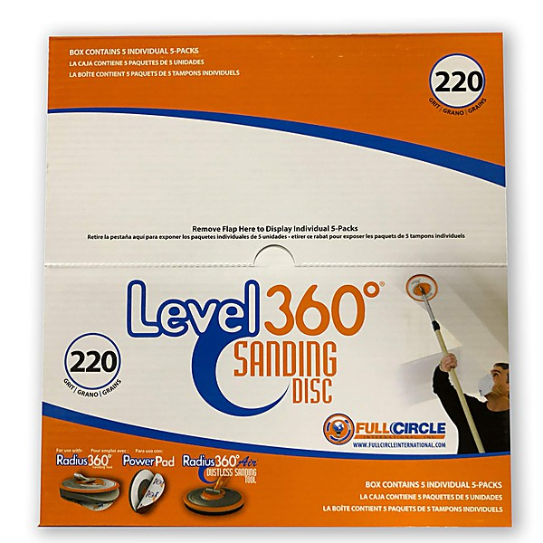

# Full Circle

By **Various Artists**

## Album Data

- **Catalog:** Beets
- **Format:** Digital, Album
- **Album:** Full Circle
- **Artist:** Various Artists
- **Albumartist:** Various Artists
- **Genre:** Power Pop
- **MusicBrainz Album Artist ID:** 
- **MusicBrainz Album ID:** 
- **MusicBrainz Release Group ID:** 
- **Year:** 2000
- **Catalog #:** 
- **Label:** 
- **Total Tracks:** 13

## Album Tracks

### Track 06 - Blue Eyes

- **Artist:** Cary Brothers
- **Format:** ALAC
- **Genre:** Indie Rock
- **Length:** 4:20
- **MusicBrainz Track ID:** 
- **Title:** Blue Eyes
- **Track:** 06
- **Year:** 0000

### Track 01 - Don't Panic

- **Artist:** Coldplay
- **Format:** ALAC
- **Genre:** Indie Rock
- **Length:** 2:18
- **MusicBrainz Track ID:** 
- **Title:** Don't Panic
- **Track:** 01
- **Year:** 0000

### Track 05 - I Just Don't Think I'll Ever Get Over You

- **Artist:** Colin Hay
- **Format:** ALAC
- **Genre:** Indie Rock
- **Length:** 5:20
- **MusicBrainz Track ID:** 
- **Title:** I Just Don't Think I'll Ever Get Over You
- **Track:** 05
- **Year:** 0000

### Track 12 - Let Go

- **Artist:** Frou Frou
- **Format:** ALAC
- **Genre:** Electronica
- **Length:** 4:14
- **MusicBrainz Track ID:** 
- **Title:** Let Go
- **Track:** 12
- **Year:** 0000

### Track 11 - Such Great Heights

- **Artist:** Iron & Wine
- **Format:** ALAC
- **Genre:** Indie Folk
- **Length:** 4:14
- **MusicBrainz Track ID:** 
- **Title:** Such Great Heights
- **Track:** 11
- **Year:** 0000

### Track 08 - One of These Things First

- **Artist:** Nick Drake
- **Format:** ALAC
- **Genre:** Indie Rock
- **Length:** 4:51
- **MusicBrainz Track ID:** 
- **Title:** One of These Things First
- **Track:** 08
- **Year:** 0000

### Track 07 - Fair

- **Artist:** Remy Zero
- **Format:** ALAC
- **Genre:** Indie Rock
- **Length:** 3:56
- **MusicBrainz Track ID:** 
- **Title:** Fair
- **Track:** 07
- **Year:** 0000

### Track 02 - Caring Is Creepy

- **Artist:** The Shins
- **Format:** ALAC
- **Genre:** Indie Rock
- **Length:** 3:22
- **MusicBrainz Track ID:** 
- **Title:** Caring Is Creepy
- **Track:** 02
- **Year:** 0000

### Track 04 - New Slang

- **Artist:** The Shins
- **Format:** ALAC
- **Genre:** Indie Rock
- **Length:** 3:53
- **MusicBrainz Track ID:** 
- **Title:** New Slang
- **Track:** 04
- **Year:** 0000

### Track 09 - Lebanese Blonde

- **Artist:** Thievery Corporation
- **Format:** ALAC
- **Genre:** Electronica
- **Length:** 4:48
- **MusicBrainz Track ID:** 
- **Title:** Lebanese Blonde
- **Track:** 09
- **Year:** 0000

### Track 03 - In The Waiting Line

- **Artist:** Zero 7
- **Format:** ALAC
- **Genre:** Electronica
- **Length:** 4:35
- **MusicBrainz Track ID:** 
- **Title:** In The Waiting Line
- **Track:** 03
- **Year:** 0000

