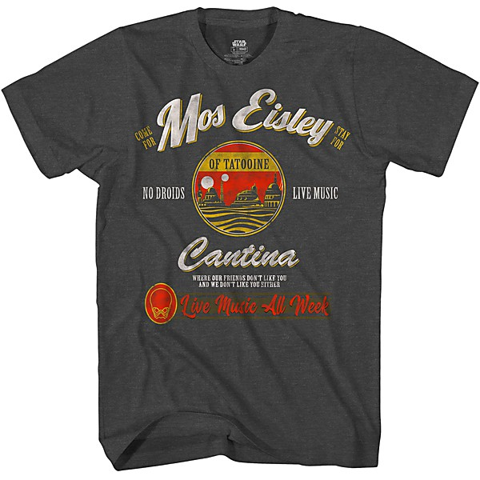

# Golden Rock'n Rollers

By **Various Artists**

## Album Data

- **Catalog:** Beets
- **Format:** Digital, Album
- **Album:** Golden Rock'n Rollers
- **Artist:** Various Artists
- **Albumartist:** Various Artists
- **Genre:** Pop
- **MusicBrainz Album Artist ID:** 
- **MusicBrainz Album ID:** 
- **MusicBrainz Release Group ID:** 
- **Year:** 1976
- **Catalog #:** 
- **Label:** 
- **Total Tracks:** 00

## Album Tracks

### Track 01 - The Most Beautiful Girl

- **Artist:** Charlie Rich
- **Format:** AAC
- **Genre:** Classic Country
- **Length:** 2:54
- **MusicBrainz Track ID:** 
- **Title:** The Most Beautiful Girl
- **Track:** 01
- **Year:** 2000

