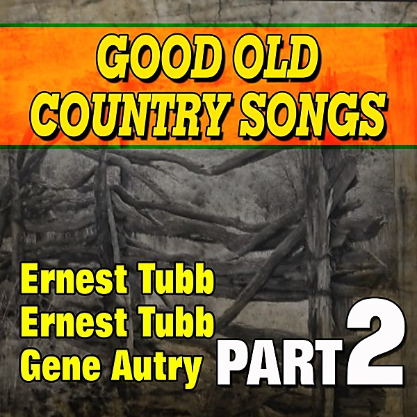

# Good Old Country

By **Various Artists**

## Album Data

- **Catalog:** Beets
- **Format:** Digital, Album
- **Album:** Good Old Country
- **Artist:** Various Artists
- **Albumartist:** Various Artists
- **Genre:** Classic Country
- **MusicBrainz Album Artist ID:** 
- **MusicBrainz Album ID:** 
- **MusicBrainz Release Group ID:** 
- **Year:** 2000
- **Catalog #:** 
- **Label:** 
- **Total Tracks:** 00

## Album Tracks

### Track 07 - Save the Last Dance for Me

- **Artist:** The Drifters
- **Format:** AAC
- **Genre:** Soul
- **Length:** 2:37
- **MusicBrainz Track ID:** 
- **Title:** Save the Last Dance for Me
- **Track:** 07
- **Year:** 1998

