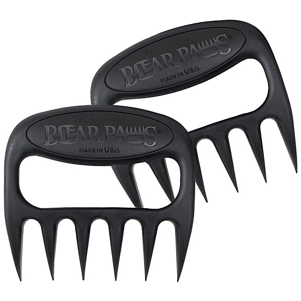

# Hard to Find 45's on CD, Vol. 3

By **Various Artists**

## Album Data

- **Catalog:** Beets
- **Format:** Digital, Album
- **Album:** Hard to Find 45's on CD, Vol. 3
- **Artist:** Various Artists
- **Albumartist:** Various Artists
- **Genre:** Unknown
- **MusicBrainz Album Artist ID:** 
- **MusicBrainz Album ID:** 
- **MusicBrainz Release Group ID:** 
- **Year:** 1999
- **Catalog #:** 
- **Label:** 
- **Total Tracks:** 10

## Album Tracks

### Track 10 - Settin' the Woods on Fire

- **Artist:** Bob Log III
- **Format:** ALAC
- **Genre:** Punk Blues
- **Length:** 1:50
- **MusicBrainz Track ID:** 
- **Title:** Settin' the Woods on Fire
- **Track:** 10
- **Year:** 2009

### Track 05 - I'll Never Get Out of this World Alive

- **Artist:** C.W. Stoneking
- **Format:** ALAC
- **Genre:** Blues
- **Length:** 2:41
- **MusicBrainz Track ID:** 
- **Title:** I'll Never Get Out of this World Alive
- **Track:** 05
- **Year:** 2009

### Track 03 - In New Orleans

- **Artist:** C.W. Stoneking
- **Format:** ALAC
- **Genre:** Blues
- **Length:** 3:04
- **MusicBrainz Track ID:** 
- **Title:** In New Orleans
- **Track:** 03
- **Year:** 2009

### Track 07 - My Bucket's Got a Hole in it

- **Artist:** Jawbone
- **Format:** ALAC
- **Genre:** Ragga Jungle
- **Length:** 2:22
- **MusicBrainz Track ID:** 
- **Title:** My Bucket's Got a Hole in it
- **Track:** 07
- **Year:** 2009

### Track 08 - Bottle Up And Go

- **Artist:** Jawbone
- **Format:** ALAC
- **Genre:** Ragga Jungle
- **Length:** 2:49
- **MusicBrainz Track ID:** 
- **Title:** Bottle Up And Go
- **Track:** 08
- **Year:** 2009

### Track 01 - On the Banks of the Old Ponchartrain

- **Artist:** Possessed By Paul James
- **Format:** ALAC
- **Genre:** Lo-Fi
- **Length:** 4:07
- **MusicBrainz Track ID:** 
- **Title:** On the Banks of the Old Ponchartrain
- **Track:** 01
- **Year:** 2009

### Track 05 - Bourgeois Blues

- **Artist:** Possessed By Paul James
- **Format:** ALAC
- **Genre:** Lo-Fi
- **Length:** 5:01
- **MusicBrainz Track ID:** 
- **Title:** Bourgeois Blues
- **Track:** 05
- **Year:** 2009

### Track 01 - Rock Island Line

- **Artist:** Reverend Peyton's Big Damn Band
- **Format:** ALAC
- **Genre:** Rockabilly
- **Length:** 1:58
- **MusicBrainz Track ID:** 
- **Title:** Rock Island Line
- **Track:** 01
- **Year:** 2009

### Track 02 - Lost Highway

- **Artist:** Scott H. Biram
- **Format:** ALAC
- **Genre:** Punk Blues
- **Length:** 2:57
- **MusicBrainz Track ID:** 
- **Title:** Lost Highway
- **Track:** 02
- **Year:** 2009

### Track 04 - Go Down Old Hannah

- **Artist:** Scott H. Biram
- **Format:** ALAC
- **Genre:** Punk Blues
- **Length:** 1:16
- **MusicBrainz Track ID:** 
- **Title:** Go Down Old Hannah
- **Track:** 04
- **Year:** 2009

### Track 03 - Ramblin' Man

- **Artist:** Soda
- **Format:** ALAC
- **Genre:** Idm
- **Length:** 3:41
- **MusicBrainz Track ID:** 
- **Title:** Ramblin' Man
- **Track:** 03
- **Year:** 2009

### Track 09 - Old Riley

- **Artist:** Soda
- **Format:** ALAC
- **Genre:** Idm
- **Length:** 3:32
- **MusicBrainz Track ID:** 
- **Title:** Old Riley
- **Track:** 09
- **Year:** 2009

### Track 09 - I Can't Help it (if I'm Still in Love with You)

- **Artist:** Tom VandenAvond
- **Format:** ALAC
- **Genre:** Americana
- **Length:** 2:27
- **MusicBrainz Track ID:** 
- **Title:** I Can't Help it (if I'm Still in Love with You)
- **Track:** 09
- **Year:** 2009

### Track 06 - Ha Ha, This Way

- **Artist:** Tom VandenAvond
- **Format:** ALAC
- **Genre:** Americana
- **Length:** 3:09
- **MusicBrainz Track ID:** 
- **Title:** Ha Ha, This Way
- **Track:** 06
- **Year:** 2009

### Track 06 - Howlin' at the Moon

- **Artist:** Truckstop Honeymoon
- **Format:** ALAC
- **Genre:** Indie Rock
- **Length:** 2:53
- **MusicBrainz Track ID:** 
- **Title:** Howlin' at the Moon
- **Track:** 06
- **Year:** 2009

### Track 08 - Lovesick Blues

- **Artist:** Wayne Hancock
- **Format:** ALAC
- **Genre:** Western Swing
- **Length:** 3:18
- **MusicBrainz Track ID:** 
- **Title:** Lovesick Blues
- **Track:** 08
- **Year:** 2009

### Track 07 - Goodnight Irene

- **Artist:** Wayne Hancock
- **Format:** ALAC
- **Genre:** Western Swing
- **Length:** 3:05
- **MusicBrainz Track ID:** 
- **Title:** Goodnight Irene
- **Track:** 07
- **Year:** 2009

### Track 04 - Mother is Gone

- **Artist:** William Elliott Whitmore
- **Format:** ALAC
- **Genre:** Americana
- **Length:** 3:22
- **MusicBrainz Track ID:** 
- **Title:** Mother is Gone
- **Track:** 04
- **Year:** 2009

### Track 02 - The Gallis (Gallows) Pole

- **Artist:** William Elliott Whitmore
- **Format:** ALAC
- **Genre:** Americana
- **Length:** 2:26
- **MusicBrainz Track ID:** 
- **Title:** The Gallis (Gallows) Pole
- **Track:** 02
- **Year:** 2009

