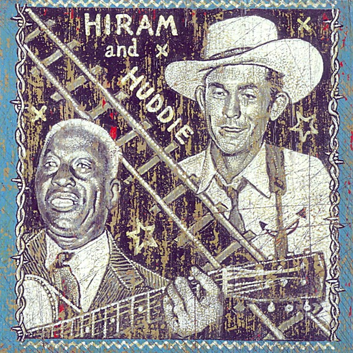

# Hiram and Huddie

By **Various Artists**

## Album Data

- **Catalog:** Beets
- **Format:** Digital, Album
- **Album:** Hiram and Huddie
- **Artist:** Various Artists
- **Albumartist:** Various Artists
- **Genre:** Americana
- **MusicBrainz Album Artist ID:** 
- **MusicBrainz Album ID:** 
- **MusicBrainz Release Group ID:** 
- **Year:** 2009
- **Catalog #:** 
- **Label:** 
- **Total Tracks:** 00

## Album Tracks

### Track 01 - Shadows - Theme From The Deer Hunter

- **Artist:** Various Artists
- **Format:** AAC
- **Genre:** Emo
- **Length:** 3:27
- **MusicBrainz Track ID:** 
- **Title:** Shadows - Theme From The Deer Hunter
- **Track:** 01
- **Year:** 0000

