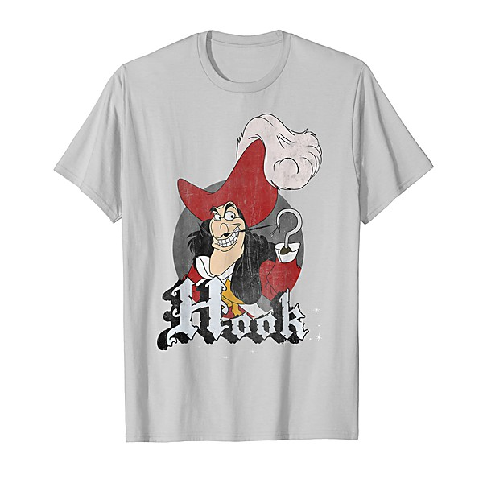

# Hook Heaven

By **Various Artists**

## Album Data

- **Catalog:** Beets
- **Format:** Digital, Album
- **Album:** Hook Heaven
- **Artist:** Various Artists
- **Albumartist:** Various Artists
- **Genre:** Power Pop
- **MusicBrainz Album Artist ID:** 
- **MusicBrainz Album ID:** 
- **MusicBrainz Release Group ID:** 
- **Year:** 2005
- **Catalog #:** 
- **Label:** 
- **Total Tracks:** 22

## Album Tracks

### Track 08 - Ordinary Day

- **Artist:** Chris Brown
- **Format:** MP3
- **Genre:** Pop
- **Length:** 3:22
- **MusicBrainz Track ID:** 
- **Title:** Ordinary Day
- **Track:** 08
- **Year:** 2007

### Track 20 - Stop And Go

- **Artist:** Craig Marshall
- **Format:** MP3
- **Genre:** Power Pop
- **Length:** 3:34
- **MusicBrainz Track ID:** 
- **Title:** Stop And Go
- **Track:** 20
- **Year:** 2007

### Track 11 - Whatever Happens Stays Here

- **Artist:** David Brookings
- **Format:** MP3
- **Genre:** Power Pop
- **Length:** 4:58
- **MusicBrainz Track ID:** 
- **Title:** Whatever Happens Stays Here
- **Track:** 11
- **Year:** 2007

### Track 13 - Today

- **Artist:** Dean Drouillard
- **Format:** MP3
- **Genre:** Power Pop
- **Length:** 3:04
- **MusicBrainz Track ID:** 
- **Title:** Today
- **Track:** 13
- **Year:** 2007

### Track 06 - This Machine Al,one

- **Artist:** Fighting Brothers McCarthy
- **Format:** MP3
- **Genre:** Power Pop
- **Length:** 3:40
- **MusicBrainz Track ID:** 
- **Title:** This Machine Al,one
- **Track:** 06
- **Year:** 2007

### Track 19 - Good Night

- **Artist:** Fred
- **Format:** MP3
- **Genre:** Indie Rock
- **Length:** 2:06
- **MusicBrainz Track ID:** 
- **Title:** Good Night
- **Track:** 19
- **Year:** 2007

### Track 21 - Sentimental Maniac

- **Artist:** Geoff Gibbons
- **Format:** MP3
- **Genre:** Easy Listening
- **Length:** 3:52
- **MusicBrainz Track ID:** 
- **Title:** Sentimental Maniac
- **Track:** 21
- **Year:** 2007

### Track 07 - On The Outside

- **Artist:** Invisible Mind Circus
- **Format:** MP3
- **Genre:** Power Pop
- **Length:** 4:12
- **MusicBrainz Track ID:** 
- **Title:** On The Outside
- **Track:** 07
- **Year:** 2007

### Track 03 - Unnoticed

- **Artist:** Jesse Sprinkle
- **Format:** MP3
- **Genre:** Power Pop
- **Length:** 3:28
- **MusicBrainz Track ID:** 
- **Title:** Unnoticed
- **Track:** 03
- **Year:** 2007

### Track 12 - moc.emalton

- **Artist:** Kelly's Heels
- **Format:** MP3
- **Genre:** Power Pop
- **Length:** 3:37
- **MusicBrainz Track ID:** 
- **Title:** moc.emalton
- **Track:** 12
- **Year:** 2007

### Track 01 - Come On Mandy

- **Artist:** Luzer
- **Format:** MP3
- **Genre:** Rock And Roll
- **Length:** 4:23
- **MusicBrainz Track ID:** 
- **Title:** Come On Mandy
- **Track:** 01
- **Year:** 2007

### Track 17 - Retire

- **Artist:** Mike Elgert
- **Format:** MP3
- **Genre:** Power Pop
- **Length:** 3:54
- **MusicBrainz Track ID:** 
- **Title:** Retire
- **Track:** 17
- **Year:** 2007

### Track 14 - My Satisfaction

- **Artist:** Sketch Middle
- **Format:** MP3
- **Genre:** Power Pop
- **Length:** 2:36
- **MusicBrainz Track ID:** 
- **Title:** My Satisfaction
- **Track:** 14
- **Year:** 2007

### Track 22 - The Evil Room

- **Artist:** Star Collector
- **Format:** MP3
- **Genre:** Power Pop
- **Length:** 4:29
- **MusicBrainz Track ID:** 
- **Title:** The Evil Room
- **Track:** 22
- **Year:** 2007

### Track 09 - Destination

- **Artist:** The Slowtime Mondays
- **Format:** MP3
- **Genre:** Power Pop
- **Length:** 3:25
- **MusicBrainz Track ID:** 
- **Title:** Destination
- **Track:** 09
- **Year:** 2007

### Track 02 - Die In LA

- **Artist:** The Animators
- **Format:** MP3
- **Genre:** Power Pop
- **Length:** 3:43
- **MusicBrainz Track ID:** 
- **Title:** Die In LA
- **Track:** 02
- **Year:** 2007

### Track 15 - Ghetto Falsetto

- **Artist:** The Bon Mots
- **Format:** MP3
- **Genre:** Rock
- **Length:** 2:32
- **MusicBrainz Track ID:** 
- **Title:** Ghetto Falsetto
- **Track:** 15
- **Year:** 2007

### Track 16 - Let's Find Our Way

- **Artist:** The Green Fields
- **Format:** MP3
- **Genre:** Sunshine Pop
- **Length:** 3:01
- **MusicBrainz Track ID:** 
- **Title:** Let's Find Our Way
- **Track:** 16
- **Year:** 2007

### Track 10 - Evil Twin

- **Artist:** The Queue
- **Format:** MP3
- **Genre:** Power Pop
- **Length:** 4:55
- **MusicBrainz Track ID:** 
- **Title:** Evil Twin
- **Track:** 10
- **Year:** 2007

### Track 04 - Hopes Up

- **Artist:** The Red Button
- **Format:** MP3
- **Genre:** Indie Pop
- **Length:** 2:55
- **MusicBrainz Track ID:** 
- **Title:** Hopes Up
- **Track:** 04
- **Year:** 2007

### Track 05 - Fly Baby, Right Now

- **Artist:** The Sketches
- **Format:** MP3
- **Genre:** Pop Rock
- **Length:** 3:24
- **MusicBrainz Track ID:** 
- **Title:** Fly Baby, Right Now
- **Track:** 05
- **Year:** 2007

### Track 18 - Under The Rocks And Stars

- **Artist:** Young Sportsmen
- **Format:** MP3
- **Genre:** Power Pop
- **Length:** 3:18
- **MusicBrainz Track ID:** 
- **Title:** Under The Rocks And Stars
- **Track:** 18
- **Year:** 2007

