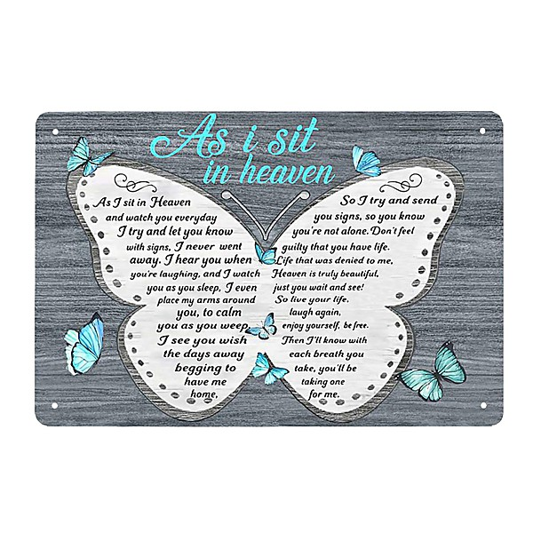

# I Love Rock & Roll

By **Various Artists**

## Album Data

- **Catalog:** Beets
- **Format:** Digital, Album
- **Album:** I Love Rock & Roll
- **Artist:** Various Artists
- **Albumartist:** Various Artists
- **Genre:** Rockabilly
- **MusicBrainz Album Artist ID:** 
- **MusicBrainz Album ID:** 
- **MusicBrainz Release Group ID:** 
- **Year:** 1996
- **Catalog #:** 
- **Label:** Not Lame Recordings
- **Total Tracks:** 22

## Album Tracks

### Track 12 - One Hit Wonders of the World Unite

- **Artist:** Badger
- **Format:** MP3
- **Genre:** Emo
- **Length:** 3:54
- **MusicBrainz Track ID:** 
- **Title:** One Hit Wonders of the World Unite
- **Track:** 12
- **Year:** 2003

### Track 05 - Girl in the Crowd

- **Artist:** Barely Pink
- **Format:** MP3
- **Genre:** Power Pop
- **Length:** 2:14
- **MusicBrainz Track ID:** 
- **Title:** Girl in the Crowd
- **Track:** 05
- **Year:** 2003

### Track 01 - Folk Singer

- **Artist:** Brendan Benson
- **Format:** MP3
- **Genre:** Indie Pop
- **Length:** 3:52
- **MusicBrainz Track ID:** 
- **Title:** Folk Singer
- **Track:** 01
- **Year:** 2001

### Track 12 - Absolutely Nothing

- **Artist:** Chris Church
- **Format:** MP3
- **Genre:** Power Pop
- **Length:** 4:01
- **MusicBrainz Track ID:** 
- **Title:** Absolutely Nothing
- **Track:** 12
- **Year:** 2004

### Track 02 - Nothing Lasts Forever

- **Artist:** Copperpot
- **Format:** MP3
- **Genre:** Emo
- **Length:** 3:39
- **MusicBrainz Track ID:** 
- **Title:** Nothing Lasts Forever
- **Track:** 02
- **Year:** 2002

### Track 01 - You Should Know It

- **Artist:** Epicycle
- **Format:** MP3
- **Genre:** Power Pop
- **Length:** 3:46
- **MusicBrainz Track ID:** 
- **Title:** You Should Know It
- **Track:** 01
- **Year:** 2002

### Track 01 - California Sex Lawyer

- **Artist:** Fountains of Wayne
- **Format:** MP3
- **Genre:** Pop Punk
- **Length:** 2:59
- **MusicBrainz Track ID:** 
- **Title:** California Sex Lawyer
- **Track:** 01
- **Year:** 2000

### Track 01 - Hello Mr. Future

- **Artist:** Jason Falkner
- **Format:** MP3
- **Genre:** Indie Rock
- **Length:** 3:03
- **MusicBrainz Track ID:** 
- **Title:** Hello Mr. Future
- **Track:** 01
- **Year:** 2004

### Track 07 - Each Day I Call Her Name

- **Artist:** Jim Ellison
- **Format:** MP3
- **Genre:** Power Pop
- **Length:** 2:44
- **MusicBrainz Track ID:** 
- **Title:** Each Day I Call Her Name
- **Track:** 07
- **Year:** 2005

### Track 02 - Starspangledsatellites

- **Artist:** Lackloves
- **Format:** MP3
- **Genre:** Power Pop
- **Length:** 4:16
- **MusicBrainz Track ID:** 
- **Title:** Starspangledsatellites
- **Track:** 02
- **Year:** 2002

### Track 10 - Sarah

- **Artist:** Neil Traynor
- **Format:** MP3
- **Genre:** Power Pop
- **Length:** 3:18
- **MusicBrainz Track ID:** 
- **Title:** Sarah
- **Track:** 10
- **Year:** 2003

### Track 02 - Yet to Say

- **Artist:** Parthenon Huxley
- **Format:** MP3
- **Genre:** Power Pop
- **Length:** 2:45
- **MusicBrainz Track ID:** 
- **Title:** Yet to Say
- **Track:** 02
- **Year:** 2001

### Track 02 - Sweet Amnisia

- **Artist:** Pat Buchanan
- **Format:** MP3
- **Genre:** Power Pop
- **Length:** 3:31
- **MusicBrainz Track ID:** 
- **Title:** Sweet Amnisia
- **Track:** 02
- **Year:** 2005

### Track 02 - Two Possible Answers (The Road)

- **Artist:** Paula Kelley
- **Format:** MP3
- **Genre:** Indie Pop
- **Length:** 3:15
- **MusicBrainz Track ID:** 
- **Title:** Two Possible Answers (The Road)
- **Track:** 02
- **Year:** 2002

### Track 03 - Delicious

- **Artist:** Pillbugs
- **Format:** MP3
- **Genre:** Indie Rock
- **Length:** 2:44
- **MusicBrainz Track ID:** 
- **Title:** Delicious
- **Track:** 03
- **Year:** 2002

### Track 12 - Flat-Chested Midget Body Doubles

- **Artist:** Preoccupied Pipers
- **Format:** MP3
- **Genre:** Power Pop
- **Length:** 4:32
- **MusicBrainz Track ID:** 
- **Title:** Flat-Chested Midget Body Doubles
- **Track:** 12
- **Year:** 2004

### Track 12 - Medley

- **Artist:** Randell Kirsch
- **Format:** MP3
- **Genre:** Power Pop
- **Length:** 4:36
- **MusicBrainz Track ID:** 
- **Title:** Medley
- **Track:** 12
- **Year:** 2003

### Track 01 - Screw You Jack

- **Artist:** Samurai Seven
- **Format:** MP3
- **Genre:** Indie Rock
- **Length:** 4:10
- **MusicBrainz Track ID:** 
- **Title:** Screw You Jack
- **Track:** 01
- **Year:** 2005

### Track 01 - Where She Ought to Be

- **Artist:** Sparkwood
- **Format:** MP3
- **Genre:** Indie Pop
- **Length:** 3:11
- **MusicBrainz Track ID:** 
- **Title:** Where She Ought to Be
- **Track:** 01
- **Year:** 2005

### Track 01 - Yo Pussycat

- **Artist:** Starclock
- **Format:** MP3
- **Genre:** Indie Pop
- **Length:** 3:54
- **MusicBrainz Track ID:** 
- **Title:** Yo Pussycat
- **Track:** 01
- **Year:** 2002

### Track 05 - What She Needs

- **Artist:** Supremium
- **Format:** MP3
- **Genre:** Power Pop
- **Length:** 3:06
- **MusicBrainz Track ID:** 
- **Title:** What She Needs
- **Track:** 05
- **Year:** 2000

### Track 03 - Baby, You Know the Deal

- **Artist:** The Afternoons
- **Format:** MP3
- **Genre:** Twee Pop
- **Length:** 2:21
- **MusicBrainz Track ID:** 
- **Title:** Baby, You Know the Deal
- **Track:** 03
- **Year:** 2005

### Track 01 - Let's Start

- **Artist:** The Masticators
- **Format:** MP3
- **Genre:** Indie Rock
- **Length:** 4:00
- **MusicBrainz Track ID:** 
- **Title:** Let's Start
- **Track:** 01
- **Year:** 2000

### Track 02 - All Day All Night

- **Artist:** The Oranges
- **Format:** MP3
- **Genre:** Indie Rock
- **Length:** 3:30
- **MusicBrainz Track ID:** 
- **Title:** All Day All Night
- **Track:** 02
- **Year:** 2000

### Track 07 - Only a Night

- **Artist:** The Sun Kings
- **Format:** MP3
- **Genre:** Indie Rock
- **Length:** 4:18
- **MusicBrainz Track ID:** 
- **Title:** Only a Night
- **Track:** 07
- **Year:** 2003

### Track 03 - Tulsa

- **Artist:** The Supahip
- **Format:** MP3
- **Genre:** Power Pop
- **Length:** 3:15
- **MusicBrainz Track ID:** 
- **Title:** Tulsa
- **Track:** 03
- **Year:** 2005

### Track 15 - Around the Sun

- **Artist:** The Tearaways
- **Format:** MP3
- **Genre:** Ska
- **Length:** 4:02
- **MusicBrainz Track ID:** 
- **Title:** Around the Sun
- **Track:** 15
- **Year:** 2004

### Track 02 - Riot Helmet

- **Artist:** True Love
- **Format:** MP3
- **Genre:** Hardcore Punk
- **Length:** 3:11
- **MusicBrainz Track ID:** 
- **Title:** Riot Helmet
- **Track:** 02
- **Year:** 2003

