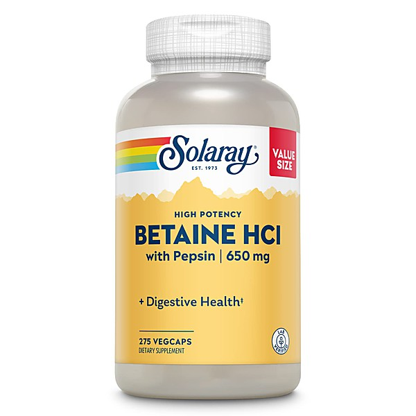

# International Pop Overthrow

By **Various Artists**

## Album Data

- **Catalog:** Beets
- **Format:** Digital, Album
- **Album:** International Pop Overthrow
- **Artist:** Various Artists
- **Albumartist:** Various Artists
- **Genre:** Power Pop
- **MusicBrainz Album Artist ID:** 
- **MusicBrainz Album ID:** 
- **MusicBrainz Release Group ID:** 
- **Year:** 2000
- **Catalog #:** 
- **Label:** 
- **Total Tracks:** 22

## Album Tracks

### Track 18 - Broken In Time

- **Artist:** Across The Board
- **Format:** ALAC
- **Genre:** Power Pop
- **Length:** 3:13
- **MusicBrainz Track ID:** 
- **Title:** Broken In Time
- **Track:** 18
- **Year:** 2017

### Track 13 - My Soft Rock Girlfriend

- **Artist:** Blake Jones & The Trike Shop
- **Format:** ALAC
- **Genre:** Sunshine Pop
- **Length:** 2:38
- **MusicBrainz Track ID:** 
- **Title:** My Soft Rock Girlfriend
- **Track:** 13
- **Year:** 2017

### Track 13 - Zen Time

- **Artist:** Brent Daniel
- **Format:** ALAC
- **Genre:** Power Pop
- **Length:** 3:18
- **MusicBrainz Track ID:** 
- **Title:** Zen Time
- **Track:** 13
- **Year:** 2017

### Track 03 - Pockets

- **Artist:** Caper Clowns
- **Format:** ALAC
- **Genre:** Britpop
- **Length:** 3:21
- **MusicBrainz Track ID:** 
- **Title:** Pockets
- **Track:** 03
- **Year:** 2017

### Track 11 - Common Law

- **Artist:** Cartoon Spirits
- **Format:** ALAC
- **Genre:** Power Pop
- **Length:** 2:47
- **MusicBrainz Track ID:** 
- **Title:** Common Law
- **Track:** 11
- **Year:** 2017

### Track 07 - You're Not In Love

- **Artist:** Coke Belda
- **Format:** ALAC
- **Genre:** Power Pop
- **Length:** 3:42
- **MusicBrainz Track ID:** 
- **Title:** You're Not In Love
- **Track:** 07
- **Year:** 2017

### Track 05 - Little Crumbles

- **Artist:** Corin Ashley
- **Format:** ALAC
- **Genre:** Power Pop
- **Length:** 3:45
- **MusicBrainz Track ID:** 
- **Title:** Little Crumbles
- **Track:** 05
- **Year:** 2017

### Track 07 - The Green Tea Party

- **Artist:** Cosmo Topper
- **Format:** ALAC
- **Genre:** Alternative Rock
- **Length:** 4:03
- **MusicBrainz Track ID:** 
- **Title:** The Green Tea Party
- **Track:** 07
- **Year:** 2017

### Track 01 - Penelope Please

- **Artist:** Crickle
- **Format:** ALAC
- **Genre:** Power Pop
- **Length:** 4:24
- **MusicBrainz Track ID:** 
- **Title:** Penelope Please
- **Track:** 01
- **Year:** 2017

### Track 22 - Hold Back The Night

- **Artist:** Daniel Trigger
- **Format:** ALAC
- **Genre:** Hard Rock
- **Length:** 5:14
- **MusicBrainz Track ID:** 
- **Title:** Hold Back The Night
- **Track:** 22
- **Year:** 2017

### Track 20 - Atmosfear

- **Artist:** Danny And The Echos
- **Format:** ALAC
- **Genre:** Power Pop
- **Length:** 3:03
- **MusicBrainz Track ID:** 
- **Title:** Atmosfear
- **Track:** 20
- **Year:** 2017

### Track 08 - Just Another Day

- **Artist:** Diamond Hands
- **Format:** ALAC
- **Genre:** Indie Rock
- **Length:** 2:41
- **MusicBrainz Track ID:** 
- **Title:** Just Another Day
- **Track:** 08
- **Year:** 2017

### Track 22 - Ride On

- **Artist:** Greg Ieronimo
- **Format:** ALAC
- **Genre:** Power Pop
- **Length:** 5:21
- **MusicBrainz Track ID:** 
- **Title:** Ride On
- **Track:** 22
- **Year:** 2017

### Track 10 - Stay With Me

- **Artist:** Huxley Rittman & The Rusty Hitmen
- **Format:** ALAC
- **Genre:** Power Pop
- **Length:** 3:52
- **MusicBrainz Track ID:** 
- **Title:** Stay With Me
- **Track:** 10
- **Year:** 2017

### Track 19 - Rod Stewart

- **Artist:** Jengi
- **Format:** ALAC
- **Genre:** Power Pop
- **Length:** 2:46
- **MusicBrainz Track ID:** 
- **Title:** Rod Stewart
- **Track:** 19
- **Year:** 2017

### Track 02 - Chelsea

- **Artist:** Jimmy Haber
- **Format:** ALAC
- **Genre:** Power Pop
- **Length:** 3:51
- **MusicBrainz Track ID:** 
- **Title:** Chelsea
- **Track:** 02
- **Year:** 2017

### Track 22 - Think About You

- **Artist:** John Macom
- **Format:** ALAC
- **Genre:** Power Pop
- **Length:** 4:40
- **MusicBrainz Track ID:** 
- **Title:** Think About You
- **Track:** 22
- **Year:** 2017

### Track 12 - Smile At Me

- **Artist:** John McMullan
- **Format:** ALAC
- **Genre:** Power Pop
- **Length:** 3:12
- **MusicBrainz Track ID:** 
- **Title:** Smile At Me
- **Track:** 12
- **Year:** 2017

### Track 11 - No Backup Plan

- **Artist:** Jonathan Segel
- **Format:** ALAC
- **Genre:** Indie Rock
- **Length:** 4:25
- **MusicBrainz Track ID:** 
- **Title:** No Backup Plan
- **Track:** 11
- **Year:** 2017

### Track 17 - It Had To Be You

- **Artist:** Kalina & Kiana
- **Format:** ALAC
- **Genre:** Power Pop
- **Length:** 3:32
- **MusicBrainz Track ID:** 
- **Title:** It Had To Be You
- **Track:** 17
- **Year:** 2017

### Track 05 - Kiss A Memory

- **Artist:** Lannie Flowers
- **Format:** ALAC
- **Genre:** Power Pop
- **Length:** 3:24
- **MusicBrainz Track ID:** 
- **Title:** Kiss A Memory
- **Track:** 05
- **Year:** 2017

### Track 03 - Transmission

- **Artist:** Leisure McCorkle
- **Format:** ALAC
- **Genre:** Power Pop
- **Length:** 3:15
- **MusicBrainz Track ID:** 
- **Title:** Transmission
- **Track:** 03
- **Year:** 2017

### Track 05 - Fly Like A Bird

- **Artist:** Leslie Pereira, The Lazy Heroes
- **Format:** ALAC
- **Genre:** Power Pop
- **Length:** 2:47
- **MusicBrainz Track ID:** 
- **Title:** Fly Like A Bird
- **Track:** 05
- **Year:** 2017

### Track 12 - Everybody Knows

- **Artist:** Lunchbox
- **Format:** ALAC
- **Genre:** Post-Grunge
- **Length:** 2:00
- **MusicBrainz Track ID:** 
- **Title:** Everybody Knows
- **Track:** 12
- **Year:** 2017

### Track 15 - Curbside Recycling

- **Artist:** Metropolitan Farms
- **Format:** ALAC
- **Genre:** Power Pop
- **Length:** 2:38
- **MusicBrainz Track ID:** 
- **Title:** Curbside Recycling
- **Track:** 15
- **Year:** 2017

### Track 19 - Get To You

- **Artist:** Micah Gilbert
- **Format:** ALAC
- **Genre:** Power Pop
- **Length:** 3:24
- **MusicBrainz Track ID:** 
- **Title:** Get To You
- **Track:** 19
- **Year:** 2017

### Track 04 - When You Shine

- **Artist:** Michael Roberts
- **Format:** ALAC
- **Genre:** Power Pop
- **Length:** 4:07
- **MusicBrainz Track ID:** 
- **Title:** When You Shine
- **Track:** 04
- **Year:** 2017

### Track 06 - Crawl Through Your Hair

- **Artist:** New Mystery Girl
- **Format:** ALAC
- **Genre:** Power Pop
- **Length:** 2:15
- **MusicBrainz Track ID:** 
- **Title:** Crawl Through Your Hair
- **Track:** 06
- **Year:** 2017

### Track 08 - I Will Let You Down

- **Artist:** Nine Violets
- **Format:** ALAC
- **Genre:** Power Pop
- **Length:** 3:18
- **MusicBrainz Track ID:** 
- **Title:** I Will Let You Down
- **Track:** 08
- **Year:** 2017

### Track 12 - Wrong Way

- **Artist:** Old Rage
- **Format:** ALAC
- **Genre:** Power Pop
- **Length:** 3:03
- **MusicBrainz Track ID:** 
- **Title:** Wrong Way
- **Track:** 12
- **Year:** 2017

### Track 09 - Therapy

- **Artist:** Plasticsoul
- **Format:** ALAC
- **Genre:** Power Pop
- **Length:** 4:12
- **MusicBrainz Track ID:** 
- **Title:** Therapy
- **Track:** 09
- **Year:** 2017

### Track 03 - It Ain't Easy Being A Boy

- **Artist:** Pop Co-Op
- **Format:** ALAC
- **Genre:** Power Pop
- **Length:** 2:50
- **MusicBrainz Track ID:** 
- **Title:** It Ain't Easy Being A Boy
- **Track:** 03
- **Year:** 2017

### Track 11 - What Love Can Do

- **Artist:** Razz Band
- **Format:** ALAC
- **Genre:** Power Pop
- **Length:** 3:09
- **MusicBrainz Track ID:** 
- **Title:** What Love Can Do
- **Track:** 11
- **Year:** 2017

### Track 14 - Let It Ride

- **Artist:** REACTION
- **Format:** ALAC
- **Genre:** Speed Metal
- **Length:** 3:21
- **MusicBrainz Track ID:** 
- **Title:** Let It Ride
- **Track:** 14
- **Year:** 2017

### Track 21 - Decline Of America

- **Artist:** Rob Schulz
- **Format:** ALAC
- **Genre:** Power Pop
- **Length:** 3:56
- **MusicBrainz Track ID:** 
- **Title:** Decline Of America
- **Track:** 21
- **Year:** 2017

### Track 14 - Say I Do

- **Artist:** Scott Perry
- **Format:** ALAC
- **Genre:** Power Pop
- **Length:** 3:21
- **MusicBrainz Track ID:** 
- **Title:** Say I Do
- **Track:** 14
- **Year:** 2017

### Track 20 - Sir Finkle

- **Artist:** Shplang
- **Format:** ALAC
- **Genre:** Power Pop
- **Length:** 3:01
- **MusicBrainz Track ID:** 
- **Title:** Sir Finkle
- **Track:** 20
- **Year:** 2017

### Track 16 - Breakthrough

- **Artist:** Slang
- **Format:** ALAC
- **Genre:** Crust Punk
- **Length:** 2:45
- **MusicBrainz Track ID:** 
- **Title:** Breakthrough
- **Track:** 16
- **Year:** 2017

### Track 07 - I Don't Know You Now

- **Artist:** Slyboots
- **Format:** ALAC
- **Genre:** Downtempo
- **Length:** 3:21
- **MusicBrainz Track ID:** 
- **Title:** I Don't Know You Now
- **Track:** 07
- **Year:** 2017

### Track 08 - Treat Me Bad

- **Artist:** Starfire Band
- **Format:** ALAC
- **Genre:** Power Pop
- **Length:** 2:26
- **MusicBrainz Track ID:** 
- **Title:** Treat Me Bad
- **Track:** 08
- **Year:** 2017

### Track 09 - Down Falls The Rain

- **Artist:** Steve Ramone
- **Format:** ALAC
- **Genre:** Power Pop
- **Length:** 2:42
- **MusicBrainz Track ID:** 
- **Title:** Down Falls The Rain
- **Track:** 09
- **Year:** 2017

### Track 04 - Kiss My Wife

- **Artist:** Steve Rosenbaum
- **Format:** ALAC
- **Genre:** Power Pop
- **Length:** 4:26
- **MusicBrainz Track ID:** 
- **Title:** Kiss My Wife
- **Track:** 04
- **Year:** 2017

### Track 16 - Mirror On The Wall

- **Artist:** Stootsie
- **Format:** ALAC
- **Genre:** Power Pop
- **Length:** 3:08
- **MusicBrainz Track ID:** 
- **Title:** Mirror On The Wall
- **Track:** 16
- **Year:** 2017

### Track 15 - Two Nearly Touching Hearts

- **Artist:** Sue Hedges
- **Format:** ALAC
- **Genre:** Power Pop
- **Length:** 3:30
- **MusicBrainz Track ID:** 
- **Title:** Two Nearly Touching Hearts
- **Track:** 15
- **Year:** 2017

### Track 06 - Highwire Solution

- **Artist:** Suite 100
- **Format:** ALAC
- **Genre:** Power Pop
- **Length:** 4:40
- **MusicBrainz Track ID:** 
- **Title:** Highwire Solution
- **Track:** 06
- **Year:** 2017

### Track 02 - Have Wings, Will Travel

- **Artist:** Sunshine Bloom
- **Format:** ALAC
- **Genre:** Power Pop
- **Length:** 4:14
- **MusicBrainz Track ID:** 
- **Title:** Have Wings, Will Travel
- **Track:** 02
- **Year:** 2017

### Track 16 - Shake Mahone

- **Artist:** Synners Of Truth
- **Format:** ALAC
- **Genre:** Power Pop
- **Length:** 3:03
- **MusicBrainz Track ID:** 
- **Title:** Shake Mahone
- **Track:** 16
- **Year:** 2017

### Track 17 - Miles & Miles

- **Artist:** The Arcadeans
- **Format:** ALAC
- **Genre:** Power Pop
- **Length:** 4:19
- **MusicBrainz Track ID:** 
- **Title:** Miles & Miles
- **Track:** 17
- **Year:** 2017

### Track 02 - Have You Got Someone

- **Artist:** The Belmondos
- **Format:** ALAC
- **Genre:** Indie Rock
- **Length:** 3:42
- **MusicBrainz Track ID:** 
- **Title:** Have You Got Someone
- **Track:** 02
- **Year:** 2017

### Track 18 - Have You Met You

- **Artist:** The Bishop's Daredevil Stunt Club
- **Format:** ALAC
- **Genre:** Power Pop
- **Length:** 3:59
- **MusicBrainz Track ID:** 
- **Title:** Have You Met You
- **Track:** 18
- **Year:** 2017

### Track 06 - No More Excuses

- **Artist:** The Blood Rush Hour
- **Format:** ALAC
- **Genre:** Power Pop
- **Length:** 3:52
- **MusicBrainz Track ID:** 
- **Title:** No More Excuses
- **Track:** 06
- **Year:** 2017

### Track 09 - The Hangers On

- **Artist:** The Harriets
- **Format:** ALAC
- **Genre:** Pop
- **Length:** 3:34
- **MusicBrainz Track ID:** 
- **Title:** The Hangers On
- **Track:** 09
- **Year:** 2017

### Track 21 - Blow My Mind

- **Artist:** The Jeremy Band
- **Format:** ALAC
- **Genre:** Power Pop
- **Length:** 4:26
- **MusicBrainz Track ID:** 
- **Title:** Blow My Mind
- **Track:** 21
- **Year:** 2017

### Track 10 - Top Of The Line

- **Artist:** The JetBeats
- **Format:** ALAC
- **Genre:** Power Pop
- **Length:** 2:14
- **MusicBrainz Track ID:** 
- **Title:** Top Of The Line
- **Track:** 10
- **Year:** 2017

### Track 17 - All Mine

- **Artist:** The Morning Line
- **Format:** ALAC
- **Genre:** Alternative Rock
- **Length:** 3:11
- **MusicBrainz Track ID:** 
- **Title:** All Mine
- **Track:** 17
- **Year:** 2017

### Track 19 - I've Got It All

- **Artist:** The Neighbourhood Strange
- **Format:** ALAC
- **Genre:** Power Pop
- **Length:** 4:30
- **MusicBrainz Track ID:** 
- **Title:** I've Got It All
- **Track:** 19
- **Year:** 2017

### Track 18 - Freebasing Your Love

- **Artist:** The Newds
- **Format:** ALAC
- **Genre:** Power Pop
- **Length:** 4:05
- **MusicBrainz Track ID:** 
- **Title:** Freebasing Your Love
- **Track:** 18
- **Year:** 2017

### Track 15 - Electric City

- **Artist:** The Penultimate
- **Format:** ALAC
- **Genre:** Power Pop
- **Length:** 3:46
- **MusicBrainz Track ID:** 
- **Title:** Electric City
- **Track:** 15
- **Year:** 2017

### Track 21 - You'll Never Take My Heart

- **Artist:** The Shamus Twins
- **Format:** ALAC
- **Genre:** Power Pop
- **Length:** 1:50
- **MusicBrainz Track ID:** 
- **Title:** You'll Never Take My Heart
- **Track:** 21
- **Year:** 2017

### Track 20 - Prisoner Of War

- **Artist:** The Spindles
- **Format:** ALAC
- **Genre:** Rock
- **Length:** 4:00
- **MusicBrainz Track ID:** 
- **Title:** Prisoner Of War
- **Track:** 20
- **Year:** 2017

### Track 01 - Say You Will

- **Artist:** The Stanleys
- **Format:** ALAC
- **Genre:** Power Pop
- **Length:** 1:59
- **MusicBrainz Track ID:** 
- **Title:** Say You Will
- **Track:** 01
- **Year:** 2017

### Track 10 - That's Rock!

- **Artist:** The Tearaways
- **Format:** ALAC
- **Genre:** Ska
- **Length:** 3:11
- **MusicBrainz Track ID:** 
- **Title:** That's Rock!
- **Track:** 10
- **Year:** 2017

### Track 01 - What If She Loves You

- **Artist:** The Top Boost
- **Format:** ALAC
- **Genre:** Neo-Psychedelia
- **Length:** 3:07
- **MusicBrainz Track ID:** 
- **Title:** What If She Loves You
- **Track:** 01
- **Year:** 2017

### Track 14 - Who'll Be The One

- **Artist:** The Viewers
- **Format:** ALAC
- **Genre:** Tech House
- **Length:** 4:32
- **MusicBrainz Track ID:** 
- **Title:** Who'll Be The One
- **Track:** 14
- **Year:** 2017

### Track 13 - I Know A Girl

- **Artist:** The Vinylos
- **Format:** ALAC
- **Genre:** Power Pop
- **Length:** 3:11
- **MusicBrainz Track ID:** 
- **Title:** I Know A Girl
- **Track:** 13
- **Year:** 2017

### Track 04 - One Eyed Car

- **Artist:** The Virtues
- **Format:** ALAC
- **Genre:** Boogie
- **Length:** 2:06
- **MusicBrainz Track ID:** 
- **Title:** One Eyed Car
- **Track:** 04
- **Year:** 2017

## See also

- [101 # 1 hits cd 4 Disc 4](101__1_hits_cd_4_Disc_4.md)
- [10 Best From The 60s](10_Best_From_The_60s.md)
- [1953](1953.md)
- [1955](1955.md)
- [1957](1957.md)
- [1958](1958.md)
- [1959](1959.md)
- [1960](1960.md)
- [1961](1961.md)
- [1962](1962.md)
- [1963](1963.md)
- [1964](1964.md)
- [1965](1965.md)
- [1966](1966.md)
- [1967](1967.md)
- [1968](1968.md)
- [1969](1969.md)
- [1970](1970.md)
- [1972](1972.md)
- [1973](1973.md)
- [2005 Summer Soiree Mix](2005_Summer_Soiree_Mix.md)
- [20 Sweet Soul Classics](20_Sweet_Soul_Classics.md)
- [21 Winners](21_Winners.md)
- [24 Original Happening Hits](24_Original_Happening_Hits.md)
- [Absolutely the Best of Gospel, Vol. 3](Absolutely_the_Best_of_Gospel__Vol_3.md)
- [Action All-Stars](Action_All-Stars.md)
- [AM Gold](AM_Gold_2_3_4.md)
- [AM Gold](AM_Gold_2_3.md)
- [AM Gold](AM_Gold_2.md)
- [AM Gold](AM_Gold.md)
- [At Dianne's Place](At_Diannes_Place.md)
- [A Tribute to the Cars](A_Tribute_to_the_Cars.md)
- [A Year in Your Life](A_Year_in_Your_Life.md)
- [Backstage Pass All Access](Backstage_Pass_All_Access.md)
- [Best of Bootie 2008](Best_of_Bootie_2008.md)
- [Best of Bundle Bonus Trax](Best_of_Bundle_Bonus_Trax.md)
- [Best of Doo Wop Uptempo](Best_of_Doo_Wop_Uptempo.md)
- [Best of International Pop Overthrow](Best_of_International_Pop_Overthrow.md)
- [Best Power Pop Bundle - 2012 Part 1](Best_Power_Pop_Bundle_-_2012_Part_1.md)
- [Billboard Pop Memories](Billboard_Pop_Memories.md)
- [Billboard Top Rock & Roll Hits](Billboard_Top_Rock_and_Roll_Hits_2.md)
- [Billboard Top Rock & Roll Hits](Billboard_Top_Rock_and_Roll_Hits.md)
- [Bonnaroo 2004](Bonnaroo_2004.md)
- [Bonnaroo 2004 - Sweet Sounds vol. 6 (Silver Disc)](Bonnaroo_2004_-_Sweet_Sounds_vol_6_Silver_Disc.md)
- [Brokedown Palace](Brokedown_Palace.md)
- [Bruce Steinberg Casette Tape](Bruce_Steinberg_Casette_Tape.md)
- [Chart Toppers](Chart_Toppers_2.md)
- [Chart Toppers](Chart_Toppers.md)
- [Christmas Music 2016](Christmas_Music_2016.md)
- [Club Mix '96, Vol. 1](Club_Mix_96__Vol_1.md)
- [Cool Country Hits - Volume 2](Cool_Country_Hits_-_Volume_2.md)
- [Double Dose of Pop!](Double_Dose_of_Pop!.md)
- [Double Take](Double_Take.md)
- [English Cats & Others](English_Cats_and_Others.md)
- [For Our Children](For_Our_Children.md)
- [Full Circle](Full_Circle.md)
- [Garden State](Garden_State.md)
- [Goa 2011 Vol. 1 [Disc 1]](Goa_2011_Vol_1_[Disc_1].md)
- [Golden Age of American Rock 'n' Roll, Vol. 7](Golden_Age_of_American_Rock_n_Roll__Vol_7.md)
- [Golden Rock'n Rollers](Golden_Rockn_Rollers.md)
- [Good Old Country](Good_Old_Country.md)
- [Greatest Hits of the 60's](Greatest_Hits_of_the_60s.md)
- [Happy Holidays from Drew](Happy_Holidays_from_Drew.md)
- [Hard to Find 45's on CD, Vol. 3](Hard_to_Find_45s_on_CD__Vol_3.md)
- [Hiram and Huddie](Hiram_and_Huddie.md)
- [Hit History Vol. 25 - 1979](Hit_History_Vol_25_-_1979.md)
- [Hook Heaven 2](Hook_Heaven_2.md)
- [Hook Heaven](Hook_Heaven.md)
- [I Love Rock & Roll](I_Love_Rock_and_Roll.md)
- [International Pop Overthrow Vol. 20 - [Disc 3]](International_Pop_Overthrow_Vol_20_-_[Disc_3].md)
- [Jefferson Starship - The Box Set Series_Flights Beyond](Jefferson_Starship_-_The_Box_Set_Series_Flights_Beyond.md)
- [Johnny Depp's Favorites](Johnny_Depps_Favorites.md)
- [Jukebox Jive](Jukebox_Jive.md)
- [Keep On Movin' (April's Mix)](Keep_On_Movin_Aprils_Mix.md)
- [Kissing The Bride](Kissing_The_Bride.md)
- [KPIG Greatest Hits Volume 1](KPIG_Greatest_Hits_Volume_1.md)
- [KY Classics](KY_Classics.md)
- [Launch Issue No. 1](Launch_Issue_No_1.md)
- [Leaders Of The Pack](Leaders_Of_The_Pack.md)
- [Liquid Dreams](Liquid_Dreams.md)
- [Lost & Forgotten Power Pop](Lost_and_Forgotten_Power_Pop.md)
- [Lost & Forgotten Power Pop V9](Lost_and_Forgotten_Power_Pop_V9.md)
- [Lost & Forgotten Power Pop - Vol. 10](Lost_and_Forgotten_Power_Pop_-_Vol_10.md)
- [Lost & Forgotten Power Pop - Vol. 11](Lost_and_Forgotten_Power_Pop_-_Vol_11.md)
- [Lost & Forgotten Power Pop - Vol. 12](Lost_and_Forgotten_Power_Pop_-_Vol_12.md)
- [Lost & Forgotten Power Pop - Vol. 13](Lost_and_Forgotten_Power_Pop_-_Vol_13.md)
- [Lost & Forgotten Power Pop - Vol. 14](Lost_and_Forgotten_Power_Pop_-_Vol_14.md)
- [Lost & Forgotten Power Pop - Vol. 15](Lost_and_Forgotten_Power_Pop_-_Vol_15.md)
- [Lost & Forgotten Power Pop - Vol. 16](Lost_and_Forgotten_Power_Pop_-_Vol_16.md)
- [Lost & Forgotten Power Pop - Vol. 17](Lost_and_Forgotten_Power_Pop_-_Vol_17.md)
- [Lost & Forgotten Power Pop - Vol. 18](Lost_and_Forgotten_Power_Pop_-_Vol_18.md)
- [Lost & Forgotten Power Pop - Vol. 19](Lost_and_Forgotten_Power_Pop_-_Vol_19.md)
- [Lost & Forgotten Power Pop - Vol. 20](Lost_and_Forgotten_Power_Pop_-_Vol_20.md)
- [Lost & Forgotten Power Pop - Vol. 2](Lost_and_Forgotten_Power_Pop_-_Vol_2.md)
- [Lost & Forgotten Power Pop - Vol. 3](Lost_and_Forgotten_Power_Pop_-_Vol_3.md)
- [Lost & Forgotten Power Pop - Vol. 5](Lost_and_Forgotten_Power_Pop_-_Vol_5.md)
- [Lost & Forgotten Power Pop - Vol. 6](Lost_and_Forgotten_Power_Pop_-_Vol_6.md)
- [Lost & Forgotten Power Pop - Vol. 7](Lost_and_Forgotten_Power_Pop_-_Vol_7.md)
- [Lost & Forgotten Power Pop, Volume 8](Lost_and_Forgotten_Power_Pop__Volume_8.md)
- [Lost in the Haze Vol. 19](Lost_in_the_Haze_Vol_19.md)
- [Mashups](Mashups.md)
- [Midheaven .09 Sampler](Midheaven_09_Sampler.md)
- [Mix Tape from Linda](Mix_Tape_from_Linda.md)
- [Monster Mash Party Time](Monster_Mash_Party_Time.md)
- [More Action!](More_Action!.md)
- [Motown](Motown.md)
- [Moulin Rouge](Moulin_Rouge.md)
- [Nashpop](Nashpop.md)
- [Nipper's Greatest Hits](Nippers_Greatest_Hits.md)
- [Not Lame Brand Super Charged Flash Light Pops](Not_Lame_Brand_Super_Charged_Flash_Light_Pops.md)
- [Now That's What I Call Music, Vol. 1](Now_Thats_What_I_Call_Music__Vol_1.md)
- [Now, Vol. 17](Now__Vol_17.md)
- [Number One Hits](Number_One_Hits.md)
- [Oldies But Goodies, Vol. 1](Oldies_But_Goodies__Vol_1.md)
- [Oldies But Goodies, Vol. 2](Oldies_But_Goodies__Vol_2.md)
- [Oldies But Goodies, Vol. 6](Oldies_But_Goodies__Vol_6.md)
- [Oldies But Goodies, Vol. 7](Oldies_But_Goodies__Vol_7.md)
- [Oldies But Goodies, Vol. 8](Oldies_But_Goodies__Vol_8.md)
- [One More For The Fans](One_More_For_The_Fans.md)
- [Only Rock 'N Roll 1960-1964](Only_Rock_N_Roll_1960-1964.md)
- [Paris in the Spring](Paris_in_the_Spring.md)
- [PGH October Compilation](PGH_October_Compilation.md)
- [Philharmania](Philharmania.md)
- [Phosphene River](Phosphene_River.md)
- [PopGeekHeaven Present Power Pop Prime Vol. 9 [Disc 3]](PopGeekHeaven_Present_Power_Pop_Prime_Vol_9_[Disc_3].md)
- [PopGeekHeaven Presents Power Pop Prime Volume 9 [Disc 2]](PopGeekHeaven_Presents_Power_Pop_Prime_Volume_9_[Disc_2].md)
- [PopGeekHeaven's The Best Of 2017](PopGeekHeavens_The_Best_Of_2017.md)
- [Pop Geek Heaven Surprise Box - Pt. 4](Pop_Geek_Heaven_Surprise_Box_-_Pt_4.md)
- [Pottery Barn](Pottery_Barn.md)
- [Power Pop Planet Volume 1 [Disc 2]](Power_Pop_Planet_Volume_1_[Disc_2].md)
- [Power Pop Planet Volume 2 [Disc 2]](Power_Pop_Planet_Volume_2_[Disc_2].md)
- [Power Pop Planet Volume 3 [Disc 2]](Power_Pop_Planet_Volume_3_[Disc_2].md)
- [Power Pop Planet Volume 4 [Disc 2]](Power_Pop_Planet_Volume_4_[Disc_2].md)
- [Power Pop Planet Volume 4](Power_Pop_Planet_Volume_4.md)
- [Power Pop Prime - Volume 1](Power_Pop_Prime_-_Volume_1.md)
- [Power Pop Prime - Volume 2](Power_Pop_Prime_-_Volume_2.md)
- [Power Pop Prime - Volume 3](Power_Pop_Prime_-_Volume_3.md)
- [Power Pop - The Best of 2015](Power_Pop_-_The_Best_of_2015.md)
- [Power Pop - The Best Of 2016](Power_Pop_-_The_Best_Of_2016.md)
- [Psychedelic Salon](Psychedelic_Salon.md)
- [Pure Love Moods Vol. 2](Pure_Love_Moods_Vol_2.md)
- [Pure Pop For Cool People - A Compilation of Not Lame 1999 Releases](Pure_Pop_For_Cool_People_-_A_Compilation_of_Not_Lame_1999_Releases.md)
- [Radio Gold [Compose]](Radio_Gold_[Compose].md)
- [Record Store Day April 22, 2017 (Blue CD Sampler)](Record_Store_Day_April_22__2017_Blue_CD_Sampler.md)
- [Record Store Day April 22, 2017 (Yellow CD Sampler)](Record_Store_Day_April_22__2017_Yellow_CD_Sampler.md)
- [Red Radio Vol. 3 - Happy Birthday](Red_Radio_Vol_3_-_Happy_Birthday.md)
- [Retrospace Podcasts](Retrospace_Podcasts.md)
- [Romantic Moments Of The 60's](Romantic_Moments_Of_The_60s.md)
- [Roots N' Blues - The Retrospective, Disc 4](Roots_N_Blues_-_The_Retrospective__Disc_4.md)
- [Sentimental Journey, Vol. 4](Sentimental_Journey__Vol_4.md)
- [Shake Some Action!](Shake_Some_Action!.md)
- [Shake Some Action](Shake_Some_Action.md)
- [Sisters of Soul [Crimson]](Sisters_of_Soul_[Crimson].md)
- [Six Years of Power Pop!](Six_Years_of_Power_Pop!.md)
- [Sliding Doors](Sliding_Doors.md)
- [Soul Hits of the 70s](Soul_Hits_of_the_70s.md)
- [Southland Tales](Southland_Tales.md)
- [Stax](Stax.md)
- [Steady, As She Goes](Steady__As_She_Goes.md)
- [Step Up 2 the Streets (Original Motion Picture Soundtrack)](Step_Up_2_the_Streets_Original_Motion_Picture_Soundtrack.md)
- [Stick With Me Baby](Stick_With_Me_Baby.md)
- [Super Charged Flashlight Pops V. II](Super_Charged_Flashlight_Pops_V_II.md)
- [Super Girls](Super_Girls.md)
- [Super Hits of the '70s](Super_Hits_of_the_70s.md)
- [Super Oldies Volume 3](Super_Oldies_Volume_3.md)
- [Surfin' Roots](Surfin_Roots.md)
- [Swingers Soundtrack](Swingers_Soundtrack.md)
- [Sympophony #1](Sympophony_1.md)
- [The Best Of Power Pop Vol. 8](The_Best_Of_Power_Pop_Vol_8.md)
- [The British Invasion](The_British_Invasion.md)
- [The Disco Years, Vol. 3](The_Disco_Years__Vol_3.md)
- [The Fabulous Fifties](The_Fabulous_Fifties.md)
- [The History of Space Age Pop, Vol. 2](The_History_of_Space_Age_Pop__Vol_2.md)
- [The Life Aquatic](The_Life_Aquatic.md)
- [The Life Aquatic With Steve Zissou](The_Life_Aquatic_With_Steve_Zissou.md)
- [The Look of Love](The_Look_of_Love.md)
- [The Lost & Forgotten Power Pop Collection Part 5](The_Lost_and_Forgotten_Power_Pop_Collection_Part_5.md)
- [There's a Riot Goin' On! The Rock 'N' Roll Classics of Lieber and Stoller](Theres_a_Riot_Goin_On!_The_Rock_N_Roll_Classics_of_Lieber_and_Stoller.md)
- [The Retrospace 2011 Xmas Mix](The_Retrospace_2011_Xmas_Mix.md)
- [The Rock 'N' Roll Era](The_Rock_N_Roll_Era_2_3.md)
- [The Rock 'N' Roll Era](The_Rock_N_Roll_Era_2.md)
- [The Rock 'N' Roll Era](The_Rock_N_Roll_Era.md)
- [The Rocky Horror Picture Show](The_Rocky_Horror_Picture_Show.md)
- [The Seventies Generation](The_Seventies_Generation.md)
- [Timeless](Timeless.md)
- [Town Hall Party 8-8-1959](Town_Hall_Party_8-8-1959.md)
- [Treasure Chest Of Awesome](Treasure_Chest_Of_Awesome.md)
- [Very Best of Country [Crimson] Disc 1](Very_Best_of_Country_[Crimson]_Disc_1.md)
- [Very Oldie Goldies Vol. 2](Very_Oldie_Goldies_Vol_2.md)
- [Very Oldie Goldies Vol. 3](Very_Oldie_Goldies_Vol_3.md)
- [Very Oldie Goldies Vol. 4](Very_Oldie_Goldies_Vol_4.md)
- [Wackiest Album in the Universe, Vol. 1](Wackiest_Album_in_the_Universe__Vol_1.md)
- [Wattstax](Wattstax.md)
- [What's Up Matador (Disc 2)](Whats_Up_Matador_Disc_2.md)
- [Willow YouTube Brown Bird Plus](Willow_YouTube_Brown_Bird_Plus.md)
- [Your Hit Parade](Your_Hit_Parade_2_3_4.md)
- [Your Hit Parade](Your_Hit_Parade_2_3.md)
- [Your Hit Parade](Your_Hit_Parade_2.md)
- [Your Hit Parade](Your_Hit_Parade.md)
- [CD: An Elpee's Worth Of Productions](../../CD/Various_Artists/An_Elpees_Worth_Of_Productions.md)
- [CD: Hank Williams Timeless](../../CD/Various_Artists/Hank_Williams_Timeless.md)
- [CD: Justin & Christina](../../CD/Various_Artists/Justin_and_Christina.md)
- [CD: Phantom Of The Paradise](../../CD/Various_Artists/Phantom_Of_The_Paradise.md)
- [CD: Sucker Punch](../../CD/Various_Artists/Sucker_Punch.md)
- [CD: ](../../CD/Various_Artists/Various_Artists.md)
