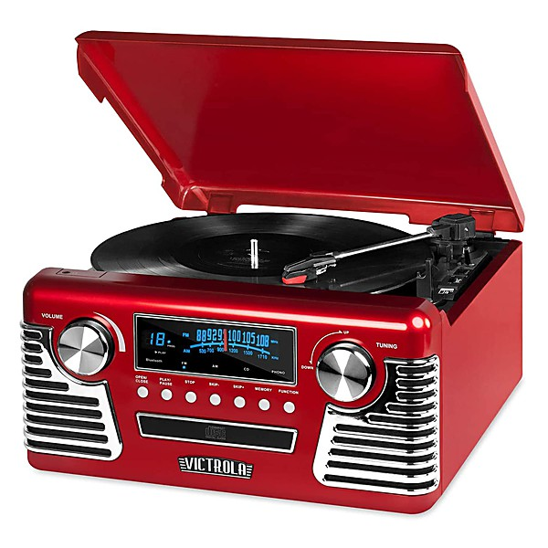

# Jukebox Jive

By **Various Artists**

## Album Data

- **Catalog:** Beets
- **Format:** Digital, Album
- **Album:** Jukebox Jive
- **Artist:** Various Artists
- **Albumartist:** Various Artists
- **Genre:** Rock And Roll
- **MusicBrainz Album Artist ID:** 
- **MusicBrainz Album ID:** 
- **MusicBrainz Release Group ID:** 
- **Year:** 1997
- **Catalog #:** 
- **Label:** 
- **Total Tracks:** 00

## Album Tracks

### Track 00 - 01-Track 1 8

- **Artist:** Various Artists
- **Format:** ALAC
- **Genre:** Emo
- **Length:** 3:30
- **MusicBrainz Track ID:** 
- **Title:** 01-Track 1 8
- **Track:** 00
- **Year:** 0000

### Track 00 - 02-Track 2 7

- **Artist:** Various Artists
- **Format:** ALAC
- **Genre:** Emo
- **Length:** 6:30
- **MusicBrainz Track ID:** 
- **Title:** 02-Track 2 7
- **Track:** 00
- **Year:** 0000

### Track 00 - 03-Track 3 7

- **Artist:** Various Artists
- **Format:** ALAC
- **Genre:** Emo
- **Length:** 3:49
- **MusicBrainz Track ID:** 
- **Title:** 03-Track 3 7
- **Track:** 00
- **Year:** 0000

### Track 00 - 04-Track 4 5

- **Artist:** Various Artists
- **Format:** ALAC
- **Genre:** Emo
- **Length:** 5:14
- **MusicBrainz Track ID:** 
- **Title:** 04-Track 4 5
- **Track:** 00
- **Year:** 0000

### Track 00 - 05-Track 5 5

- **Artist:** Various Artists
- **Format:** ALAC
- **Genre:** Emo
- **Length:** 4:29
- **MusicBrainz Track ID:** 
- **Title:** 05-Track 5 5
- **Track:** 00
- **Year:** 0000

### Track 00 - 06-Track 6 4

- **Artist:** Various Artists
- **Format:** ALAC
- **Genre:** Emo
- **Length:** 4:51
- **MusicBrainz Track ID:** 
- **Title:** 06-Track 6 4
- **Track:** 00
- **Year:** 0000

### Track 00 - 07-Track 7 3

- **Artist:** Various Artists
- **Format:** ALAC
- **Genre:** Emo
- **Length:** 2:24
- **MusicBrainz Track ID:** 
- **Title:** 07-Track 7 3
- **Track:** 00
- **Year:** 0000

### Track 00 - 08-Track 8 2

- **Artist:** Various Artists
- **Format:** ALAC
- **Genre:** Emo
- **Length:** 4:56
- **MusicBrainz Track ID:** 
- **Title:** 08-Track 8 2
- **Track:** 00
- **Year:** 0000

### Track 00 - 09-Track 9 1

- **Artist:** Various Artists
- **Format:** ALAC
- **Genre:** Emo
- **Length:** 4:20
- **MusicBrainz Track ID:** 
- **Title:** 09-Track 9 1
- **Track:** 00
- **Year:** 0000

### Track 00 - 10-Track 10 1

- **Artist:** Various Artists
- **Format:** ALAC
- **Genre:** Emo
- **Length:** 5:42
- **MusicBrainz Track ID:** 
- **Title:** 10-Track 10 1
- **Track:** 00
- **Year:** 0000

### Track 00 - 11-Track 11 1

- **Artist:** Various Artists
- **Format:** ALAC
- **Genre:** Emo
- **Length:** 4:31
- **MusicBrainz Track ID:** 
- **Title:** 11-Track 11 1
- **Track:** 00
- **Year:** 0000

### Track 00 - 12-Track 12 1

- **Artist:** Various Artists
- **Format:** ALAC
- **Genre:** Emo
- **Length:** 4:01
- **MusicBrainz Track ID:** 
- **Title:** 12-Track 12 1
- **Track:** 00
- **Year:** 0000

### Track 00 - 13-Track 13 1

- **Artist:** Various Artists
- **Format:** ALAC
- **Genre:** Emo
- **Length:** 3:52
- **MusicBrainz Track ID:** 
- **Title:** 13-Track 13 1
- **Track:** 00
- **Year:** 0000

### Track 00 - 14-Track 14 2

- **Artist:** Various Artists
- **Format:** ALAC
- **Genre:** Emo
- **Length:** 3:59
- **MusicBrainz Track ID:** 
- **Title:** 14-Track 14 2
- **Track:** 00
- **Year:** 0000

### Track 00 - 15-Track 15 2

- **Artist:** Various Artists
- **Format:** ALAC
- **Genre:** Emo
- **Length:** 4:27
- **MusicBrainz Track ID:** 
- **Title:** 15-Track 15 2
- **Track:** 00
- **Year:** 0000

### Track 00 - 16-Track 16 1

- **Artist:** Various Artists
- **Format:** ALAC
- **Genre:** Emo
- **Length:** 3:52
- **MusicBrainz Track ID:** 
- **Title:** 16-Track 16 1
- **Track:** 00
- **Year:** 0000

### Track 00 - 17-Track 17

- **Artist:** Various Artists
- **Format:** ALAC
- **Genre:** Emo
- **Length:** 4:59
- **MusicBrainz Track ID:** 
- **Title:** 17-Track 17
- **Track:** 00
- **Year:** 0000

