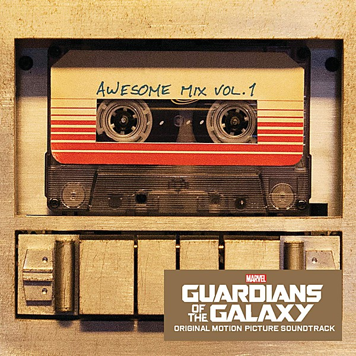

# KPIG Greatest Hits Volume 1

By **Various Artists**

## Album Data

- **Catalog:** Beets
- **Format:** Digital, Album
- **Album:** KPIG Greatest Hits Volume 1
- **Artist:** Various Artists
- **Albumartist:** Various Artists
- **Genre:** Americana
- **MusicBrainz Album Artist ID:** 
- **MusicBrainz Album ID:** 
- **MusicBrainz Release Group ID:** 
- **Year:** 2003
- **Catalog #:** 
- **Label:** 
- **Total Tracks:** 00

## Album Tracks

### Track 00 - Dirty Water

- **Artist:** Various Artists
- **Format:** ALAC
- **Genre:** Rock
- **Length:** 2:48
- **MusicBrainz Track ID:** 
- **Title:** Dirty Water
- **Track:** 00
- **Year:** 0000

### Track 00 - Funky Broadway, Pt. 1

- **Artist:** Various Artists
- **Format:** AAC
- **Genre:** Emo
- **Length:** 2:44
- **MusicBrainz Track ID:** 
- **Title:** Funky Broadway, Pt. 1
- **Track:** 00
- **Year:** 0000

### Track 00 - He's So Fine

- **Artist:** Various Artists
- **Format:** AAC
- **Genre:** Emo
- **Length:** 1:57
- **MusicBrainz Track ID:** 
- **Title:** He's So Fine
- **Track:** 00
- **Year:** 0000

### Track 00 - I'm So Lonesome I Could Cry

- **Artist:** Various Artists
- **Format:** ALAC
- **Genre:** Emo
- **Length:** 3:17
- **MusicBrainz Track ID:** 
- **Title:** I'm So Lonesome I Could Cry
- **Track:** 00
- **Year:** 0000

### Track 00 - Little Bit O'Soul

- **Artist:** Various Artists
- **Format:** AAC
- **Genre:** Emo
- **Length:** 2:26
- **MusicBrainz Track ID:** 
- **Title:** Little Bit O'Soul
- **Track:** 00
- **Year:** 0000

### Track 00 - Loop De Loop

- **Artist:** Various Artists
- **Format:** ALAC
- **Genre:** Emo
- **Length:** 2:24
- **MusicBrainz Track ID:** 
- **Title:** Loop De Loop
- **Track:** 00
- **Year:** 0000

### Track 00 - Memphis

- **Artist:** Various Artists
- **Format:** ALAC
- **Genre:** Emo
- **Length:** 2:34
- **MusicBrainz Track ID:** 
- **Title:** Memphis
- **Track:** 00
- **Year:** 0000

### Track 00 - Psychotic Reaction

- **Artist:** Various Artists
- **Format:** AAC
- **Genre:** Emo
- **Length:** 3:10
- **MusicBrainz Track ID:** 
- **Title:** Psychotic Reaction
- **Track:** 00
- **Year:** 0000

### Track 00 - Raindrops

- **Artist:** Various Artists
- **Format:** AAC
- **Genre:** Emo
- **Length:** 3:00
- **MusicBrainz Track ID:** 
- **Title:** Raindrops
- **Track:** 00
- **Year:** 0000

### Track 00 - Right Or Wrong

- **Artist:** Various Artists
- **Format:** ALAC
- **Genre:** Emo
- **Length:** 2:15
- **MusicBrainz Track ID:** 
- **Title:** Right Or Wrong
- **Track:** 00
- **Year:** 0000

### Track 00 - Soldier Boy

- **Artist:** Various Artists
- **Format:** AAC
- **Genre:** Emo
- **Length:** 2:42
- **MusicBrainz Track ID:** 
- **Title:** Soldier Boy
- **Track:** 00
- **Year:** 0000

### Track 00 - Summer In The City

- **Artist:** Various Artists
- **Format:** ALAC
- **Genre:** Emo
- **Length:** 2:48
- **MusicBrainz Track ID:** 
- **Title:** Summer In The City
- **Track:** 00
- **Year:** 0000

### Track 00 - Suspicion

- **Artist:** Various Artists
- **Format:** ALAC
- **Genre:** Emo
- **Length:** 2:34
- **MusicBrainz Track ID:** 
- **Title:** Suspicion
- **Track:** 00
- **Year:** 0000

### Track 00 - Talk Talk

- **Artist:** Various Artists
- **Format:** ALAC
- **Genre:** Rock
- **Length:** 1:59
- **MusicBrainz Track ID:** 
- **Title:** Talk Talk
- **Track:** 00
- **Year:** 0000

### Track 00 - Tonight's The Night

- **Artist:** Various Artists
- **Format:** ALAC
- **Genre:** Emo
- **Length:** 2:02
- **MusicBrainz Track ID:** 
- **Title:** Tonight's The Night
- **Track:** 00
- **Year:** 0000

