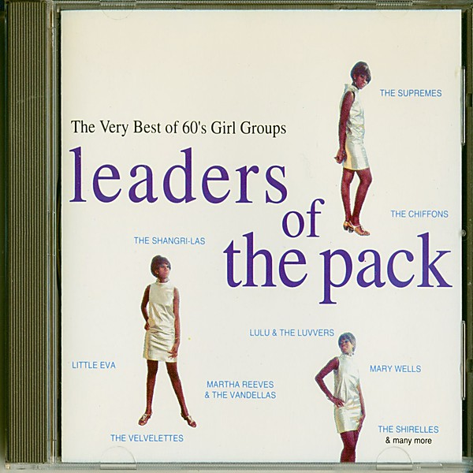

# Leaders Of The Pack

By **Various Artists**

## Album Data

- **Catalog:** Beets
- **Format:** Digital, Album
- **Album:** Leaders Of The Pack
- **Artist:** Various Artists
- **Albumartist:** Various Artists
- **Genre:** Emo
- **MusicBrainz Album Artist ID:** 
- **MusicBrainz Album ID:** 
- **MusicBrainz Release Group ID:** 
- **Year:** 0000
- **Catalog #:** 
- **Label:** BMG International
- **Total Tracks:** 00

## Album Tracks

### Track 03 - Better Off Alone

- **Artist:** Alice Deejay
- **Format:** MP3
- **Genre:** Trance
- **Length:** 4:27
- **MusicBrainz Track ID:** 
- **Title:** Better Off Alone
- **Track:** 03
- **Year:** 2001

### Track 19 - Back In My Life

- **Artist:** Alice Deejay
- **Format:** MP3
- **Genre:** Trance
- **Length:** 3:53
- **MusicBrainz Track ID:** 
- **Title:** Back In My Life
- **Track:** 19
- **Year:** 2001

### Track 08 - One Of These Days

- **Artist:** Ambassador Of Love
- **Format:** MP3
- **Genre:** Trance
- **Length:** 2:44
- **MusicBrainz Track ID:** 
- **Title:** One Of These Days
- **Track:** 08
- **Year:** 2001

### Track 06 - 9pm (Till I Come)

- **Artist:** ATB
- **Format:** MP3
- **Genre:** Trance
- **Length:** 2:52
- **MusicBrainz Track ID:** 
- **Title:** 9pm (Till I Come)
- **Track:** 06
- **Year:** 2001

### Track 20 - Don't Stop

- **Artist:** ATB
- **Format:** MP3
- **Genre:** Trance
- **Length:** 2:33
- **MusicBrainz Track ID:** 
- **Title:** Don't Stop
- **Track:** 20
- **Year:** 2001

### Track 11 - Rush (digital Release Only)

- **Artist:** Blue Foundation Meets Mathias Hantho
- **Format:** MP3
- **Genre:** Trance
- **Length:** 3:01
- **MusicBrainz Track ID:** 
- **Title:** Rush (digital Release Only)
- **Track:** 11
- **Year:** 2001

### Track 12 - The Launch

- **Artist:** DJ Jean
- **Format:** MP3
- **Genre:** Trance
- **Length:** 4:17
- **MusicBrainz Track ID:** 
- **Title:** The Launch
- **Track:** 12
- **Year:** 2001

### Track 16 - I Have A Dream

- **Artist:** DJ Quicksilver
- **Format:** MP3
- **Genre:** Trance
- **Length:** 3:43
- **MusicBrainz Track ID:** 
- **Title:** I Have A Dream
- **Track:** 16
- **Year:** 2001

### Track 17 - I Have A Dream

- **Artist:** DJ Quicksilver
- **Format:** MP3
- **Genre:** Trance
- **Length:** 2:38
- **MusicBrainz Track ID:** 
- **Title:** I Have A Dream
- **Track:** 17
- **Year:** 2001

### Track 10 - Claps

- **Artist:** DJ Shah
- **Format:** MP3
- **Genre:** Hard Trance
- **Length:** 1:27
- **MusicBrainz Track ID:** 
- **Title:** Claps
- **Track:** 10
- **Year:** 2001

### Track 14 - Deadline

- **Artist:** Dutch Force
- **Format:** MP3
- **Genre:** Trance
- **Length:** 5:02
- **MusicBrainz Track ID:** 
- **Title:** Deadline
- **Track:** 14
- **Year:** 2001

### Track 23 - Blue (Da Ba Dee)

- **Artist:** Eiffel 65
- **Format:** MP3
- **Genre:** Techno
- **Length:** 4:31
- **MusicBrainz Track ID:** 
- **Title:** Blue (Da Ba Dee)
- **Track:** 23
- **Year:** 2001

### Track 02 - Take Your Time (The Riddle '99)

- **Artist:** Lightforce
- **Format:** MP3
- **Genre:** Thrash Metal
- **Length:** 1:06
- **MusicBrainz Track ID:** 
- **Title:** Take Your Time (The Riddle '99)
- **Track:** 02
- **Year:** 2001

### Track 01 - Arabian Pleasure

- **Artist:** Mario Piu & Mauro Picotto
- **Format:** MP3
- **Genre:** Trance
- **Length:** 3:25
- **MusicBrainz Track ID:** 
- **Title:** Arabian Pleasure
- **Track:** 01
- **Year:** 2001

### Track 05 - It's A Fine Day

- **Artist:** Miss Jane
- **Format:** MP3
- **Genre:** Trance
- **Length:** 3:49
- **MusicBrainz Track ID:** 
- **Title:** It's A Fine Day
- **Track:** 05
- **Year:** 2001

### Track 07 - Dreams 2002 (Single Cut)

- **Artist:** Miss Shiva
- **Format:** MP3
- **Genre:** Hard Trance
- **Length:** 3:33
- **MusicBrainz Track ID:** 
- **Title:** Dreams 2002 (Single Cut)
- **Track:** 07
- **Year:** 2001

### Track 13 - Angel

- **Artist:** Ralph Fridge
- **Format:** MP3
- **Genre:** Trance
- **Length:** 2:06
- **MusicBrainz Track ID:** 
- **Title:** Angel
- **Track:** 13
- **Year:** 2001

### Track 04 - Drop It (Fiocco Remix)

- **Artist:** Scoop
- **Format:** MP3
- **Genre:** Progressive House
- **Length:** 2:21
- **MusicBrainz Track ID:** 
- **Title:** Drop It (Fiocco Remix)
- **Track:** 04
- **Year:** 2001

### Track 22 - Tune

- **Artist:** Spacekid
- **Format:** MP3
- **Genre:** Trance
- **Length:** 3:14
- **MusicBrainz Track ID:** 
- **Title:** Tune
- **Track:** 22
- **Year:** 2001

### Track 18 - Switch Off, Please II

- **Artist:** Thomas P. Heckmann
- **Format:** MP3
- **Genre:** Tech House
- **Length:** 3:01
- **MusicBrainz Track ID:** 
- **Title:** Switch Off, Please II
- **Track:** 18
- **Year:** 2001

### Track 15 - Unknown Track

- **Artist:** Unknown Artist
- **Format:** MP3
- **Genre:** Emo
- **Length:** 3:24
- **MusicBrainz Track ID:** 
- **Title:** Unknown Track
- **Track:** 15
- **Year:** 2001

### Track 21 - The Awakening

- **Artist:** York
- **Format:** MP3
- **Genre:** Trance
- **Length:** 2:32
- **MusicBrainz Track ID:** 
- **Title:** The Awakening
- **Track:** 21
- **Year:** 2001

### Track 09 - Kernkraft 400

- **Artist:** Zombie Nation
- **Format:** MP3
- **Genre:** Trance
- **Length:** 2:33
- **MusicBrainz Track ID:** 
- **Title:** Kernkraft 400
- **Track:** 09
- **Year:** 2001

