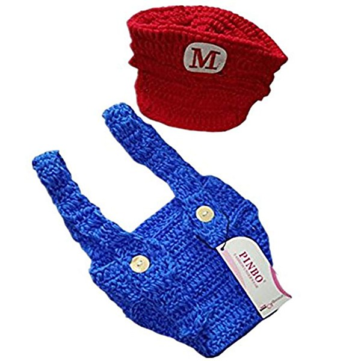

# Liquid Dreams

By **Various Artists**

## Album Data

- **Catalog:** Beets
- **Format:** Digital, Album
- **Album:** Liquid Dreams
- **Artist:** Various Artists
- **Albumartist:** Various Artists
- **Genre:** Trance
- **MusicBrainz Album Artist ID:** 
- **MusicBrainz Album ID:** 
- **MusicBrainz Release Group ID:** 
- **Year:** 2001
- **Catalog #:** 
- **Label:** 
- **Total Tracks:** 19

## Album Tracks

### Track 12 - Stolen love

- **Artist:** Advertising
- **Format:** MP3
- **Genre:** Punk Rock
- **Length:** 2:23
- **MusicBrainz Track ID:** 
- **Title:** Stolen love
- **Track:** 12
- **Year:** 0000

### Track 02 - Always Come Back

- **Artist:** Bad Boy
- **Format:** MP3
- **Genre:** Power Pop
- **Length:** 3:13
- **MusicBrainz Track ID:** 
- **Title:** Always Come Back
- **Track:** 02
- **Year:** 1978

### Track 10 - Hot for you

- **Artist:** Blades
- **Format:** MP3
- **Genre:** Hardcore Punk
- **Length:** 2:13
- **MusicBrainz Track ID:** 
- **Title:** Hot for you
- **Track:** 10
- **Year:** 0000

### Track 16 - Look What You've Done

- **Artist:** Hi-Fi
- **Format:** MP3
- **Genre:** Russian Pop
- **Length:** 3:36
- **MusicBrainz Track ID:** 
- **Title:** Look What You've Done
- **Track:** 16
- **Year:** 0000

### Track 06 - Viens Plus Pres De Moi

- **Artist:** Les Merseys
- **Format:** MP3
- **Genre:** Rock
- **Length:** 2:13
- **MusicBrainz Track ID:** 
- **Title:** Viens Plus Pres De Moi
- **Track:** 06
- **Year:** 0000

### Track 08 - Annoying All The Neighbors

- **Artist:** Little Bo Bitch
- **Format:** MP3
- **Genre:** Power Pop
- **Length:** 3:35
- **MusicBrainz Track ID:** 
- **Title:** Annoying All The Neighbors
- **Track:** 08
- **Year:** 0000

### Track 19 - Ally Sally [Demo]

- **Artist:** Pezband
- **Format:** MP3
- **Genre:** Power Pop
- **Length:** 3:59
- **MusicBrainz Track ID:** 
- **Title:** Ally Sally [Demo]
- **Track:** 19
- **Year:** 0000

### Track 05 - Dingley's Bookshop

- **Artist:** Rabbitt
- **Format:** MP3
- **Genre:** Progressive Rock
- **Length:** 2:10
- **MusicBrainz Track ID:** 
- **Title:** Dingley's Bookshop
- **Track:** 05
- **Year:** 0000

### Track 04 - I'm sorry

- **Artist:** Straight Eight
- **Format:** MP3
- **Genre:** Power Pop
- **Length:** 3:08
- **MusicBrainz Track ID:** 
- **Title:** I'm sorry
- **Track:** 04
- **Year:** 0000

### Track 17 - Sweeny Todd Folder

- **Artist:** Sweeny Todd
- **Format:** MP3
- **Genre:** Glam Rock
- **Length:** 3:30
- **MusicBrainz Track ID:** 
- **Title:** Sweeny Todd Folder
- **Track:** 17
- **Year:** 0000

### Track 09 - Teenage Flu

- **Artist:** The Atlantics
- **Format:** MP3
- **Genre:** Psychobilly
- **Length:** 2:31
- **MusicBrainz Track ID:** 
- **Title:** Teenage Flu
- **Track:** 09
- **Year:** 1979

### Track 18 - Shot Of Your Love

- **Artist:** The Dawgs
- **Format:** MP3
- **Genre:** Power Pop
- **Length:** 2:38
- **MusicBrainz Track ID:** 
- **Title:** Shot Of Your Love
- **Track:** 18
- **Year:** 0000

### Track 01 - The Lady I Can't Forget

- **Artist:** The Flying Elephants
- **Format:** MP3
- **Genre:** Power Pop
- **Length:** 4:22
- **MusicBrainz Track ID:** 
- **Title:** The Lady I Can't Forget
- **Track:** 01
- **Year:** 0000

### Track 14 - Two For One

- **Artist:** The Meantime
- **Format:** MP3
- **Genre:** Rock And Roll
- **Length:** 2:40
- **MusicBrainz Track ID:** 
- **Title:** Two For One
- **Track:** 14
- **Year:** 0000

### Track 11 - Why Don't You Let Me Go

- **Artist:** The Monsters
- **Format:** MP3
- **Genre:** Deathcore
- **Length:** 2:01
- **MusicBrainz Track ID:** 
- **Title:** Why Don't You Let Me Go
- **Track:** 11
- **Year:** 2009

### Track 15 - I've got a heart

- **Artist:** The Realists
- **Format:** MP3
- **Genre:** Rock
- **Length:** 2:18
- **MusicBrainz Track ID:** 
- **Title:** I've got a heart
- **Track:** 15
- **Year:** 0000

### Track 13 - Baby's In The Know

- **Artist:** The Reels
- **Format:** MP3
- **Genre:** New Wave
- **Length:** 3:02
- **MusicBrainz Track ID:** 
- **Title:** Baby's In The Know
- **Track:** 13
- **Year:** 0000

### Track 03 - Bisogna Saper Perdere

- **Artist:** The Rokes
- **Format:** MP3
- **Genre:** Soul
- **Length:** 3:17
- **MusicBrainz Track ID:** 
- **Title:** Bisogna Saper Perdere
- **Track:** 03
- **Year:** 0000

### Track 07 - Cindy Won't You

- **Artist:** Yankee Rose
- **Format:** MP3
- **Genre:** Power Pop
- **Length:** 2:42
- **MusicBrainz Track ID:** 
- **Title:** Cindy Won't You
- **Track:** 07
- **Year:** 1980

