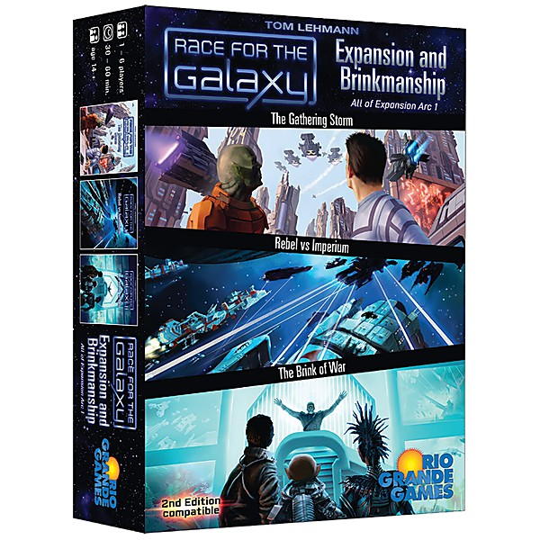

# Lost & Forgotten Power Pop - Vol. 11

By **Various Artists**

## Album Data

- **Catalog:** Beets
- **Format:** Digital, Album
- **Album:** Lost & Forgotten Power Pop - Vol. 11
- **Artist:** Various Artists
- **Albumartist:** Various Artists
- **Genre:** Indie Rock
- **MusicBrainz Album Artist ID:** 
- **MusicBrainz Album ID:** 
- **MusicBrainz Release Group ID:** 
- **Year:** 0000
- **Catalog #:** 
- **Label:** 
- **Total Tracks:** 00

## Album Tracks

### Track 00 - 3-D - Telephone Number

- **Artist:** 3-D
- **Format:** MP3
- **Genre:** Power Pop
- **Length:** 2:46
- **MusicBrainz Track ID:** 
- **Title:** 3-D - Telephone Number
- **Track:** 00
- **Year:** 0000

### Track 00 - B.B. SPIN - She's That Girl

- **Artist:** B.B. Spin
- **Format:** MP3
- **Genre:** Power Pop
- **Length:** 4:05
- **MusicBrainz Track ID:** 
- **Title:** B.B. SPIN - She's That Girl
- **Track:** 00
- **Year:** 0000

### Track 00 - BERLIN AIRLIFT - This is Your Life

- **Artist:** Berlin Airlift
- **Format:** MP3
- **Genre:** New Wave
- **Length:** 2:53
- **MusicBrainz Track ID:** 
- **Title:** BERLIN AIRLIFT - This is Your Life
- **Track:** 00
- **Year:** 0000

### Track 00 - BILL WRAY - Pinball, That's All

- **Artist:** Bill Wray
- **Format:** MP3
- **Genre:** Power Pop
- **Length:** 3:02
- **MusicBrainz Track ID:** 
- **Title:** BILL WRAY - Pinball, That's All
- **Track:** 00
- **Year:** 0000

### Track 00 - CASTLE FARM - Hot Rod Queen

- **Artist:** Castle Farm
- **Format:** MP3
- **Genre:** Power Pop
- **Length:** 3:17
- **MusicBrainz Track ID:** 
- **Title:** CASTLE FARM - Hot Rod Queen
- **Track:** 00
- **Year:** 0000

### Track 00 - FAST FORWARD - Don't Walk Away

- **Artist:** Fast Forward
- **Format:** MP3
- **Genre:** Synthcore
- **Length:** 4:04
- **MusicBrainz Track ID:** 
- **Title:** FAST FORWARD - Don't Walk Away
- **Track:** 00
- **Year:** 0000

### Track 00 - SQUIRE - It's A Mod Mod World

- **Artist:** Squire
- **Format:** MP3
- **Genre:** Power Pop
- **Length:** 2:23
- **MusicBrainz Track ID:** 
- **Title:** SQUIRE - It's A Mod Mod World
- **Track:** 00
- **Year:** 0000

### Track 00 - SUE SAAD & THE NEXT - Gimme Love

- **Artist:** Sue Saad & The Next
- **Format:** AAC
- **Genre:** Power Pop
- **Length:** 3:09
- **MusicBrainz Track ID:** 
- **Title:** SUE SAAD & THE NEXT - Gimme Love
- **Track:** 00
- **Year:** 0000

### Track 00 - THE KNOW - I Like Girls Out Of Reach

- **Artist:** The Know
- **Format:** MP3
- **Genre:** Shoegaze
- **Length:** 4:54
- **MusicBrainz Track ID:** 
- **Title:** THE KNOW - I Like Girls Out Of Reach
- **Track:** 00
- **Year:** 0000

### Track 00 - THE SWINGERS - Distortion

- **Artist:** The Swingers
- **Format:** MP3
- **Genre:** Punk Rock
- **Length:** 3:52
- **MusicBrainz Track ID:** 
- **Title:** THE SWINGERS - Distortion
- **Track:** 00
- **Year:** 0000

